# Bodymass Index
## Worum gehts? (Goal)
Der Allgemeine Sportverband Österreich (ASVÖ) benötigt eine Software zur schnellen Bewertung des Körpergewichts für Sportler:innen. Der Grund ist, dass in manchen Sportarten Untergewicht ein immer größeres Problem darstellt.
## Deine Rolle? (Role)
Du bist Praktikant:in in der Softwareentwicklungsabteilung der Firma Fitness4All GmbH.
## Für wen? (Audience)
Die Software wird für den ASVÖ erstellt. Womöglich ist die Software auch für diverse Modelagenturen oder Anbieter für Versicherungen interessant. Das wird von der Marketingabteilung noch ermittelt.
## Die Situation? (Situation)
Du entwickelst als Praktikant eine erste Beispiel-Lösung. Dein Abteilungsleiter möchte wissen, wie man das Problem lösen könnte und er möchte auch sehen, wie du dich bei deinem ersten kleinen Projekt machst. 
Er möchte, dass du für die Lösung den Body-Mass-Index (BMI) verwendest.
Dein Produkt wird im Rahmen des kommenden Meetings in deiner Abteilung vorgestellt. Auf Basis deiner Lösung wird dann von den Kollegen der Abteilung eine App für's Handy entwickelt, die dann auch von den Sportler:innen verwendet werden kann.
## Funktionale Anforderungen? (Product)
Für die Software gelten folgende funktionale Anforderungen:
### Gratis-Version der Software:
- Benutzer:innen können die für die Berechnungen nötigen Daten eingeben.
- Benutzer:innen bekommen den berechneten (und wenn nötig gerundeten) BMI als Ergebnis.
- Benutzer:innen bekommen eine Interpretation des BMI als Ergebnis.
- Benutzer:innen sollen bei Falscheingaben einen Hinweis zur Richtigstellung erhalten und die Eingabe solange wiederholen können, bis alles passt.
- ...
### Bezahl-Version der Software
- Benutzer:innen sollen nach einer Berechnung die Möglichkeit haben, weitere Berechnungen durchzuführen.
- Benutzer:innen (z.B. Trainer) sollen die Möglichkeit haben, ganze Messreihen auf einmal einzugeben und dafür den BMI berechnet zu bekommen.
- Benutzer:innen möchten das Programm über eine grafische Benutzeroberfläche bedienen können.
- ...
### Nicht-Funktionale Anforderungen
- Die Software soll insb. in den späteren Versionen unter Einsatz von Funktionen und Prozeduren gut modularisiert werden. Das soll die Lesbarkeit bzw. die Wartbarkeit von Code erhöhen, Codeduplikate vermeiden und die Wiederverwendbarkeit erhöhen.
- ...
## Die Bewertungsstandards? (Standards)
- Funktionalität der Software lt. Anforderungen
- Qualität des Codes
- Zeitmanagement
- ...

# Sprint 1
## Rechercheergebnis zu BMI
Quelle: https://de.wikipedia.org/wiki/Body-Mass-Index

Der Body-Mass-Index wird folgendermaßen berechnet:

    BMI = Masse (in kg) / Groesse (in Meter zum Quadrat)

Der BMI wird also in der Maßeinheit kg pro m² angegeben.

Der BMI wird von Versicherungen verwendet.
Der BMI wird im Fitness-Bereich verwendet.
Der BMI wird im Bereich der Ernährungsberatung verwendet.
Der BMI wird in der Model-Szene verwendet.

Der BMI weißt für Frauen und Männer leicht unterschiedliche Werte auf.

Interpretation (im Groben):

Untergewicht: < 18
Normalgewicht: < 25
Präadipositas: < 31
Adipositas: >= 31
## Sprint Backlog
Folgende funktionalen Anforderungen werden im ersten Sprint implementiert:
- Benutzer:innen können die für die Berechnungen nötigen Daten eingeben.
- Benutzer:innen bekommen den berechneten (und wenn nötig gerundeten) BMI als Ergebnis.
## Pseudocode

```pseudocode
- Der Benutzer gibt das Gewicht in Kilogramm ein.
- Der eingegebene kg-Wert wird als Text in eine Variable gespeichert.
- Der Benutzer gibt die Größe in Meter ein.
- Der eingegebene m-Wert wird als Text in eine Variable gespeichert.
- Der kg-Wert wird in eine Zahl konvertiert, mit der gerechnet werden kann. Das Ergebnis wird in eine neue Variable gespeichert.
- Der m-Wert wird in eine Zahl konvertiert, mit der gerechnet werden kann. Das Ergebnis wird in eine neue Variable gespeichert.
- Der BMI wird nach folgender Formler berechnet: kg/(m*m). Das Ergebnis wird in eine Variable gespeichert.
- Der berechnete BMI wird gerundet.
- Der berechnete und gerundete BMI wird ausgegeben.
```

## Ablaufplan
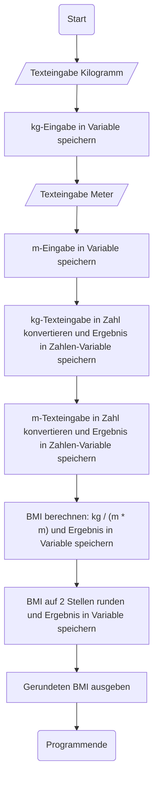
## Blockbasierte Implementierung
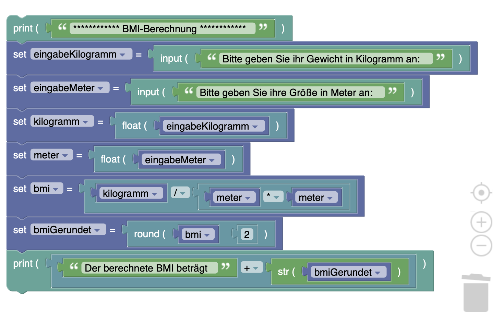
## Python-Implementierung
```python
print('************ BMI-Berechnung ************')
eingabeKilogramm = input('Bitte geben Sie ihr Gewicht in Kilogramm an: ')
eingabeMeter = input('Bitte geben Sie ihre Größe in Meter an: ')
kilogramm = float(eingabeKilogramm)
meter = float(eingabeMeter)
bmi = kilogramm / (meter * meter)
bmiGerundet = round(bmi, 2)
print('Der berechnete BMI beträgt ' + str(bmiGerundet))
```

# Sprint 2
## Sprint Backlog
Folgende funktionalen Anforderungen werden im zweiten Sprint implementiert:
- Benutzer:innen bekommen eine Interpretation des BMI als Ergebnis.
## Pseudocode
Zur Interpretation des berechneten BMI wird wie folgt vorgegangen:
```pseudocode
- Wenn der berechnete BMI < 18:
    * Interpretationsergebnis ist "Untergewicht"
- Wenn der berechnete BMI zwischen 18 und 26 (excl.):
    * Interpretationsergebnis ist "Normalgewicht"
- Wenn der berechnete BMI zwischen 26 und 31 (excl.):
    * Interpretationsergebnis ist "Übergewicht"
- Wenn der berechnete BMI größer oder gleich 31:
    * Interpretationsergebnis ist "Adipositas"
- Ausgabe des BMI-Ergebnisses (gerundet) zusammen mit dem Interpretationsergebnis.
```
Variante:
```pseudocode
- Wenn der berechnete BMI < 18:
    * Interpretationsergebnis ist "Untergewicht"
- Wenn der berechnete BMI zwischen 18 und 26 (excl.):
    * Interpretationsergebnis ist "Normalgewicht"
- Wenn der berechnete BMI zwischen 26 und 31 (excl.):
    * Interpretationsergebnis ist "Übergewicht"
- Wenn der berechnete BMI größer oder gleich 31:
    * Interpretationsergebnis ist "Adipositas"
- Ausgabe des BMI-Ergebnisses (gerundet) zusammen mit dem Interpretationsergebnis.
```
## Ablaufplan


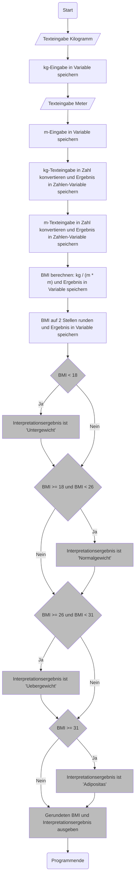

Alternativer Ablaufplan mit Else-If:

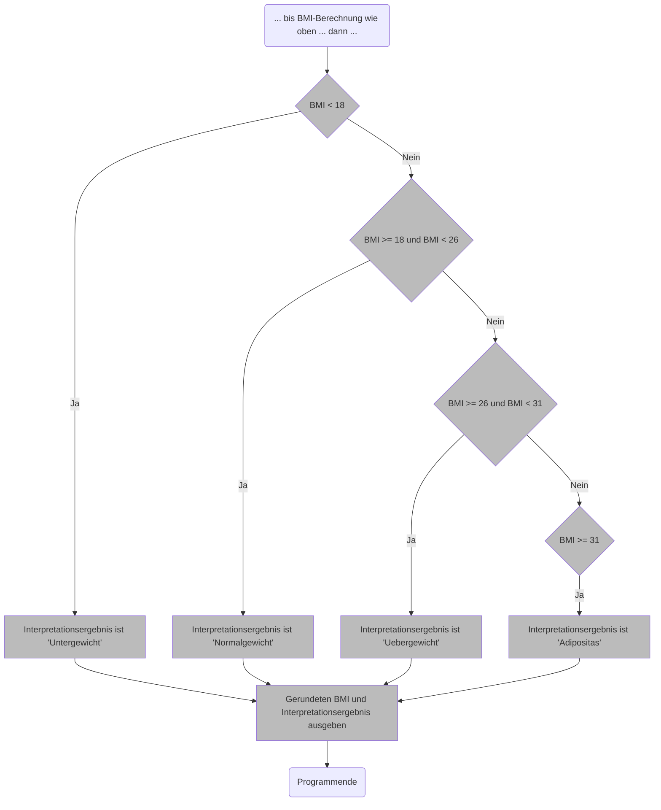

## Blockbasierte Implementierung
### Variante mit einfachem If:
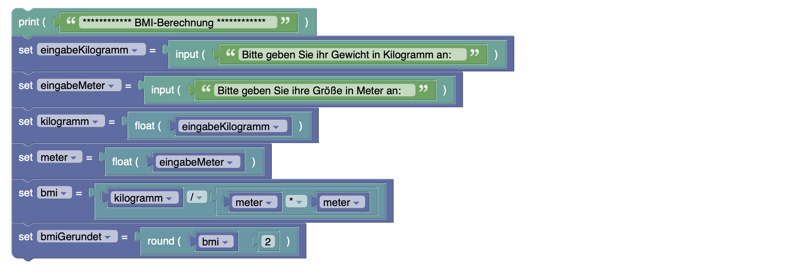
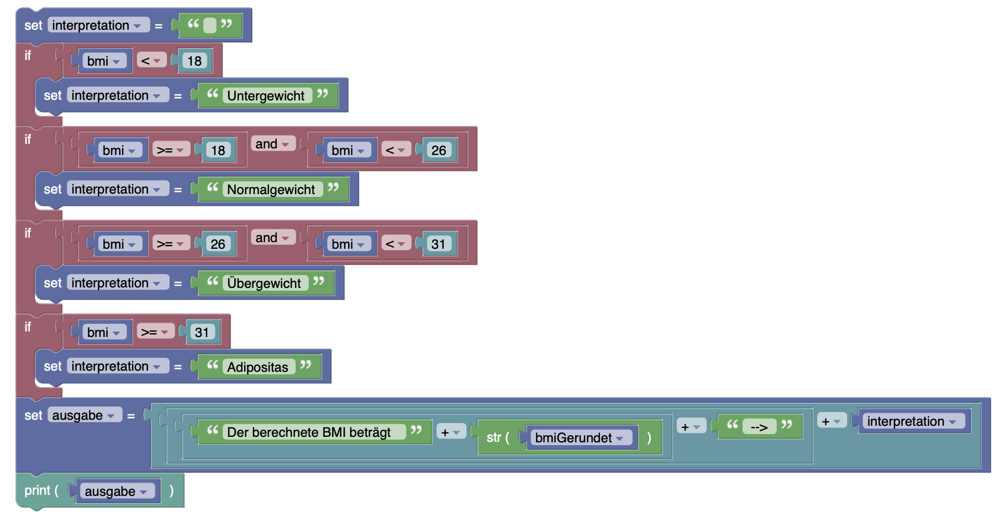

### Variante mit Else-If:
... wie oben, jedoch mit folgender If-Struktur:
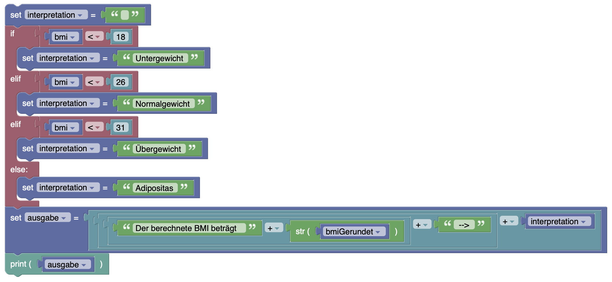
## Python-Implementierung
### Variante mit einfachem If:
```python
print('************ BMI-Berechnung ************')
eingabeKilogramm = input('Bitte geben Sie ihr Gewicht in Kilogramm an: ')
eingabeMeter = input('Bitte geben Sie ihre Größe in Meter an: ')
kilogramm = float(eingabeKilogramm)
meter = float(eingabeMeter)
bmi = kilogramm / (meter * meter)
bmiGerundet = round(bmi, 2)
interpretation = ''
if bmi < 18:
    interpretation = 'Untergewicht'
if bmi >= 18 and bmi < 26:
    interpretation = 'Normalgewicht'
if bmi >= 26 and bmi < 31:
    interpretation = 'Übergewicht'
if bmi >= 31:
    interpretation = 'Adipositas'
ausgabe = 'Der berechnete BMI beträgt ' + str(bmiGerundet) + ' --> ' + interpretation
print(ausgabe)
```

### Variante mit Else-If:

```python
print('************ BMI-Berechnung ************')
eingabeKilogramm = input('Bitte geben Sie ihr Gewicht in Kilogramm an: ')
eingabeMeter = input('Bitte geben Sie ihre Größe in Meter an: ')
kilogramm = float(eingabeKilogramm)
meter = float(eingabeMeter)
bmi = kilogramm / (meter * meter)
bmiGerundet = round(bmi, 2)
interpretation = ''
if bmi < 18:
    interpretation = "Untergewicht"
elif bmi < 26:
    interpretation = "Normalgewicht"
elif bmi < 31:
    interpretation = "Übergewicht"
else:
    interpretation = "Adipositas"
ausgabe = 'Der berechnete BMI beträgt ' + str(bmiGerundet) + ' --> ' + interpretation
print(ausgabe)
```

# Sprint 3

## Sprint Backlog
Folgende funktionalen Anforderungen werden im zweiten Sprint implementiert:
- Benutzer:innen sollen bei Falscheingaben einen Hinweis zur Richtigstellung erhalten und die Eingabe so lange wiederholen können, bis alles passt.

Bezahlfunktion:
- Benutzer:innen sollen nach einer Berechnung die Möglichkeit haben, weitere Berechnungen durchzuführen.

## Pseudocode
```pseudocode
A: 
Solange der Benutzer nicht Nein zu einer wiederholten Berechnung sagt:
    Solange noch keine korrekte Benutzereingabe vorliegt:
        Benutzer gibt kg ein
        Benutzer gibt m ein
        Wenn kg und m Zahlen sind:
            Wenn kg > 0 und m > 0:
                korrekte Benutzereingabe liegt vor
            Sonst
                Ausgabe: Bitte positive Zahlen eingeben
                Es liegt keine korrekte Benutzereingabe vor
        Sonst:
            Ausgabe: Bitte Zahlen eingeben
            Es liegt keine korrekte Benutzereingabe vor
    Korrekte Benutzereingabe liegt nun vor
    Berechnung des BMI, Interpretation, Ausgabe
    Frage an den Benutzer, ob er eine wiederholte Berechnung wünscht.
    Wenn Nein:
        Keine wiederholte Berechnung
Programmende              
```
## Ablaufplan

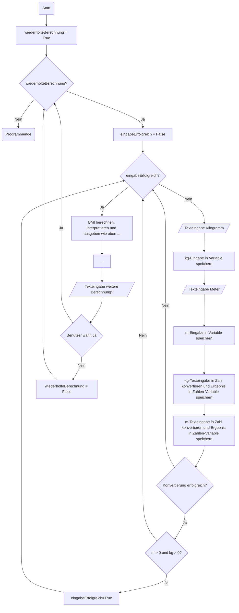

## Blockbasierte Implementierung
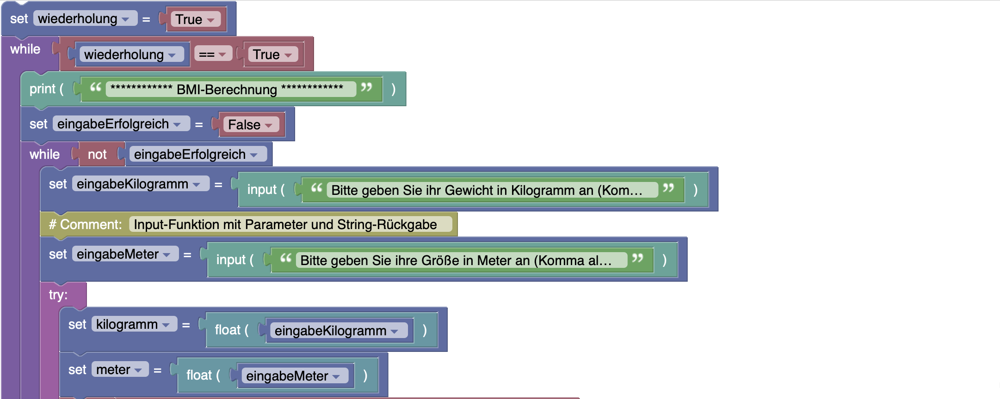
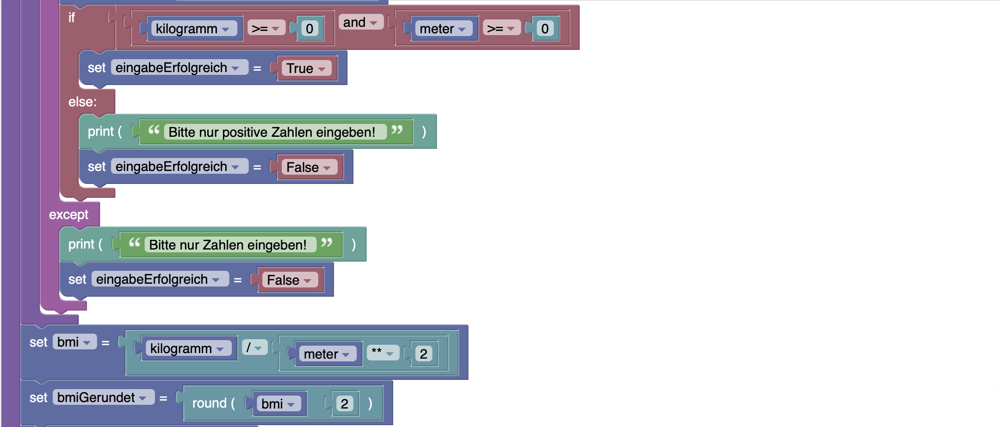
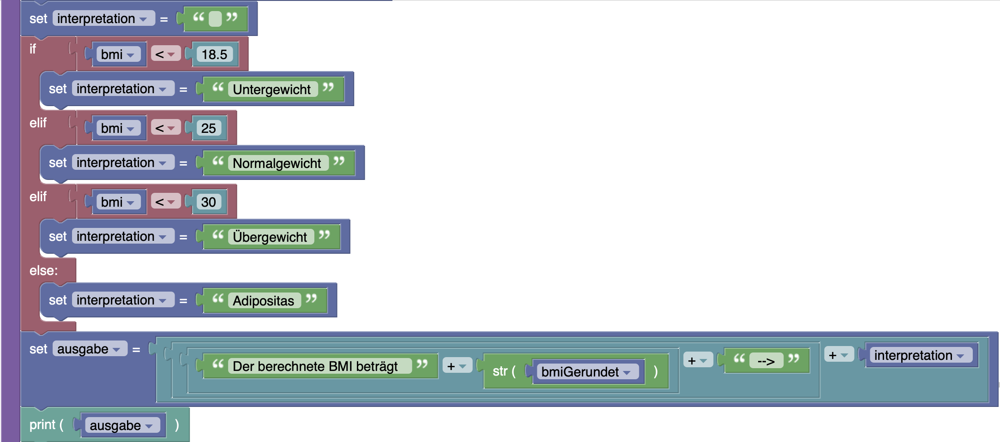
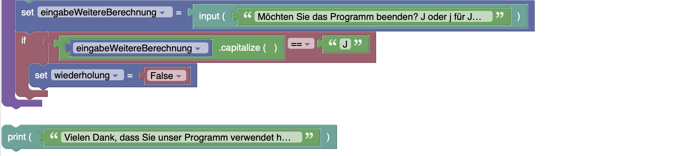
## Python-Implementierung
```python
wiederholung = True
while wiederholung == True:
    print("************ BMI-Berechnung ************")
    eingabeErfolgreich = False
    while not eingabeErfolgreich:
        eingabeKilogramm = input("Bitte geben Sie ihr Gewicht in Kilogramm an (Komma als Punkt): ") #Input-Funktion mit Parameter und String-Rückgabe
        eingabeMeter = input("Bitte geben Sie ihre Größe in Meter an (Komma als Punkt angeben): ")
        try:
            kilogramm = float(eingabeKilogramm)
            meter = float(eingabeMeter)
            if kilogramm >= 0 and meter >= 0:
                eingabeErfolgreich = True
            else:
                print("Bitte nur positive Zahlen eingeben!")
                eingabeErfolgreich = False
        except:
            print("Bitte nur Zahlen eingeben!")
            eingabeErfolgreich = False
    bmi = kilogramm / meter**2
    bmiGerundet = round(bmi,2) 
    interpretation = ""
    if bmi < 18.5: 
        interpretation = "Untergewicht" 
    elif bmi < 25: 
        interpretation = "Normalgewicht" 
    elif bmi < 30: 
        interpretation = "Übergewicht" 
    else: 
        interpretation = "Adipositas"
    ausgabe = "Der berechnete BMI beträgt " + str(bmiGerundet) + " --> " + interpretation
    print(ausgabe)
    eingabeWeitereBerechnung = input("Möchten Sie das Programm beenden? J oder j für Ja! ")
    if eingabeWeitereBerechnung.capitalize() == "J":
        wiederholung = False

print("Vielen Dank, dass Sie unser Programm verwendet haben. Auf wiedersehen!")

```

