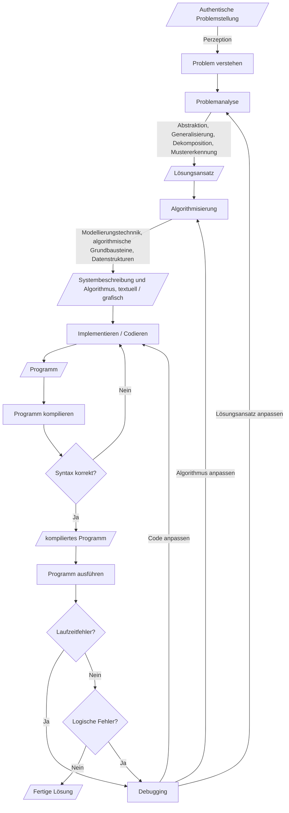

# Zentrale Prozesse und Konzepte der Programmierung im Unterricht
## Modellbildung
Im Zentrum des Unterrichts steht ein informatischer Modellbildungsprozess zur Lösung authentischer Problemsituationen. 

> Ein Modell ist eine abstrahierte Beschreibung eines realen oder geplanten Systems, das die für eine bestimmte Zielsetzung wesentlichen Eingenschaften des Systems erhält. Modellbildung ist die Beschreibung eines solchen Systems.
>
> * Systembeschreibungen
> * Verarbeitungsvorschriften
> * Datenstrukturen
>
> Modellierungstechniken:
>
> * Datenmodellierung
> * Zustandsorientierte Modellierung
> * Funktionale Modellierung
> * Objektorientierte Modellierung
>
> (nach Hubwieser, Didaktik der Informatik)

Wir lösen ein Problem mithilfe des Computers, indem wir geistige und praktische Techniken der Informatik zur Anwendung bringen. Wir lernen dabei zentrale informatische Konzepte und Prozesse kennen und wir nutzen Werkzeuge der Informatik, um Lösungen für das Problem zu realisieren. Dadurch entwickeln wir ein Verständnis über den Aufbau und die Wirkungsweise von Informatiksystemen. Das wiederum ermöglicht uns 

* Chancen und Grenzen der Nutzung von Informationssystemen zu erkennen, 
* ein korrektes Weltbild aufzubauen, 
* in einer mit IT durchsetzten Welt zu partizipieren 
* sowie vernünftig, verantwortungsvoll und reflektiert mit den Technologien umzugehen.

## Zentrale Konzepte der Programmierung im Unterricht
Die Konzepte, Prozesse und Werkzeuge, die wir für die Lösungsfindung nutzen können, sind in der Informatik vielfältig. Zur Vermittlung zentraler geistiger sowie praktischer Techniken der Informatik eignen sich jedoch insbesondere Programmiersprachen.

Im Rahmen der Nutzung von Programmiersprachen zur Lösung von Problemen gibt es verschiedene „Werkzeugkästen“ - auch Paradigmen genannt, die wiederum unterschiedliche Modellierungstechniken betreffen und damit Lösungen auf unterschiedliche Arten ermöglichen. 

Ein etablierter Werkzeugkasten ist der Imperative. Er enthält viele fundamentale Ideen der Informatik, 
* die schon über sehr lange Zeit Gültigkeit haben,
* in vielen Teilgebieten des Faches (und auch in anderen Fachgebieten) verwendet werden,
* sich gut in der Lebenswelt unserer Schüler zeigen lassen, und
* in verschiedenen Komplexitätsniveaus (von der Primarstufe bis in die Tertiärstufe) vermittelt werden können

Konkret haben wir es im gewählten Werkzeugkasten u. A. mit folgenden Ideen und Konzepten zu tun:

Online-Ressourcen zu den Python-Konzepten:
  - [Inf-Schule.de](https://www.inf-schule.de/imperative-programmierung/python/)
  - [Programmierkonzepte](https://programmierkonzepte.ch)
  - [PythonGeeks](https://pythongeeks.org/learn-python-tutorial/)
  - [W3Schools](https://www.w3schools.com/python/)

Betroffene Konzepte (Auszug):
* [Programm / Quellcode / Anweisungen](https://www.inf-schule.de/imperative-programmierung/python/konzepte/programme/konzept_programme)
  * Kompilieren und interpretieren
  * [Syntaxfehler](https://www.inf-schule.de/imperative-programmierung/python/konzepte/fehler/exkurs_syntaxfehler)
  * [Laufzeitfehler](https://www.inf-schule.de/imperative-programmierung/python/konzepte/fehler/exkurs_laufzeitfehler)
  * [Logische Fehler](https://www.inf-schule.de/imperative-programmierung/python/konzepte/fehler/exkurs_logischefehler)
* [Eingabe - Verarbeitung - Ausgabe (EVA)](https://www.inf-schule.de/imperative-programmierung/python/konzepte/programme/konzept_eva) in [Python](https://www.inf-schule.de/imperative-programmierung/python/konzepte/programme/exkurs_eingabeausgabe)
* [Bedingungen](https://www.inf-schule.de/imperative-programmierung/python/konzepte/bedingungen/konzept_bedingungen)
* [Logische Verknüpfungen](https://www.inf-schule.de/imperative-programmierung/python/konzepte/bedingungen/konzept_logischeverknuepfungen)
* [Variablen](https://www.inf-schule.de/imperative-programmierung/python/konzepte/variablen/konzept_variable) / Sichtbarkeit / Gültigkeit
* Werte (Literale)
* [Zuweisung (Assignment)](https://www.inf-schule.de/imperative-programmierung/python/konzepte/variablen/konzept_zuweisung)
* [Datentypen](https://www.inf-schule.de/imperative-programmierung/python/konzepte/datentypen/konzept_datentyp)
  * [Zahlen in Python](https://www.inf-schule.de/imperative-programmierung/python/konzepte/datentypen/exkurs_zahlen)
  * [Zeichenketten](https://www.inf-schule.de/imperative-programmierung/python/konzepte/zeichenketten/konzept_zeichenkette) in [Python](https://www.inf-schule.de/imperative-programmierung/python/konzepte/datentypen/exkurs_zeichenketten)
  * [Wahrheitswerte in Python](https://www.inf-schule.de/imperative-programmierung/python/konzepte/datentypen/exkurs_wahrheitswerte)
  * [Typumwandlung in Python](https://www.inf-schule.de/imperative-programmierung/python/konzepte/datentypen/exkurs_typumwandlungen)
* Listen und andere Datenstrukturen in Python:
  - Listen: https://www.inf-schule.de/imperative-programmierung/python/konzepte/listen
  - Listen: https://docs.python.org/3/tutorial/introduction.html#lists (Lists)
  - Sequence Types Lists, Tuples, Range: https://docs.python.org/3/library/stdtypes.html#typesseq
  - Sequence Type String: https://docs.python.org/3/library/stdtypes.html#textseq
  - Sets, Dictionaries: https://docs.python.org/3/tutorial/datastructures.html
* [Konstrollstrukturen](https://www.inf-schule.de/imperative-programmierung/python/konzepte/ablaufmodellierung/konzept_kontrollstrukturen):
  * Sequenzen von Anweisungen
  * [Fallunterscheidung (bedingte Verzweigungen)](https://www.inf-schule.de/imperative-programmierung/python/konzepte/entscheidungen/konzept_fallunterscheidungen)
  * [Wiederholung (Schleifen)](https://www.inf-schule.de/imperative-programmierung/python/konzepte/wiederholungen/konzept_wiederholungen)
  * [Ausnahmebehandlung](https://www.w3schools.com/python/python_try_except.asp)
* [Funktionen](https://www.inf-schule.de/imperative-programmierung/python/konzepte/funktion/konzept_funktion) als Modularisierungstechnik
* Ereignisse (Events) und Ereignisbehandlung (Callbacks)

## Zentrale Prozesse der Programmierung im Unterricht
Nicht nur inhaltlich, sondern auch methodisch liegt der Fokus auf Problemlösen durch Modellbildung und Simulation. Die Vorgangsweise im Rahmen des informatischen Modellbildungsprozesses kann mit Bezug auf die zentralen Ideen des Computational Thinkings wie folgt umrissen werden:

1. Problemanalyse:
  * Problemspezifikation
  * Abstraktion
  * Generalisierung
  * Mustererkennung
2. Algorithmisierung:
  * (graphische) Modellierungstechnik anwenden (z.B. Ablaufmodellierung, Zustandsmodellierung, funktionale Modellierung, objektorientierte Modellierung etc.)
  * Algorithmische Grundbausteine
  * Datenstrukturen
3. Implementierung und Test (Computerprogramm erstellen und testen)

Ausgehend vom Problem (Startzustand) führt der Weg durch den Problemraum (Zwischenzustände) hin zur fertigen Lösung (erwünschter Endzustand). Damit ergibt sich eine an den Softwareentwicklungszyklus angelehnte zyklische Vorgehensweise, die sich in Form einer Ablaufmodellierung wie folgt darstellen lässt:

## Problemanalyse
Das Problem wird analysiert und möglichst präzise formuliert. Dazu können z.B. Techniken des Computational Thinkings wie Abstraktion, Dekomposition oder Mustererkennung angewendet. Außerdem wird genau spezifiziert, wann das Problem als gelöst angesehen wird (Kriterien).

* Lösungsspezifikation: Wir definieren möglichst genaue "Abnahmekriterien" für eine Lösung
* Abstraktion: Wir fokussieren auf die für die Lösung absolut notwendigen Lösungselemente und lassen alles andere weg.
* Generalisierung: Wir versuchen eine Lösung zu finden, die nicht nur Spezialfälle von Problemen, sondern eine Problemkategorie löst. 
* Dekomposition: Wir teilen das Problem in verschiedene Teilprobleme. Wir überlegen uns, wie wir diese Teillösungen wieder zu einer Gesamtlösung zusammenbauen müssen.
* Mustererkennung: Wir halten nach Mustern und damit nach Automatisierungspotential Ausschau. Immer wiederkehrende Lösungsteile lassen sich durch Programmiersprachen sehr effizient implementieren.

### Exkurs: Computational Thinkin (CT)

>Computational thinking (CT) refers to the thought processes involved in formulating problems so their solutions can be represented as computational steps and algorithms. In education, CT is a set of problem-solving methods that involve expressing problems and their solutions in ways that a computer could also execute. It involves automation of processes, but also using computing to explore, analyze, and understand processes (natural and artificial). (Wikipedia)

> Referenzen zum Thema Computational Thinking:
> * https://digitalpromise.org/initiative/computational-thinking/computational-thinking-for-next-generation-science/what-is-computational-thinking/
> * https://towardsdatascience.com/computational-thinking-defined-7806ffc70f5e
> * http://www.icompute-uk.com/news/computational-thinking-2/

### Exkurs: Fundamentale Ideen der Softwareentwicklung
> Es gibt viele weitere zentrale Ideen der Informatik, die im Rahmen des Entwurfs von Softwaresystemen zum Einsatz kommen können. Schwill Andreas identifizierte etwa einen Katalog von sogenannten Fundamentalen Ideen. 
> 
> "Eine fundamentale Idee bezüglich eines Gegenstandsbereichs (Wissenschaft, Teilgebiet) ist ein Denk-, Handlungs-, Beschreibungs- oder Erklärungsschema, das
> 1. in verschiedenen Gebieten des Bereichs vielfältig anwendbar oder er- kennbar ist (Horizontalkriterium)
> 2. auf jedem intellektuellen Niveau aufgezeigt und vermittelt werden kann (Vertikalkriterium)
> 3. zur Annäherung an eine gewisse idealisierte Zielvorstellung dient, die jedoch faktisch möglicherweise unerreichbar ist (Zielkriterium)
> 4. in der historischen Entwicklung des Bereichs deutlich wahrnehmbar ist und längerfristig relevant bleibt (Zeitkriterium)
> 5. einen Bezug zur Sprache und Denken des Alltags und der Lebenswelt besitzt (Sinnkriterium)" (Schwill, 1993)
> 
> Schwill identifiziert weiters auf Basis dieses Kriteriensatzes folgende konkrete Ideen (hier in einer kleinen Modifikation nach Modrow für die Masteridee der Formalisierung):
> 
> (Schwill/Schubert/Modrow)

## Algorithmisierung 
Es folgt die Beschreibung des Systems und eines dazu passenden Lösungsalgorithmus. Wir verwenden dazu (grafische) Methoden verschiedener Modellierungsparadigmen (Ablaufmodellierung, zustandsorientierte Modellierung, funktionale Modellierung, objektorientierte Modellierung), sowie dazu passende algorithmische Grundbausteine und Datenstrukturen (siehe Thema "Werkzeugkasten" oben). 

> Ein Algorithmus ist eine eindeutige Handlungsvorschrift zur Lösung eines Problems oder einer Klasse von Problemen. Algorithmen bestehen aus endlich vielen, wohldefinierten Einzelschritten. Damit können sie zur Ausführung in ein Computerprogramm implementiert, aber auch in menschlicher Sprache formuliert werden. Bei der Problemlösung wird eine bestimmte Eingabe in eine bestimmte Ausgabe überführt. (https://de.wikipedia.org/wiki/Algorithmus)

Die Beschreibung des Algorithmus erfolgt z.B. über:

* ikonische / grafische Darstellungen zur Systembeschreibung, darunter:
  * [Flussdiagramme](https://en.wikipedia.org/wiki/Flowchart) bzw.[Programmablaufpläne] (https://de.wikipedia.org/wiki/Programmablaufplan)
  * [Struktogramme](https://www.inf-schule.de/) bzw. [Nassi-Shneidermann-Diagramm](https://de.wikipedia.org/wiki/Nassi-Shneiderman-Diagramm)
  * [Zustandsdiagramme](https://de.wikipedia.org/wiki/Zustandsdiagramm_(UML))
  * weitere [UML-Diagrammarten](https://de.wikipedia.org/wiki/Unified_Modeling_Language)
* textuelle Beschreibung des Algorithmus (formlos, konzeptorientiert)
* [Pseudocode](https://de.wikipedia.org/wiki/Pseudocode)

## Implementierung und Test

Nachdem wir unseren Lösungsalgorithmus geplant haben, gehen wir in die Umsetzung über. Dazu suchen wir Werkzeuge (IDE, Programmiersprache, Compiler etc.), das es uns aufgrund der unterstützten Konzepte bzw. aufgrund des gewählten Modellierungsparadigmas ermöglicht, den Algorithmus umzusetzen, auszuführen und zu testen. 

Die Implementierung wird immer wieder ausgeführt, getestet und modifiziert, solange bis die Lösung fertig ist. Im Rahmen der Modifikation kann / wird es zu Anpassungen des Lösungsansatzes sowie des Algorithmus kommen, was zu weiteren Zyklen führt. Die Lösung soll außerdem so weit wie möglich generalisiert werden, d.h. sie soll eine Klasse von Problemen und nicht nur ein spezifisches Problem mit bestimmten spezifischen Daten lösen.

Der Ablauf lässt sich also wie folgt kurz beschreiben (siehe dazu auch das Diagramm oben):

* Wir beginnen mit der Implementierung des Programms mithilfe des gewählten Werkzeugs (bestimmte Programmiersprache, bestimmte Entwicklungsumgebung). 
* In kurzen Zyklen werden wir nach jeder kurzen Programmiertätigkeit immer wieder das Programm versuchen auszuführen. 
  * Wenn sich das Programm nicht starten lässt, analysieren wir die Fehlermeldungen des Compilers und bessern Syntaxfehler aus. Wir müssen uns an die Syntax der gewählten Programmiersprache ganz genau halten, sonst versteht der Computer nicht, was er für uns tun soll. 
  * Wenn sich das Programm jedoch starten lässt, können wir kontrollieren, ob das Programm die richtigen (Teil-)Ergebnisse im Sinne unserer Lösungsspezifikation liefert. Dazu benötigen wir Techniken, die es uns ermöglichen in die Laufzeit eines Programmes hineinzuschauen bzw. Ergebnisse des Programmes anzuzeigen (Debugging-Strategien). 
    * Es ist möglich, dass an irgendwelchen Stellen während der Ausführung des Programms Laufzeitfehler auftreten, die das Programm auch zum Absturz bringen. Der Code muss debugt werden.
    * Falls das Programm beim Ausführen noch keine korrekten Lösungen / Lösungsteile liefert, haben wir es ggf. mit einem Bug zu tun. Der Code muss debugt werden.
    * Debugging: Es können Modifikation in der Problemanalyse, im Algorithmus oder auch im Code nötig werden (zyklische Natur). Eine Modifikation der Problemanalyse führt zu Modifikation des Algorithmus und der Implementierung. 
    * Eine Modifikation im Algorithmus führt zu einer Modifikation der Implementierung. Jedenfalls wird es also immer Modifikationen in der Implementierung brauchen, um den Bug zu beheben.
  * Wenn das Programm im Sinne Lösungsspezifikation korrekte Ergebnisse liefert, dann sind wir fertig. Handelt es sich nur um eine Teillösung, gehen wir zur Bearbeitung des nächsten Lösungsteils über. Ggf. müssen gegen Ende mehrere Lösungsteile miteinander verbunden werden, um zur Gesamtlösung zu kommen.

## Anhang 1: Methodische Prinzipien

Für den Unterricht sind neben der Problemorientierung und der informatischen Modellbildung und Simulation u. A. folgende methodisch-didaktischen Ideen relevant:

* Cognitive Apprenticeship:
  * Authentische Problemstellungen in verschiedenen Kontexten
  * Lernen am Modell
  * Lerngerüste (und deren Ausblenden)
  * Einüben von Transfer (etwa durch Analogiebildung)
  * Reflexion, Artikulation, Exploration
* Kontext vs. Abstraktion: Vom Abstrakten zum Konkreten und wieder zum Abstrakten (Kontextualisierung vs. Abstraktion); Explikation von Verhältnis zwischen Konzept, realisierendem Werkzeug und Anwendung im Rahmen der Problemlösung explizieren
* Genetischer Ansatz: Hinweis auf historische Relevanz / Genese der Inhalte
* Spiralprinzip (immer wieder Aufgreifen derselben Konzepte in höheren Komplexitätsstufen) und damit:
    * multiple (d.h. symbolische, ikonische und enaktive) Repräsentationen
    * vorwegnehmendes Lernen
    * Fortsetzbarkeit auf immer komplexeren Niveaus

## Anhang 2: Beispiele für Mini-Projekte für Anfänger

Für den einführenden Programmierunterricht eigenen sich Projekte zur Umsetzung im Unterricht wie die folgenden:

* Einfache Spiele wie Schere-Stein-Papier, Wörter raten (Hangman), Stadt Land Fluss, Zahlen raten
* Einfache Adventure-Games (Zork)
* Einfache Chatbots (Elisa)
* Einfache Textproduktionen wie Madlips, SVG-Grafiken zeichnen, Export-Funktionen
* Zahlen raten / KI für Zahlen raten (binäre Suche)
* Einfache Berechnungen mit Entscheidungen und Userinterface (z. B. BMI)
* Einfache Automaten (z. B. Ticketautomat, Tamagotchi, zelluläre Automaten für Game of Life)
* Einfache Microcontroller-Projekte (z.B. mit dem Micro:bit, siehe dazu das Schulbuch https://microbit.eeducation.at/wiki/Hauptseite)

Auf vielen Online-Programmierplattformen (wie etwa auf der Makecode-Plattform) oder auch in vielen Entwicklungsumgebungen sind außerdem oft auch Tutorials, Beispiele, kleine Projektaufgaben integriert.