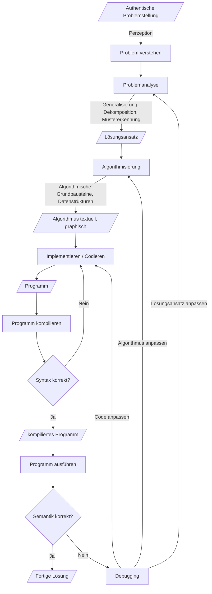

# Zentrale Prozesse, Konzepte und Werkzeuge der Programmierung im Unterricht
## Modellbildung
Im Zentrum des Unterrichts steht ein informatischer Modellbildungsprozess zur Lösung authentischer Problemsituationen. Wir lösen ein Problem mithilfe des Computers, indem wir geistige und praktische Techniken der Informatik zur Anwendung bringen. Wir lernen dabei zentrale informatische Konzepte und Prozesse kennen und wir nutzen Werkzeuge der Informatik, um Lösungen für das Problem zu realisieren. Dadurch entwickeln wir ein Verständnis über den Aufbau und die Wirkungsweise von Informatiksystemen. Das wiederum ermöglicht uns Chancen und Grenzen der Nutzung von Informationssystemen zu erkennen, ein korrektes Weltbild aufzubauen, in einer mit IT durchsetzten Welt zu partizipieren sowie vernünftig, verantwortungsvoll und reflektiert mit den Technologien umzugehen.
## Zentrale Konzepte der Programmierung
Die Konzepte, Prozesse und Werkzeuge, die wir für die Lösungsfindung nutzen können, sind in der Informatik vielfältig. Zur Vermittlung zentraler geistiger sowie praktischer Techniken der Informatik eignen sich jedoch insbesondere Programmiersprachen.

Im Rahmen der Nutzung von Programmiersprachen zur Lösung von Problemen gibt es verschiedene „Werkzeugkästen“ - auch Paradigmen genannt, die wiederum unterschiedliche Modellierungstechniken betreffen und damit Lösungen auf unterschiedliche Arten ermöglichen. 

Ein etablierter Werkzeugkasten ist der Imperative (prozedural / objektorientiert). Er enthält viele fundamentale Ideen der Informatik, 
* die schon über sehr lange Zeit Gültigkeit haben,
* in vielen Teilgebieten des Faches (und auch in anderen Fachgebieten) verwendet werden,
* sich gut in der Lebenswelt unserer Schüler zeigen lassen, und
* in verschiedenen Komplexitätsniveaus (von der Primarstufe bis in die Tertiärstufe) vermittelt werden können

Konkret haben wir es im gewählten Werkzeugkasten u. A. mit folgenden Ideen und Konzepten zu tun:

* Quellcode (Compilezeit) und Syntax
* Ausgeführtes Programm (Laufzeit) und Semantik
* Kompilieren und Interpretieren
* Eingabe - Verarbeitung - Ausgabe (EVA)
* Werte (Literale)
* Operatoren und Operanden
* Ausdrücke (Expression; z. B. arithmetische oder bool‘sche Ausdrücke)
* Anweisungen (Statements)
* Sequenzen von Anweisungen
* Anweisungsblöcke und Einrückung
* Variablen
* Zuweisung (Assignment)
* Datentypen (Ganzzahlen, Kommazahlen, Texte)
* Sichtbarkeit (Scope) und Gültigkeit (Lifetime)
* Bedingte Verzweigungen (Conditionals)
* Schleifen (Loops)
* Komplexere Datentypen (Listen, Tupel, Dictionaries)
* Modularisierung mit Funktionen
* Ereignisse (Events)
* Ereignisbehandlung (Handler bzw. Callbacks)

Wichtig für die Vermittlung solcher Ideen sind u. A. folgende methodisch-didaktische Prinzipien:

* Authentische Problemstellungen mit verschiedenen Kontexten
* Lernen am Modell
* Lerngerüste (und deren Ausblenden)
* Einüben von Transfer (primär durch Analogiebildung)
* Vom Abstrakten zum Konkreten wieder zum Abstrakten (Kontextualisierung vs. Abstraktion)
* Verhältnis zwischen Konzept, realisierendem Werkzeug und Anwendung im Rahmen der Problemlösung explizieren
* Hinweis auf historische Relevanz (zusammen mit den Personen dazu)
* Spiralprinzip, und damit
    * Multiple (d.h. symbolische, ikonische und enaktive) Repräsentation
    * Vorwegnehmendes Lernen
    * Fortsetzbarkeit auf immer komplexeren Niveaus

## Zentrale Prozesse der Programmierung
Methodisch liegt der Fokus weiters auf Problemlösen durch Modellbildung und Simulation.

Die Vorgangsweise im Rahmen des informatischen Modellbildungsprozesses sieht mit Bezug auf die zentralen Ideen des Computational Thinkings dann wie folgt aus:

1. Problemanalyse
2. Algorithmisierung
3. Implementierung und Test

Wichtig ist zu verstehen, dass es sich bei den oben genannten drei Punkten um einen Zyklus handelt, der immer wieder durchlaufen wird, solange, bis das Problem gelöst ist. Ausgehend vom Problem (Startzustand), über einen Weg durch den Problemraum (Zwischenzustände) hin zur fertigen Lösung (erwünschter Endzustand) ergibt sich damit eine an den Softwareentwicklungszyklus angelehnte zyklische Vorgehensweise. 

Der zyklische Ablauf des Unterrichts gestaltet sich also wie folgt:

## Problemanalyse
Das Problem wird analysiert und möglichst präzise formuliert. Dazu werden Techniken wie Abstraktion, Dekomposition oder Mustererkennung angewendet. Außerdem wird genau spezifiziert, wann das Problem als gelöst angesehen wird (Kriterien).

* Abstraktion: Wir fokussieren auf die für die Lösung absolut notwendigen Lösungselemente und lassen alles andere weg. 
* Generalisierung: Wir versuchen eine Lösung zu finden, die nicht nur Spezialfälle von Problemen, sondern eine Problemkategorie löst. 
* Dekomposition: Wir teilen das Problem in verschiedene Teilprobleme. Wir überlegen uns, wie wir diese Teillösungen wieder zu einer Gesamtlösung zusammenbauen müssen.
* Mustererkennung: Wir halten nach Mustern und damit nach Automatisierungspotential Ausschau. Immer wiederkehrende Lösungsteile lassen sich durch Programmiersprachen sehr effizient implementieren.
* Lösungsspezifikation: Wir definieren möglichst genaue "Abnahmekriterien" für eine Lösung 
  
## Algorithmisierung 
Es folgt die Beschreibung eines Lösungsalgorithmus. Wir verwenden dazu algorithmische Grundbausteine und passende Datenstrukturen (siehe Thema "Werkzeugkasten" oben). 

> Ein Algorithmus (benannt nach Al-Chwarizmi, von arabisch: الخوارزمی al-Ḫwārizmī, deutsch ‚der Choresmier‘) ist eine eindeutige Handlungsvorschrift zur Lösung eines Problems oder einer Klasse von Problemen. Algorithmen bestehen aus endlich vielen, wohldefinierten Einzelschritten. Damit können sie zur Ausführung in ein Computerprogramm implementiert, aber auch in menschlicher Sprache formuliert werden. Bei der Problemlösung wird eine bestimmte Eingabe in eine bestimmte Ausgabe überführt. (https://de.wikipedia.org/wiki/Algorithmus)

Die Beschreibung des Algorithmus erfolgt über formlose (aber konzeptorientierte) Texte, Pseudocode oder auch ikonische / grafische Darstellungen. Im Bereich der imperativ-prozeduralen Programmierung eigenen sich z. B.

* Aktivitätsdiagramme (Flussdiagramme)
* Struktogramme
* Zustandsdiagramme
  
## Implementierung und Test
Nachdem wir unseren Lösungsalgorithmus geplant haben, gehen wir in die Umsetzung über. Dazu suchen wir ein Werkzeug, das es uns aufgrund der unterstützten Konzepte bzw. aufgrund des gewählten Modellierungsparadigmas ermöglicht, den Algorithmus umzusetzen, auszuführen und zu testen. 

Die Implementierung wird immer wieder ausgeführt, getestet und modifiziert, solange bis die Lösung fertig ist. Im Rahmen der Modifikation kann / wird es zu Anpassungen des Lösungsansatzes sowie des Algorithmus kommen, was zu weiteren Zyklen führt. Die Lösung soll außerdem so weit wie möglich generalisiert werden, d.h. sie soll eine Klasse von Problemen und nicht nur ein spezifisches Problem mit bestimmten spezifischen Daten lösen.

Der Ablauf lässt sich also wie folgt kurz beschreiben:

* Wir beginnen mit der Implementierung des Programms mithilfe des gewählten Werkzeugs (bestimmte Programmiersprache, bestimmte Entwicklungsumgebung). 
* In kurzen Zyklen werden wir nach jeder kurzen Programmiertätigkeit immer wieder das Programm versuchen auszuführen. 
* Wenn sich das Programm nicht starten lässt, analysieren wir die Fehlermeldungen des Compilers und bessern Syntaxfehler aus. Wir müssen uns an die Syntax der gewählten Programmiersprache ganz genau halten, sonst versteht der Computer nicht, was er für uns tun soll. 
* Wenn sich das Programm jedoch starten lässt, können wir kontrollieren, ob das Programm die richtigen (Teil-)Ergebnisse im Sinne unserer Lösungsspezifikation liefert. Dazu benötigen wir Techniken, die es uns ermöglichen in die Laufzeit eines Programmes hineinzuschauen bzw. Ergebnisse des Programmes anzuzeigen (Debugging-Strategien). 
* Falls das Programm beim Ausführen noch keine korrekten Lösungen / Lösungsteile liefert, haben wir es ggf. mit einem Bug zu tun, die Semantik passt also nicht. 
* Dann können Modifikation in der Problemanalyse, im Algorithmus oder auch im Code nötig werden (zyklische Natur). Eine Modifikation der Problemanalyse führt zu Modifikation des Algorithmus und der Implementierung. 
* Eine Modifikation im Algorithmus führt zu einer Modifikation der Implementierung. Jedenfalls wird es also immer Modifikationen in der Implementierung brauchen, um den Bug zu beheben.
* Wenn das Programm im Sinne Lösungsspezifikation korrekte Ergebnisse liefert, dann sind wir fertig. Handelt es sich nur um eine Teillösung, gehen wir zur Bearbeitung des nächsten Lösungsteils über. Ggf. müssen gegen Ende mehrere Lösungsteile miteinander verbunden werden, um zur Gesamtlösung zu kommen.

## Referenzen zum Thema Computational Thinking

* https://digitalpromise.org/initiative/computational-thinking/computational-thinking-for-next-generation-science/what-is-computational-thinking/
* https://towardsdatascience.com/computational-thinking-defined-7806ffc70f5e
* http://www.icompute-uk.com/news/computational-thinking-2/

## Beispiele für Mini-Projekte für Anfänger

Für den einführenden Programmierunterricht eigenen sich Projekte zur Umsetzung im Unterricht wie die folgenden:

* Einfache Spiele wie Schere-Stein-Papier, Wörter raten (Hangman), Stadt Land Fluss, Zahlen raten
* Einfache Adventure-Games (Zork)
* Einfache Chatbots (Elisa)
* Einfache Textproduktionen wie Madlips, SVG-Grafiken zeichnen, Export-Funktionen
* Zahlen raten / KI für Zahlen raten (binäre Suche)
* Einfache Berechnungen mit Entscheidungen und Userinterface (z. B. BMI)
* Einfache Automaten (z. B. Ticketautomat, Tamagotchi, zelluläre Automaten für Game of Life)
* Einfache Microcontroller-Projekte (z.B. mit dem Micro:bit, siehe dazu das Schulbuch https://microbit.eeducation.at/wiki/Hauptseite)

Auf vielen Online-Programmierplattformen (wie etwa auf der Makecode-Plattform) oder auch in vielen Entwicklungsumgebungen sind außerdem oft auch Tutorials, Beispiele, kleine Projektaufgaben integriert.

