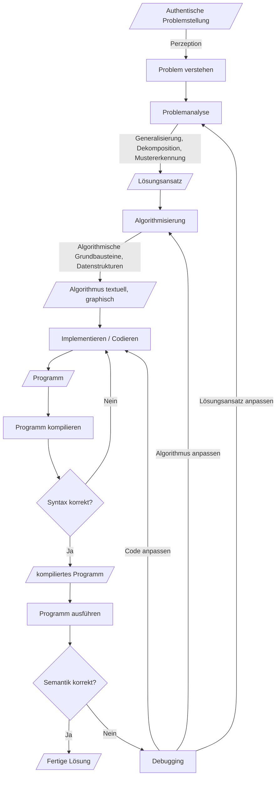

# VO Programmieren - Skript

# Plan für den ersten VO-Termin
1. Handlungsanleitungen
   1. Dijkstra
   2. Computerspielen
2. Programmieren mit Python und Blockbasiert
   1. Problemstellung BMI
   2. Umsetzung in Excel
   3. Umsetzung in blockbasiertem Python
3. Programmieren mit micro:bits
   1. Verweis auf das Buch
   2. Zahlen-Raten
   3. Zahlen-Raten KI

# Anforderungen an die LV
Die folgenden Auszüge stammen aus dem [Curriculum](https://ph-tirol.ac.at/sites/default/files/mitteilungsblatt/02_HLG_Digitale_Grundbildung.pdf).

Im Hochschullehrgang erwerben die Studierenden Kompetenzen und Wissen in Bezug auf mediendidaktische, individuelle und gesellschaftliche Aspekte, Programmierung, Computer- Systeme und Anwendungen. Dabei erarbeiten sie sich Kompetenzen zu den drei zentralen Perspektiven des Frankfurt Dreiecks (technisch-medial, gesellschaftlich-kulturell und interaktionsbezogen) und kombinieren diese mit den nötigen Grundlagen der Medienbildung und Informatik.

Zudem bauen die Studierenden Wissensinhalte und Kompetenzen in Bezug auf wesentliche Themenbereiche des Unterrichts der Digitalen Grundbildung (DigiKomp Kategorien) auf. Sie thematisieren die fachdidaktische Umsetzung dieser Kenntnisse und Fähigkeiten, üben diese ein und bereiten sich auf den Unterricht vor.

Absolvent*innen sind nach Abschluss des Hochschullehrgangs Digitale Grundbildung u.a. in der Lage 
... grundlegende Kenntnisse, Methoden und Fähigkeiten zu entwickeln, die für die Vermittlung von Programmierkompetenzen und das Erarbeiten von Informatischem Denken benötigt werden ...

Modul 3

Ziel dieses Moduls ist es, grundlegende Kenntnisse, Methoden und Fähigkeiten zu entwickeln, die für die Vermittlung von Programmierkompetenzen und das Erarbeiten von informatischem Denken benötigt werden. Dabei sollen insbesondere Kompetenzen vermittelt werden, welche das Arbeiten an Projekten in Teams unterstützen und welche die Relevanz von Programmiersprachen und Werkzeugen im schulischen Kontext beurteilen helfen.

Bildungsinhalte:

* informatisches Denken und Informatische Arbeitsprinzipien (etwa Entwurfsprinzipien, strukturierte Programmierung, abstrakte Datentypen, Modularisierung, Hierarchisierung, Prototyping, Debugging)
* blockorientierte und textbasierte Programmiersprachen
* Programmierkonzepte (Variablen, Schleifen, Verzweigungen, Ereignisse, Prozeduren, Funktionen)
* kognitive Entwicklungsstufen beim Erlernen von Programmieren
* Entwicklungsumgebungen im schulischen Kontext und deren Unterrichtsrelevanz
* Entwicklungsprozesse (insbesondere agile Projekte)
* Roboter, Ein-Platinen-Rechner und andere elektronischen Materialien des informatischen Denkens

Die Absolvent*innen des Moduls sind in der Lage, ...
* Teilbereiche des Informatischen Denkens benennen und Bezüge zur Lebenswelt von Schüler*innen herzustellen.
* informatische Arbeitsprinzipien zu erklären und damit Probleme zu analysieren, Problemlösungen unter Benutzung geeigneter Methoden zu beschreiben und diese zu realisieren.
* unterschiedliche Programmiersprachen-Paradigma und Darstellungsformen sowie deren Vor- und Nachteile im Schulunterricht zu benennen.
* gängige Entwicklungsumgebungen zu nennen, und wissen über deren Vor- und Nachteile Bescheid.
* unterschiedliche Programmierkonzepte in einer blockorientierten bzw. textorientierten Programmiersprache anzuwenden und zu reflektieren.
* Programmiersprachen in kreativer Art und Weise zur Verwirklichung von Projekten zu nutzen.
* kognitive Entwicklungsstufen (zum Beispiel: pre-tracing, tracing, post-tracing) beim Erlernen von Programmierfähigkeiten im Unterricht zu berücksichtigen.
* klassische und agile Entwicklungsmethoden zu nennen und diese im Schulunterricht mit den Schüler*innen in Projekten umzusetzen.
* ein im Kontext der Modulinhalte zu verortendes, didaktisch und fachdidaktisch begründetes Projekt mit Robotern, Ein-Platinen-Rechner oder anderen elektronischen Materialien des informatischen Denkens, zu planen, umzusetzen und die erstellten Unterrichtsszenarien kritisch zu reflektieren.

# Betroffene Lehrplanteile

RIS: https://www.ris.bka.gv.at/Dokumente/BgblAuth/BGBLA_2022_II_267/BGBLA_2022_II_267.html

## 1. Klasse 
### Kompetenzbereich Produktion: 

Inhalte digital erstellen und veröffentlichen, Algorithmen entwerfen und Programmieren

Die Schülerinnen und Schüler können
- (T) eindeutige Handlungsanleitungen (Algorithmen) nachvollziehen, ausführen sowie selbstständig formulieren.
- (G) verschiedene Darstellungsformen von Inhalten und die Wirkung auf sich und andere beschreiben.
- (I) mit Daten einfache Berechnungen durchführen sowie in verschiedenen (visuellen) Formaten sammeln und präsentieren.
- (I) einzeln und gemeinsam Texte und Präsentationen (unter Einbeziehung von Bildern, Grafiken und anderen Objekten) strukturieren und formatieren.

### Anwendungsbereiche
- Sequenzen und einfache Schleifen
- Planung, Gestaltung und Auswertung von Umfragen

## 2. Klasse
### Kompetenzbereich Produktion: 
Inhalte digital erstellen und veröffentlichen, Algorithmen entwerfen und Programmieren

Die Schülerinnen und Schüler können
- (T) darstellen, wie Programme Daten speichern und verarbeiten, indem sie Zahlen oder andere Symbole zur Darstellung von Informationen verwenden.
- (T) unter Nutzung einer geeigneten Entwicklungsumgebung einfache Programme erstellen, diese testen und debuggen (Fehler erkennen und beheben).
- (G) die Rechte am geistigen Eigentum beachten und bei der Erstellung oder beim Remixen von Programmen die entsprechenden Urheberrechte angeben.
- (I) visuelle/audiovisuelle/auditive Inhalte erzeugen, adaptieren und analysieren. Sie können Möglichkeiten der Veröffentlichung benennen.

## 3. Klasse
### Kompetenzbereich Produktion: 
Inhalte digital erstellen und veröffentlichen, Algorithmen entwerfen und Programmieren

Die Schülerinnen und Schüler können
- (T) an Beispielen Elemente des Computational Thinkings nachvollziehen und diese zur Lösung von Problemen einsetzen. Sie wissen, wie sie Lösungswege in Programmiersprache umsetzen können.
- (G) verschiedene populäre Medienkulturen benennen sowie Möglichkeiten verschiedener Darstellungsformen von Inhalten erproben.
- (I) ihre eigenen medialen Produktionen auf Barrierefreiheit überprüfen und ggf. Barrieren beseitigen.
- (I) Einstellungen in Softwareapplikationen den persönlichen Bedürfnissen entsprechend anpassen.

### Anwendungsbereiche
- Gezielte bzw. manipulative Darstellungen, zB in Diagrammen, durch Bildausschnitte oder Vertonung
- Konfigurationsmöglichkeiten von Betriebssystemen und Kommunikationssystemen, um sie barrierefrei zugänglich machen

## 4. Klasse
### Kompetenzbereich Produktion
Inhalte digital erstellen und veröffentlichen, Algorithmen entwerfen und Programmieren

Die Schülerinnen und Schüler können
- (T) Programme entwerfen und iterativ entwickeln, die Kontrollstrukturen kombinieren, einschließlich verschachtelter Schleifen und zusammengesetzter Konditionale.
- (G) Möglichkeiten verschiedener Darstellungsformen von Inhalten erproben und deren Einfluss auf die Wahrnehmung des Inhalts hinterfragen.
- (I) mit bereitgestellten Medien und Software-Applikationen zielgerichtet und kreativ gestaltend kooperieren.
- (I) einfache Programme oder Webanwendungen mit geeigneten Werkzeugen erstellen, um ein bestimmtes Problem zu lösen oder eine bestimmte Aufgabe zu erfüllen.
 
### Anwendungsbereiche
- Dokumentation von Programmen
- Projektplanung inklusive Aufgabenverteilung und Zeitplan
(Graphische) Notationen, Pseudocode
- Ästhetische und technische Kompetenzen von Medienkulturen in Projekten

# Didaktische Überlegungen Teil 1: Lerntheorie zum Programmieren

## Programmieren lernen und Piaget
Die Berücksichtigung der kognitiven Entwicklungsstufen nach Piaget können im Rahmen der Gestaltung von Programmierunterricht didaktisch hilfreich sein.

Dazu ist die Theorie von Raymond Lister interessant, der seine Findings in folgendem Paper publiziert hat: Raymond Lister. 2016. Toward a Developmental Epistemology of Computer Programming. In Proceedings of the 11th Workshop in Primary and Secondary Computing Education (WiPSCE '16). Association for Computing Machinery, New York, NY, USA, 5–16. https://doi.org/10.1145/2978249.2978251

Eine zusammenfassende Darstellung des Papers wird hier geboten (incl. Video):
https://textbooks.cs.ksu.edu/cis400/a-learning-programming/

Kurz beschrieben geht es darum, den Fortschritt, den die Lernenden bei der Nutzung von Programmiersprachen zur Lösung von Problemstellungen in verschiedene Entwicklungsphasen machen, methodisch-didaktisch zu nutzen:

<table>
    <tr>
        <th>Stufe</th>
        <th>Beobachtungen (nach Lister)</th>
    </tr>
    <tr>
        <td>Sensomotorische Phase (Pre-Tracing-Phase)</td>
        <td>
            <ul>
                <li>Zeilenweise Codeerklärungen zu < 50 % ok</li>
                <li>Vorherrschende Problemlösungsstrategie: Versuch und Irrtum</li>
            </ul>
        </td>
    </tr>
    <tr> 
        <td>Präoperationale Phase (Tracing-Phase)</td><td>
            <ul>
                <li>Zeilenweise Codeerklärungen zu > 50 % ok</li>
                <li>Zeilenweise Codeerklärungen ohne Bezug zur Semantik des gesamten Programmteils</li>
                <li>Keine Beziehungen zwischen den Codezeilen interpretierbar</li>
                <li>Ikonische Repräsentationen von Code (Diagramme) können nicht sinnbringend eingesetzt werden</li>
                <li>Vorherschende Problemlösunsstrategie: Zufällige Codeänderungen und intensives Testen der Ergebnisse</li>
            </ul>
        </td>
    </tr>
    <tr> 
        <td>Phase der konkreten Operationen (Tracing-Phase)</td><td>
            <ul>
                <li>Vorherschende Problemlösunsstrategie: Copy-Paste mit Lösungsidee; da und dort ausbessern</li>
                <li>Auf die Semantik des Codes (und damit auch schon ansatzweise die Beziehungen zwischen den Zeilen) kann durch intensive Beschäftigung mit der Laufzeit und den Ausführungsergebnissen geschlossen werden</li>
                <li>Beschäftigung auf mit der Lösung sehr kontextualisiert; Abstraktionsfähigkeit noch eingeschränkt</li>
            </ul>
        </td>
    </tr>
    <tr> 
        <td>Phase der formalen Operationen (Post-Tracing-Phase)</td><td>
            <ul>
                <li>Hypothetisches und deduktives Denken ist ausgeprägt</li>
                <li>Code kann "gelesen" werden -> es geht nicht mehr um die Interpretation der einzelnen Zeilen und ihrer Beziehungen sondern um das Gesamtkonstrukt -> Schema</li>
            </ul>
        </td>
    </tr>
</table>

(https://textbooks.cs.ksu.edu/cis400/a-learning-programming/06-developmental-epistemology/)

Dieses Modell geht also davon aus, dass Lernende beim Programmieren diese Phasen durchlaufen und letztendlich neues Wissen durch Akkomodation aufbauen bzw. entsprechend der Cognitive Load Theorie entsprechende Schemata aufbauen. Ein Experte hat solche Schemata bereits ausgebildet. Ein Anfänger muss hingegen Code zeilenweise interpretieren, die einzelnen Codezeilen zueinander in Beziehung bringen und dann im Gesamten ableiten, was der Code macht. Ein Experte liest code durch Applikation seiner Schemata auf Teilstrukturen im Code, ohne darüber nachzudenken zu müssen, was einzelne Zeilen bedeuten, wie sie syntaktisch genau aufgebaut sind, wie sie zueinander in Beziehung stehen etc.

Beim Codieren selbst hat der Experte bereits vor Beginn der Codierphase eine klare Vorstellung der betroffenen Schemata und implementiert diese zur Problemlösung direkt. Er kennt die Syntax der Sprache. Er kennt die Werkzeuge, die er dabei verwendet. Anfänger müssen sich jede Codezeile sowohl syntaktisch als auch semantisch hart erarbeiten. Sie müssen lernen die Beziehungen zwischen den Zeilen korrekt herzustellen. Sie müssen abschätzen, was ihr Code nun in Bezug auf die Lösung Problemstellung bedeutet und sie müssen darüber nachdenken, wie sie mit ihrem Code dann auch noch eine ganze Klasse von ähnlichen Problemstellungen lösen können (Abstraktion). Sie müssen sich außerdem mit Syntaxproblemen und Tooling-Problemen (Compiler, Kommandozeile, IDEs etc.) auseinandersetzen.

(https://textbooks.cs.ksu.edu/cis400/a-learning-programming/06-developmental-epistemology/)
## Parallelen zur CLT und zu SOLO
Es fallen zwei offensichtliche Parallelen zu weiteren bekannten Theorien auf: Die Cognitive Load Theorie nach Sweller argumentiert im Rahmen der Theorie der Elementinteraktion sowie der Schemakonstruktion den Lernprozess auf ähnliche Art und Weise.

Für die Lösung von Programmierproblemstellungen ist ein hoher Grad an Elementinteraktivität nötig. Lösungen in der Programmierung bestehen aus der zueinander passenden Anwendungen von im Prinzip vielen kleinen Lösungselementen. Das Arbeitsgedächtnis kann aber immer nur 3 bis 5 Lösungselemente gleichzeitig verarbeiten. Ziel muss es sein, diese Lösungselemente zusammengenommen als komplette Lösungschemata im Langzeitgedächtnis zu verankern. 

Ein Schema nach Sweller ist ein kognitives Konstrukt mit Hilfe dessen Informationen organisiert, strukturiert und (im Arbeitsgedächtnis) schnell verarbeitet werden können. Im Arbeitsgedächtnis wird ein automatisiertes Schema dabei als ein einziges Element betrachtet, selbst wenn das Schema eine Vielzahl von interagierenden Elementen betreffen kann. Durch die (automatisierte) Anwendung von Schemata können damit komplexe Herausforderungen mit relativ geringer Belastung des Arbeitsgedächtnisses gemeistert werden.

Die SOLO-Lernzieltaxonomie nach Biggs nimmt die piaget'schen Grundgedanken bzw. das Prinzip der Elementinteraktivität nach Sweller ebenfalls auf:

* prästrukturelle Problemlösungen: Die Lösung des Lernenden zeigt, dass er noch nichts verstanden hat. Versuch und Irrtum sind vorherrschend.
* unistrukturelle Problemlösungen: Die Lösung zeigt, dass einzelne Programmzeilen passen, zueinander aber in keinem sinnvollen Verhältnis stehen.
* multistrukturelle Problemlösungen: Die Lösung zeigt, dass mehrere Programmzeilen zusammenpassen und auch zusammen erklärt werden können. Die Erklärungen zu den Lösungen zeigen aber auch, dass die Lernenden Probleme bei der weiteren Abstraktion der Lösung etwa im Sinne der kreativen Zusammensetzung von Lösungsteilen oder im Sinne der Verallgemeinerung der Lösung auf ganze Problemklassen haben.
* erweitert abstrakte Problemlösungen: Die Lösung entspricht einer Lösung, die auch Experten so erstellen und erklären würden. Die Lösung wird auf Ebene der zentralen betroffenen Schemata erklärt. Sie ist allgemein gültig und kann auf Problemklassen angewendet werden.
## Gemäßigt konstruktivistische Sicht auf den Lernprozess
Lernende konstruieren nach konstruktivistischer Auffasung des Lernprozesses aktiv ihre eigene Wirklichkeit indem sie auf kognitive Konflikte mit Assimilation und Akkommodation reagieren und so kognitive Konflikte auflösen. 

* Assimilation: Neues Wissen generieren indem man an bestehende Strukturen im Gedächtnis andockt 
Akkomodation: Neues Wissen generieren, für das es noch keine Aknüpfungspunkte im Gedächtnis gibt.
* Akkomodation erfordert entsprechende Stimuli (intensive Beschäftigung, Fehlschläge, viel Arbeit, Informationen versuchen zu verarbeiten, soziale Stimuli) UND eine entsprechende Haltung zum Lernen (lernen wollen, verstehen wollen, weiterkommen wollen etc.).

Modrow spricht von „Verschärfungsprozess“: nebelhafte, unzureichende Vorstellung der Welt wird durch intensive Beschäftigung den Erfahrungen angepasst.

Für die Informatikdidaktik ist die konstruktivistische Sicht auf den Lernprozess besonders wichtig. Jerome Bruner gilt als einer der Urväter des Konstruktivismus UND als Urvater des didaktischen Konzeptes der Fundamentalen Ideen.

* Lernen erfolgt durch kognitive Konflikte / Kollisionen
    * können nur auftreten, wenn sich Lernende aktiv mit dem Gegenstand auseinandersetzen, sich dafür interessieren, ihn für relevant halten, soziale Aspekte damit verbinden ...
* Aufgabe der Lernenden: 
    * Bereitschaft zur aktiven Auseinandersetzung und zur Persönlichkeitsentwicklung
    * eigene Vorstellungen erproben, ändern, erweitern
    * Blockaden dieser Bereitschaft müssen beseitigt werden (dauerhaft und ggf. mit Konsequenzen)
* Rolle der Lehrenden 
    * beziehen sich auf individuelle Vorkenntnisse, Misskonzeptionen, Lernprozesse und Lebenswelt der Lernenden (Betroffenheit erzeugen)
    * konfrontieren die Lernenden mit ihrem unvollständigen Verständnis zu den Inhalten 
    * müssen fachlich / fachdidaktisch souverän reagieren, um individuell zugeschnittene Anregungen geben zu können

Das bedeutet also für konstruktivistische Settings (Hubwieser): 
* Aktive Beteiligung, Motivation und Interesse sind die Grundvoraussetzungen für das Lernen.
* Die Lernenden übernehmen bis zu einem gewissen Grad selbst die Steuerung und Kontrolle über den Lernprozess.
* Lernen kann nur mit Bezug auf die Erfahrungen, auf das Vorwissen und durch Interpretationen der Lernenden selbst erfolgen.
* Lernen erfolgt immer in Kontexten, d. h. situativ.
* Lernen ist ein sozialer Prozess.

Charakteristika für konstruktivistische Settings:

* Handlungsorientierung, entdeckendes Lernen und aktive Beteiligung in möglichst vielen Bereichen des Unterrichts fördern
* Eigenverantwortung für den Lernprozess fördern
* metakognitive Fähigkeiten fördern (Lernen lernen, Selbstbeobachtung, Selbstbewertung, Selbstverstärkung etc.)
* Authentizität für alle Belange des Unterrichts garantieren (authentische Lernsituationen, lernen in verschiedenen Kontexten, situiertes Lernen)
* kooperatives Lernen fördern (z. B. durch Einbettung des Lernens in einen sozialen, kooperativen Kontext)
* Perspektivenwechsel bei der Erschließung der Inhalte ermöglichen
* Erschließung von Problemlösemethoden durch die Lernenden selbst ermöglichen
* genügend Bearbeitungszeit zur Verfügung stellen
* formatives Feedback intensiv nutzen
* Instruktionsteile nicht vernachlässigen (denn fachspezifisches Vorwissen fördert den Lernprozess nachweislich am stärksten)
* neue Lehrendenrolle als Coach wahrnehmen

Instruktion ist aber trotzdem (oder gerade deswegen) wichtig (auch weil Instruktion entlastet -> siehe Cognitive Load Theorie bzw. Modeling, Scaffoling, Fading, Coaching im ID Cognitive Apprenticeship):

* Unterricht muss Instruktion und Konstruktion bieten 
* hängt auch mit den verschiedenen Zieldimensionen und Constructive Alignment zusammen
    * Ziele höherer Ebenen -> eher konstruktivistisch zu erreichen
    * Ziele niederer Ebenen -> eher kognitivistisch / behavioristisch zu erreichen
* Reinmann / Mandl sprechen vom Wissensbasierten Konstruktivismus:
    * Im wissensbasierten Konstruktivismus wird Lernen als eine persönliche Konstruktion von Bedeutung interpretiert, die nur dann gelingt, wenn eine ausreichende Wissensbasis zur Verfügung steht. Zum Erwerb dieser Wissensbasis  kann auf instruktionale Anleitungen nicht verzichtet werden.
* Auch entdeckendes Lernen funktioniert nach Klauer besonders gut, wenn es als Guided Discovery im Sinne von Jerome Bruner ausgeführt ist, d.h. wenn: 
  * [...] der Prozess des Entdeckens behutsam gelenkt wird, fehlendes, aber notwendiges Wissen im Bedarfsfall direkt vermittelt wird, die Komplexität des Problems nicht zu hoch ist oder angemessen reduziert wird und variierende Aufgaben für eine hinreichende Generalisierung der Erkenntnis und für die Einübung des Transfers sorgen. ([KL07, Seite 99])
* Modrow spricht in seiner Dissertation von pragmatisch konstruktivistisch (und ideenorientierten) Lehr-Lern-Situationen

# Didaktische Überlegungen Teil 2: Zentrale Prozesse, Konzepte und Werkzeuge
## Modellbildung
Im Zentrum des Unterrichts steht ein informatischer Modellbildungsprozess zur Lösung authentischer Problemsituationen. Wir lösen ein Problem mithilfe des Computers, indem wir geistige und praktische Techniken der Informatik zur Anwendung bringen. Wir lernen dabei zentrale informatische Konzepte und Prozesse kennen und wir nutzen Werkzeuge der Informatik, um Lösungen für das Problem zu realisieren. Dadurch entwickeln wir ein Verständnis über den Aufbau und die Wirkungsweise von Informatiksystemen. Das wiederum ermöglicht uns Chancen und Grenzen der Nutzung von Informationssystemen zu erkennen, ein korrektes Weltbild aufzubauen, in einer mit IT durchsetzten Welt zu partizipieren sowie vernünftig, verantwortungsvoll und reflektiert mit den Technologien umzugehen.
## Zentrale Konzepte der Programmierung
Die Konzepte, Prozesse und Werkzeuge, die wir für die Lösungsfindung nutzen können, sind in der Informatik vielfältig. Zur Vermittlung zentraler geistiger sowie praktischer Techniken der Informatik eignen sich jedoch insbesondere Programmiersprachen.

Im Rahmen der Nutzung von Programmiersprachen zur Lösung von Problemen gibt es verschiedene „Werkzeugkästen“ - auch Paradigmen genannt, die wiederum unterschiedliche Modellierungstechniken betreffen und damit Lösungen auf unterschiedliche Arten ermöglichen. 

Ein etablierter Werkzeugkasten ist der Imperative (prozedural / objektorientiert). Er enthält viele fundamentale Ideen der Informatik, 
* die schon über sehr lange Zeit Gültigkeit haben,
* in vielen Teilgebieten des Faches (und auch in anderen Fachgebieten) verwendet werden,
* sich gut in der Lebenswelt unserer Schüler zeigen lassen, und
* in verschiedenen Komplexitätsniveaus (von der Primarstufe bis in die Tertiärstufe) vermittelt werden können

Konkret haben wir es im gewählten Werkzeugkasten uA mit folgenden Ideen und Konzepten zu tun:

* Quellcode (Compilezeit)
* ausgeführtes Programm (Laufzeit)
* Ausdrücke (z. B. arithmetische oder bool‘sche Ausdrücke)
* Operatoren und Operanden
* Werte (Literale)
* Anweisungen
* Sequenzen von Anweisungen / Anweisungsblöcke
* Variablen
* Datentypen (Ganzzahlen, Kommazahlen, Texte)
* Sichtbarkeit / Gültigkeit
* Zuweisung
* bedingte Verzweigung
* Wiederholung
* Datenstrukturen (Listen, Dictionaries)
* Modularisierung mit Funktionen / Prozeduren

Wichtig für die Vermittlung solcher Ideen sind u. A. folgende Prinzipien:

* Authentische Problemstellungen mit verschiedenen Kontexten
* Lernen am Modell
* Scaffolding und Fading
* Transfer einüben (primär durch Analogiebildung)
* Vom Abstrakten zum Konkreten wieder zum Abstrakten
* Verhältnis zwischen Konzept, realisierendem Werkzeug und Anwendung im Rahmen der Problemlösung explizieren
* Hinweis auf historische Relevanz (und Personen dazu)
* Spiralprinzip, und damit
    * Symbolische, ikonische und enaktive Repräsentation
    * vorwegnehmendes Lernen (Henne-Ei-Problem)
    * fortsetzendes Lernen auf immer komplexeren Niveaus

## Zentrale Prozesse der Programmierung
Methodisch liegt der Fokus weiters auf Problemlösen durch Modellbildung und Simulation.

Die Vorgangsweise im Rahmen des informatischen Modellbildungsprozesses sieht mit Bezug auf die zentralen Ideen des Computational Thinking dann wie folgt aus:

1. Problemanalyse
2. Algorithmisierung
3. Implementierung und Test

Wichtig ist zu verstehen, dass es sich bei den oben genannten drei Punkten um einen Zyklus handelt, der immer wieder durchlaufen wird, solange, bis das Problem gelöst ist. Ausgehend vom Problem (Startzustand), über einen Weg durch den Problemraum (Zwischenzustände) hin zur fertigen Lösung (erwünschter Endzustand) ergibt sich damit eine an den Softwareentwicklungszyklus angelehnte zyklische Vorgehensweise. 

Der zyklische Ablauf des Unterrichts gestaltet sich also wie folgt:

## Problemanalyse
Das Problem wird analysiert und möglichst präzise formuliert. Dazu werden Techniken wie Abstraktion, Dekomposition oder Mustererkennung angewendet. Außerdem wird genau spezifiziert, wann das Problem als gelöst angesehen wird (Kriterien).

* Abstraktion: Wir fokussieren auf die für die Lösung absolut notwendigen Lösungselemente und lassen alles andere weg. 
* Generalisierung: Wir versuchen eine Lösung zu finden, die nicht nur Spezialfälle von Problemen, sondern eine Problemkategorie löst. 
* Dekomposition: Wir teilen das Problem in verschiedene Teilprobleme. Wir überlegen uns, wie wir diese Teillösungen wieder zu einer Gesamtlösung zusammenbauen müssen.
* Mustererkennung: Wir halten nach Mustern und damit nach Automatisierungspotential Ausschau: immer wiederkehrende Lösungsteile lassen sich durch Programmiersprachen sehr effizient implementieren.
* Lösungsspezifikation: Wir definieren möglichst genaue "Abnahmekriterien" für eine Lösung 
## Algorithmisierung 
Es folgt die Beschreibung eines Lösungsalgorithmus. Wir verwenden dazu algorithmische Grundbausteine und passende Datenstrukturen (siehe Thema "Werkzeugkasten" oben). 

> Ein Algorithmus (benannt nach Al-Chwarizmi, von arabisch: الخوارزمی al-Ḫwārizmī, deutsch ‚der Choresmier‘) ist eine eindeutige Handlungsvorschrift zur Lösung eines Problems oder einer Klasse von Problemen. Algorithmen bestehen aus endlich vielen, wohldefinierten Einzelschritten. Damit können sie zur Ausführung in ein Computerprogramm implementiert, aber auch in menschlicher Sprache formuliert werden. Bei der Problemlösung wird eine bestimmte Eingabe in eine bestimmte Ausgabe überführt. (https://de.wikipedia.org/wiki/Algorithmus)

Die Beschreibung des Algorithmus erfolgt über formlose (aber konzeptorientierte) Texte, Pseudocode oder auch ikonische / grafische Darstellungen. Im Bereich der imperativ-prozeduralen Programmierung eigenen sich 
* Aktivitätsdiagramme (Flussdiagramme)
* Struktogramme
* Zustandsdiagramme
## Implementierung / Codierung
Nachdem wir unseren Lösungsalgorithmus geplant haben, gehen wir in die Umsetzung über. Dazu suchen wir ein Werkzeug, das es uns aufgrund der unterstützten Konzepte bzw. aufgrund des gewählten Modellierungsparadigmas ermöglicht, den Algorithmus umzusetzen, auszuführen und zu testen. 
## Test / Simulation
Die Implementierung wird immer wieder ausgeführt, getestet und modifiziert, solange bis die Lösung fertig ist. Im Rahmen der Modifikation kann / wird es zu Anpassungen des Lösungsansatzes sowie des Algorithmus (Punkt 2) kommen, was zu weitern Zyklen führt. Die Lösung soll außerdem so weit wie möglich generalisiert werden, d.h. sie soll eine Klasse von Problemen und nicht nur ein spezifisches Problem mit bestimmten spezifischen Daten lösen. 

Der Ablauf lässt sich wie folgt kurz beschreiben:
* Wir beginnen mit der Implementierung des Programms mithilfe des gewählten Werkzeugeus (bestimmte Programmiersprache, bestimmte Entwicklungsumgebun). In kurzen Zyklen werden wir nach jeder kurzen Programmiertätigkeit immer wieder das Programm versuchen auszuführen. 
* Wenn sich das Programm nicht starten lässt, analysieren wir die Fehlermeldungen des Interpreters / Compilers und bessern Syntaxfehler aus. Wir müssen uns an die Syntax der gewählten Programmiersprache ganz genau halten, sonst versteht der Computer nicht, was er für uns tun soll. 
* Wenn sich das Programm jedoch starten lässt, können wir kontrollieren, ob das Programm die richtigen (Teil-)Ergebnisse im Sinne unserer Lösungsspezifikation liefert. Dazu benötigen wir Techniken, die es uns ermöglichen in die Laufzeit eines Programmes hineinzuschauen bzw. Ergebnisse des Programmes anzuzeigen. 
* Falls das Programm beim Ausführen noch keine korrekten Lösungen / Lösungsteile liefert haben wir es ggf. mit einem Bug zu tun, die Semantik passt nicht. Dann können Modifikation in der Problemanaylse, im Algorithmus oder auch im Code nötig werden (zyklische Natur). Eine Modifikation der Problemanalyse führt zu Modifikation des Algorithmus und der Implementierung. Eine Modifikation im Algorithmus führ zu einer Modifikation der Implementierung. Jedenfalls wird es also immer Modifikationen in der Implementierung brauchen, um den Bug zu beheben.

Wenn das Programm im Sinne Lösungsspezifikation korrekte Ergebnisse liefert, dann sind wir fertig. Handelt es sich nur um eine Teillösung, gehen wir zur Bearbeitung des nächsten Lösungsteils über. Ggf. müssen gegen Ende mehrere Lösungsteile miteinander verbunden werden, um zur Gesamtlösung zu kommen.
## Referenzen zum Thema Computational Thinking

* https://digitalpromise.org/initiative/computational-thinking/computational-thinking-for-next-generation-science/what-is-computational-thinking/
* https://towardsdatascience.com/computational-thinking-defined-7806ffc70f5e
* http://www.icompute-uk.com/news/computational-thinking-2/

# Beispiele für Mini-Projekte für Anfänger

* Einfache Spiele wie Schere-Stein-Papier, Wörter raten (Hangman), Stadt Land Fluss, Zahlen raten
* Einfache Adventure-Games (Zork)
* Einfache Chatbots (Elisa)
* Einfache Textproduktionen wie Madlips, SVG-Grafiken zeichnen, Export-Funktionen
* Zahlen raten / KI für Zahlen raten (binäre Suche)
* Einfache Berechnungen mit Entscheidungen und Userinterface (z. B. BMI, PV Anlagenbau)
* Einfache Automaten (z. B. Ticketautomat, Tamagotchi, zelluläre Automaten für Game of Life)
* Einfache Microcontroller-Projekte (z.B. mit dem Micro:bit, siehe dazu das Schulbuch https://microbit.eeducation.at/wiki/Hauptseite)

... siehe dazu auch die vielen YouTube-Videos zu Projekten für Python-Anfänger

# Unterlagen
## Python Referenzen
- https://www.w3schools.com/python/default.asp
- https://docs.python.org/3/

## Python Bibliotheken
- Python Turtle Graphics: https://docs.python.org/3/library/turtle.html
- PyGame (Game Development): https://www.pygame.org/news
- TkInter (GUI): https://docs.python.org/3/library/tkinter.html
- Custom TkInter (GUI): https://github.com/TomSchimansky/CustomTkinter
- Python Standard-Library: https://docs.python.org/3/library/index.html
- Pygal (Charting) https://www.pygal.org/en/stable/
- Requests (API-Requests): https://www.w3schools.com/python/module_requests.asp
- Processing (Interaktive-Drawing-And-Multimedia): https://py.processing.org

# Tutorials

## Offizielles Python Tutorial (de)
- https://py-tutorial-de.readthedocs.io/de/python-3.3/
## Python problem- und konzeptorientiert:
- Inf-Schule (TU Kaiserslautern): https://www.inf-schule.de/imperative-programmierung/python
- Programmierkonzepte.ch (PH Bern): https://www.programmierkonzepte.ch/index.php?inhalt_links=navigation.inc.php&inhalt_mitte=home/home.inc.php

## Programmieren in Python Universität Regensburg
- https://www.uni-regensburg.de/assets/physik/fakultaet/IT/- Tutorials-Installation-Programming-Environment/Programmieren_in_Python.pdf

## Python 3 - Das umfassende Handbuch
- https://openbook.rheinwerk-verlag.de/python/01_001.html#u1
## Python-Kurs auf openHPI
- https://open.hpi.de/courses/pythonjunior-schule2023/items/6Ac7bKMhDRu1IMOG4SLWvp

## Python Bakery Kurs
- Kompletter Kurs mit sehr guten Videos: https://blockpy.cis.udel.edu/assignments/textbook/bakery_textbook?course_id=37&embed=False 
- https://youtube.com/playlist?list=PLiK576qSavfIw_0ds6Z4JAzAyyj7b1SNE

## Python lernen in 4 Stunden
- https://youtu.be/RBpK8C3N-Y8

## EinfachInfo Pythonkurs
- https://youtube.com/playlist?list=PLywzm7Lq4JoKvxNR7ROv_gJ09roJ-UDRt

## Socratia Python Tutorials:
- https://youtube.com/playlist?list=PLi01XoE8jYohWFPpC17Z-wWhPOSuh8Er-

## Schulbuch mit Projekten für den micro:bit
- https://microbit.eeducation.at/wiki/Hauptseite

# Entwicklungsumgebungen und Hilfswerkzeuge

## Blockbasierte Onlineumgebungen für Python
- https://app.edublocks.org
- https://think.cs.vt.edu/blockpy/

## MakeCode (mit Python Unterstützung)
- https://makecode.microbit.org
    - Features:
      - Blockbasierte Programmierung
      - Python-Unterstützung
      - Viele Tutorials zum Mitmachen / Lernen
    - Programmierung von Micro:bit incl. Emulator: https://makecode.microbit.org/#
    - Minecraft: https://minecraft.makecode.com/#
    - Arcade (Spieleentwicklung): https://arcade.makecode.com 

## Python Kara
- https://www.swisseduc.ch/informatik/karatojava/pythonkara/index.html

## Python Hamstermodell
- http://www.java-hamster-modell.de/python.html

## (Didaktische) IDEs
- https://thonny.org
- https://guipy.de/doku.php?id=start
- https://www.tigerjython.ch/de/products/tigerjython-ide
- https://www.jetbrains.com/pycharm/

## Structorizer IDE
- https://help.structorizer.fisch.lu/index.php?menu=44&page=

## Sbide Structogramm IDE
- https://www.sbide.de/?s=38sVWj

## Python Tutor
- https://pythontutor.com

## Diagramme zeichnen
- Mermaid: https://mermaid.live
- PlantUML: https://plantuml.com

## Programmieren ohne Computer
- Computer Spielen einmal anders
  - https://docplayer.org/15740862-Computer-spielen-einmal-anders.html
  - https://moodle.tsn.at/course/view.php?id=15831
  - https://learninglab.tugraz.at/informatischegrundbildung/praesentation-workshop-computer-spielen-einmal-anders/