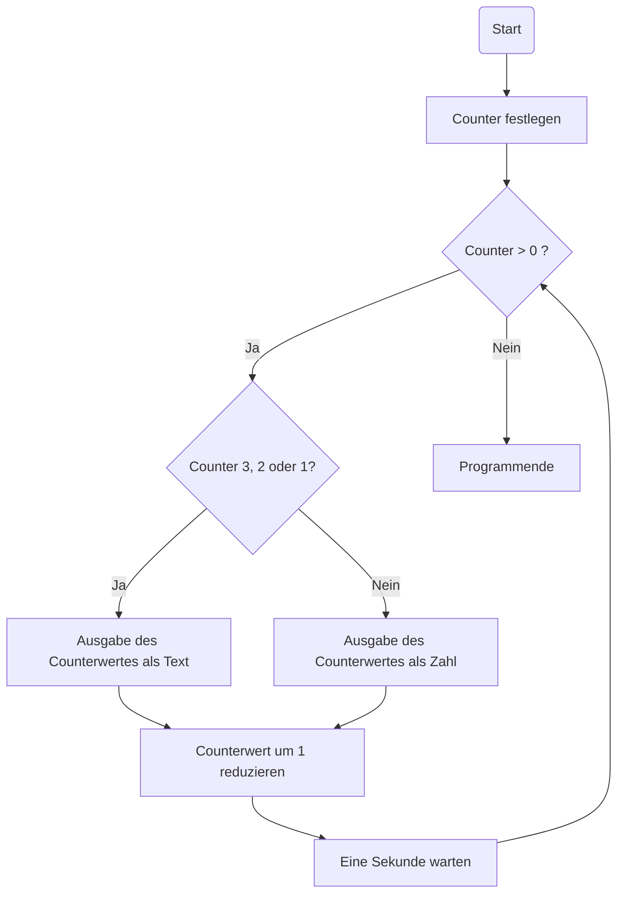

# Countdown-Applikation

## Aufgabe
Entwickle eine Countdown-Applikation, die nach dem Start von einer definierten Zahl (z.B. Sekunden) ausgehend runterzählt.

Eine solche Funktionalität findet in folgenden Beispielen Anwendung:

- Timer-App (Backofen etc.)
- Website-Countdown bis zum nächsten Sport-Event
- Starter-App für Skirennen
- Teilapp in Spielen (z.B. Stadt-Land-Fluss)
- Countdown in Computerspielen
- ...

## Beispielablauf
Die folgende Ausgabe zeigt einen Beispielablauf für die Startzahl 10:

```
DER COUNTDOWN LÄUFT ... 
10
9
8
7
6
5
4
DREI
Z W E I
E  I  N  S
... VÖLLIG LOSGELÖST ...
```
## Pseudocode
```
Wir legen zunächst Counter-Wert fest, von dem  aus wir sekündlich runterzählen möchten
Solange der Counter-Wert größer als 0 ist:
    Falls wir in den letzten drei Sekunden sind:
        Wir geben den aktuellen Counter-Wert als Wort ausgeschrieben aus
    Ansonsten:
        Wir geben den aktuellen Counter-Wert als Zahl aus 
    Wir warten eine Sekunde
    Wir vermindern den Counter-Wert um 1
```

## Ablaufplan / Flussdiagramm



## Python-Implementierung

```python
import time

counter = 10
print("DER COUNTDOWN LÄUFT ... ")
while counter > 0:
    if counter == 3:
        print("DREI")
    elif counter == 2:
        print("Z W E I")
    elif counter == 1:
        print("E  I  N  S")
    else:
        print(counter)
    counter = counter - 1
    time.sleep(1)
print("... VÖLLIG LOSGELÖST ...")

```