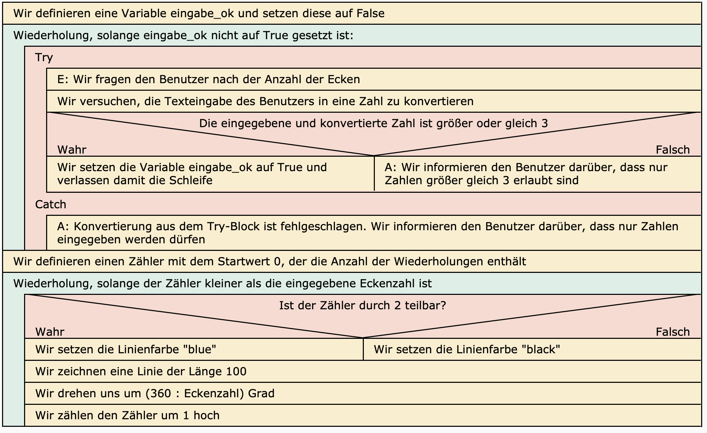
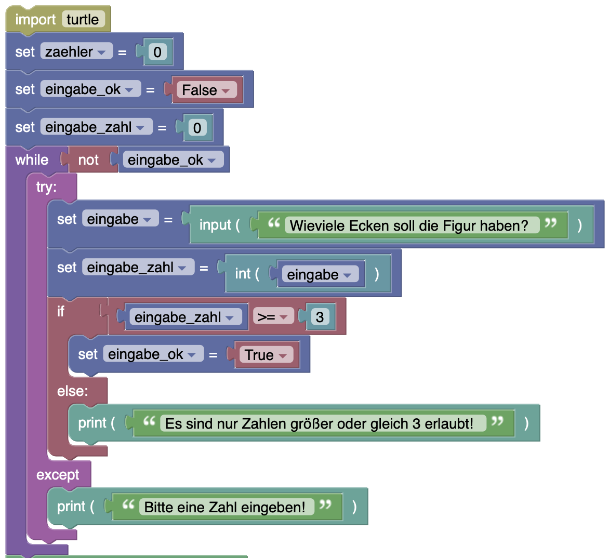
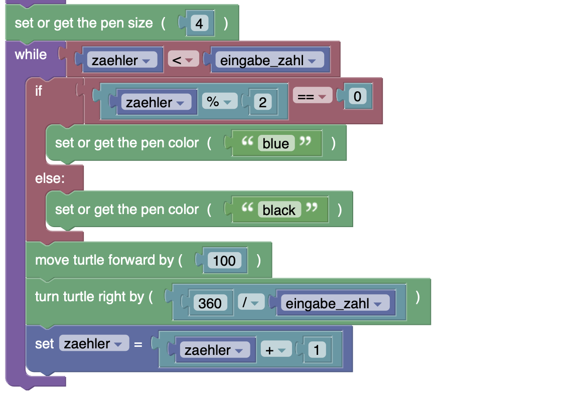

# POLYGONIX (Version 1.0 - Lernmodus)

## Problemstellung

### Ziel
Für die Volksschule Urgen soll eine Geometrie-App Namens POLYGONIX entwickelt werden, mit der Kinder geometrische Figuren kennenlernen können.
### Deine Rolle
Du bist Schüler:in im Fach Digitale Grundbildung.
### Zielgruppe
Die Zielgruppe für die App sind Volksschulkinder der 3. und 4. Klasse.
### Situation
Im Fach Digitale Grundbildung lernst du, wie man kleine Computerprogramme schreibt, mit denen man geometrische Figuren mittels Turtle-Grafik zeichnen kann. Nutze die erlangten Kompetenzen und hilf bei der Entwicklung der App.

### Produkt POLYGONIX
#### Funktionale Anforderungen (Endausbau)
Die App soll im Endausbau folgende Funktionen aufweisen:

1. LERNMODUS: Im Lernmodus der App sollen die Schüler:innen über eine Auswahl die Möglichkeit haben, verschiedene regelmäßige Polygone auf dem Bildschirm anzuzeigen (Quadrate, Dreiecke, Fünfecke etc.). Damit die Schüler:innen sich beim Zählen leichter tun, soll jede zweite Seite eine andere Farbe aufweisen.
2. ÜBUNGSMODUS: Im Übungsmodus der App bekommen die Schüler:innen ein zufälliges Polygon angezeigt, und sie müssen korrekt beantworten, um welche Art von Polygon es sich handelt.
3. STARTBILDSCHIRM: Nach dem Start der App, sollen die Kinder mit einem schönen Startbildschirm aus lauter geometrischen Figuren begrüßt werden.

#### POLYGONIX 1.0 (erster Prototyp)
Wie in der Softwareentwicklung üblich, wird das Produkt in mehreren Versionen ausgeliefert. **POLYGONIX 1.0** implementiert den LERNMODUS (nicht jedoch den STARTBILDSCHIRM oder den ÜBUNGSMODUS). Folgender Ablauf ist erwünscht (Eingabe - Verarbeitung - Ausgabe):

1. Die Schüler:innen starten die App.
2. Es folgt eine Aufforderung zur Eingabe der gewünschten Ecken-Anzahl. 
3. Die Eingabe muss eine positive Zahl größer gleich 3 sein. Falls das nicht der Fall ist, muss ein Hinweis erscheinen und die Schüler:innen müssen die Möglichkeit haben, erneut einzugeben (solange, bis eine korrekte Zahl eingegeben wurde). Das Programm darf nicht abstürzen.
4. Wenn die Eingabe korrekt war, wird auf dem Bildschirm ein regelmäßiges Polygon mit der erwünschten Anzahl von Ecken ausgegeben.

#### Didaktische Hinweise zur Vorgangsweise
Für jede Iteration durchlaufen wir die folgenden Phasen (ggf. auch iterativ):

* Problemanaylse (geistige Techniken, Lösungsansatz finden)
  * Abstraktion: Reduktion auf das für den Lösungsansatez Wesentliche
  * Generalisierung: Verallgemeinerung des Lösungsansatzes um Klassen von Problemen lösen zu können
  * Dekomposition: Gesamtproblem in Teilprobleme aufteilen, Teilprobleme lösen, Teilprobleme zu Gesamtlösung zusammenbauen; Teillösungen für Teilprobleme in Form von Programmbibliotheken nutzen
  * Mustererkennung: Muster im Lösungsansatz erkennen, die Automatisierungspotential enthalten
* Algorithmisierung (geistige Techniken, Algorithmus finden)
  * Nötige Konzepte identifizieren
  * Algorithmus in [Pseudocode](https://de.wikipedia.org/wiki/Pseudocode)
  * Algorithmus als [Struktogramm](https://www.inf-schule.de/imperative-programmierung/python/konzepte/ablaufmodellierung/konzept_kontrollstrukturen)
* Implementierung (praktische Techniken, Computerprogramm finden und testen)
  * Blockbasiert
  * Python

## POLYGONIX Version 0.1

### Problemanalyse

#### Abstraktion
Wir reduzieren das Problem zunächst auf das Zeichnen von Linien in verschiedenen Winkeln zueinander.

Ein Polygon besteht aus Kanten mit einer bestimmten Seitenlänge, die in einem bestimmen Winkel zueinander stehen.
#### Dekomposition
Funktionen: 
  - Ausgabe eines Quadrates mit Linien einer bestimmten Farbe;

Es werden folgende vorgefertigte Module (Teillösungen für Teilprobleme) verwendet: 
  - Wir verwenden das Turtle-Modul für das Zeichnen (Zeichnen von Linien, Drehung des Stiftes, Stiftfarbe)
### Algorithmisierung
#### Neue Konzepte
* [Programm / Quellcode / Anweisungen](https://www.inf-schule.de/imperative-programmierung/python/konzepte/programme/konzept_programme)
  * Kompilieren und interpretieren
  * [Syntaxfehler](https://www.inf-schule.de/imperative-programmierung/python/konzepte/fehler/exkurs_syntaxfehler)
* Werte (Literale)
* [Datentypen](https://www.inf-schule.de/imperative-programmierung/python/konzepte/datentypen/konzept_datentyp)
  * [Zahlen in Python](https://www.inf-schule.de/imperative-programmierung/python/konzepte/datentypen/exkurs_zahlen)
  * [Zeichenketten](https://www.inf-schule.de/imperative-programmierung/python/konzepte/zeichenketten/konzept_zeichenkette) in [Python](https://www.inf-schule.de/imperative-programmierung/python/konzepte/datentypen/exkurs_zeichenketten)
* [Funktionen](https://www.inf-schule.de/imperative-programmierung/python/konzepte/funktion/konzept_funktion)
* [Konstrollstrukturen](https://www.inf-schule.de/imperative-programmierung/python/konzepte/ablaufmodellierung/konzept_kontrollstrukturen):
  * Sequenzen von Anweisungen

#### Pseudocode
```python
Wir definieren die Linienfarbe "black"
Wir zeichnen eine Linie der Länge 100
Wir drehen uns um 120 Grad
Wir definieren die Linienfarbe "blue"
Wir zeichnen eine Linie der Länge 100
Wir drehen uns um 120 Grad
Wir definieren die Linienfarbe "black"
Wir zeichnen eine Linie der Länge 100
Wir drehen uns um 120 Grad
```
#### Struktogramm


### Implementierung

#### Blöcke

#### Python-Code
```python
import turtle
turtle.pensize(4)
turtle.fillcolor('yellow')
turtle.pencolor('black')
turtle.forward(100)
turtle.right(120)
turtle.pencolor('blue')
turtle.forward(100)
turtle.right(120)
turtle.pencolor('black')
turtle.forward(100)
turtle.right(120)
```
## POLYGONIX Version 0.2

### Problemanalyse
#### Dekomposition
Funktionen: 
  - Benutzer:in gibt 3 oder 4 ein
  - Es folgt eine entsprechende Ausgabe eiens gleichseitigen Dreiecks oder eines Quadrats.
  - Es folgt eine Fehlermeldung, falls der Benutzer nicht die Zahlen 3 oder 4 eingegeben hat.

Es werden folgende vorgefertigte Module (Teillösungen für Teilprobleme) verwendet: 
  - Teillösung: Wir verwenden die Print-Funktion für Ausgaben an den Benutzer
  - Teillösung: Wir verwenden die Input-Funktion für Eingaben des Benutzers
#### Abstraktion
Wir benötigen als Eingabe lediglich eine Zahl, die wir uns für das Zeichnen des Polygons merken müssen. Auf Basis dieser Zahl entscheiden wir, ob wir ein Dreieck oder ein Viereck ausgeben.
### Algorithmisierung
#### Neue Konzepte

* [Programm / Quellcode / Anweisungen](https://www.inf-schule.de/imperative-programmierung/python/konzepte/programme/konzept_programme)
  * [Laufzeitfehler](https://www.inf-schule.de/imperative-programmierung/python/konzepte/fehler/exkurs_laufzeitfehler)
  * [Logische Fehler](https://www.inf-schule.de/imperative-programmierung/python/konzepte/fehler/exkurs_logischefehler)
* [Eingabe - Verarbeitung - Ausgabe (EVA)](https://www.inf-schule.de/imperative-programmierung/python/konzepte/programme/konzept_eva) in [Python](https://www.inf-schule.de/imperative-programmierung/python/konzepte/programme/exkurs_eingabeausgabe)
* [Bedingungen](https://www.inf-schule.de/imperative-programmierung/python/konzepte/bedingungen/konzept_bedingungen)
* [Logische Verknüpfungen](https://www.inf-schule.de/imperative-programmierung/python/konzepte/bedingungen/konzept_logischeverknuepfungen)
* [Variablen](https://www.inf-schule.de/imperative-programmierung/python/konzepte/variablen/konzept_variable) / Sichtbarkeit / Gültigkeit
* [Zuweisung (Assignment)](https://www.inf-schule.de/imperative-programmierung/python/konzepte/variablen/konzept_zuweisung)
* [Datentypen](https://www.inf-schule.de/imperative-programmierung/python/konzepte/datentypen/konzept_datentyp)
  * [Wahrheitswerte in Python](https://www.inf-schule.de/imperative-programmierung/python/konzepte/datentypen/exkurs_wahrheitswerte)
  * [Typumwandlung in Python](https://www.inf-schule.de/imperative-programmierung/python/konzepte/datentypen/exkurs_typumwandlungen)
* [Konstrollstrukturen](https://www.inf-schule.de/imperative-programmierung/python/konzepte/ablaufmodellierung/konzept_kontrollstrukturen):
  * [Fallunterscheidung (bedingte Verzweigungen)](https://www.inf-schule.de/imperative-programmierung/python/konzepte/entscheidungen/konzept_fallunterscheidungen)

#### Pseudocode
```python
Wir fragen den Benutzer nach der Anzahl der Ecken, konvertieren die Texteingabe in eine Zahl und merken uns die Zahl.
Wenn der Benutzer 3 eingegeben hat:
    Wir definieren die Linienfarbe "black"
    Wir zeichnen eine Linie der Länge 100
    Wir drehen uns um 120 Grad
    Wir definieren die Linienfarbe "blue"
    Wir zeichnen eine Linie der Länge 100
    Wir drehen uns um 120 Grad
    Wir definieren die Linienfarbe "black"
    Wir zeichnen eine Linie der Länge 100
    Wir drehen uns um 120 Grad
Sonst:
    Wenn der Benutzer 4 eingegeben hat:
        Wir definieren die Linienfarbe "black"
        Wir zeichnen eine Linie der Länge 100
        Wir drehen uns um 90 Grad
        Wir definieren die Linienfarbe "blue"
        Wir zeichnen eine Linie der Länge 100
        Wir drehen uns um 90 Grad
        Wir definieren die Linienfarbe "black"
        Wir zeichnen eine Linie der Länge 100
        Wir drehen uns um 90 Grad
        Wir definieren die Linienfarbe "blue"
        Wir zeichnen eine Linie der Länge 100
        Wir drehen uns um 90 Grad
    Sonst:
        Wir geben eine Information aus, dass das noch nicht unterstützt wird.
```
#### Struktogramm


### Implementierung
#### Blöcke 


#### Python
```python
import turtle
eingabe = input("Wieviele Ecken soll die Figur haben?")
eingabe_zahl = int(eingabe) #Konvertierung von Text in Zahl
turtle.pensize(4)
if eingabe_zahl == 3:
    turtle.pencolor('black')
    turtle.forward(100)
    turtle.right(120)
    turtle.pencolor('blue')
    turtle.forward(100)
    turtle.right(120)
    turtle.pencolor('black')
    turtle.forward(100)
    turtle.right(120)
else:
    if eingabe_zahl == 4:
        turtle.pencolor('black')
        turtle.forward(100)
        turtle.right(90)
        turtle.pencolor('blue')
        turtle.forward(100)
        turtle.right(90)
        turtle.pencolor('black')
        turtle.forward(100)
        turtle.right(90)
        turtle.pencolor('blue')
        turtle.forward(100)
        turtle.right(90)
    else:
        print("Das Programm unterstützt aktuell nur Dreiecke oder Vierecke.")
```
## POLYGONIX Version 0.3
### Problemanalyse
#### Dekomposition
Funktionen: 
  - Wir generalisieren unsere Lösung, sodass sie mit beliebig vielen Ecken zurechtkommt, d.h. beliebige regelmäßige Polygone (gleichseitige Dreicke, Vierecke, Fünfecke etc.) zeichnen kann.
  - Einschränkung: Wir zeichnen vorerst alle Seiten in der selben Farbe
#### Generalisierung
Es gilt folgende Regel: In einem regelmäßigen Polygon muss die Summe aller Winkel 360 Grad ergeben.

* Für ein Dreieck (3 Seiten) zeichnen wir 3 Kanten, jeweils in einem Winkel von 360 : 3 = 120 Grad zueinander.
* Für ein Quadrat (4 Seiten) zeichnen wir 4 Kanten, jeweils in einem Winkel von 360 : 4 = 90 Grad zueinander.
* Für ein Fünfeck (5 Seiten) zeichnen wir 5 Kanten, jeweils in einem Winkel von 360 : 5 = 72 Grad zueinander.
* Für ein Sechsecke (6 Seiten) zeichnen wir 6 Kanten, jeweils in einem Winkel von 360 : 6 = 60 Grad zueinander.
#### Mustererkennung
Die **Grad** in einem regelmäßigen Polygon offensichtlich abhänging von der Anzahl der Ecken. 

Die Anzahl der Ecken spielt außerdem auch eine wichtige Rolle, beim Zeichnen der Polygone, weil sie auch die **Anzahl der zu zeichnenden Seiten** bestimmt.

Für ein Dreieck gehen wir wie folgt vor:
1. Wir zeichnen eine Linie in einer bestimmten Farbe
   Wir drehen uns um 120 Grad
2. Wir zeichnen eine Linie in einer bestimmten Farbe
   Wir drehen uns um 120 Grad
3. Wir zeichnen eine Linie in einer bestimmten Farbe
   Wir drehen uns um 120 Grad

Für ein Viereck gehen wir wie folgt vor:
1. Wir zeichnen eine Linie in einer bestimmten Farbe
   Wir drehen uns um 90 Grad
2. Wir zeichnen eine Linie in einer bestimmten Farbe
   Wir drehen uns um 90 Grad
3. Wir zeichnen eine Linie in einer bestimmten Farbe
   Wir drehen uns um 90 Grad
4. Wir zeichnen eine Linie in einer bestimmten Farbe
   Wir drehen uns um 90 Grad

Für ein Fünfeck gehen wir wie folgt vor:
1. Wir zeichnen eine Linie in einer bestimmten Farbe
   Wir drehen uns um 72 Grad
2. Wir zeichnen eine Linie in einer bestimmten Farbe
   Wir drehen uns um 72 Grad
3. Wir zeichnen eine Linie in einer bestimmten Farbe
   Wir drehen uns um 72 Grad
4. Wir zeichnen eine Linie in einer bestimmten Farbe
   Wir drehen uns um 72 Grad
5. Wir zeichnen eine Linie in einer bestimmten Farbe
   Wir drehen uns um 72 Grad

usw.
### Algorithmisierung

#### Neue Konzepte
* [Datentypen](https://www.inf-schule.de/imperative-programmierung/python/konzepte/datentypen/konzept_datentyp)
  * [Zahlen in Python](https://www.inf-schule.de/imperative-programmierung/python/konzepte/datentypen/exkurs_zahlen) - rechnen und vergleichen von Zahlen
* [Konstrollstrukturen](https://www.inf-schule.de/imperative-programmierung/python/konzepte/ablaufmodellierung/konzept_kontrollstrukturen):
  * [Wiederholung (Schleifen)](https://www.inf-schule.de/imperative-programmierung/python/konzepte/wiederholungen/konzept_wiederholungen)
#### Pseudocode

```python
Wir fragen den Benutzer nach der Anzahl der Ecken, konvertieren die Texteingabe in eine Zahl und merken uns die Zahl.
Wir definieren die Linienfarbe "black".
Wir definieren einen Zähler mit dem Startwert 0, der die Anzahl der Wiederholungen enthält.
Wir wiederholen solange der Zähler kleiner als die eingegebene Anzahl von Ecken ist:
    Wir zeichnen eine Linie der Länge 100
    Wir drehen uns um (360 : anzahl_ecken) Grad
    Wir zählen den Zähler um 1 hoch.
```
#### Struktogramm


### Implementierung

#### Blöcke


#### Python

```python
import turtle
eingabe = input("Wieviele Ecken soll die Figur haben?")
eingabe_zahl = int(eingabe)
zaehler = 0
turtle.pensize(4)
turtle.pencolor('black')
while zaehler < eingabe_zahl:
    turtle.forward(100)
    turtle.right(360/eingabe_zahl)
    zaehler = zaehler + 1
```

## POLYGONIX Version 0.4
### Problemanalyse
#### Dekomposition
Funktionen: 
  - Wir zeichnen jede zweite Linie der Figuren abwechselnd mit einer anderen Farbe

Lösung des Teilproblems Gerade/Ungerade: 
  - Wir prüfen den Schleifenzähler. Wenn der Schleifenzähler dividiert durch 2 den Rest 0 ergibt, dann verwenden wir eine andere Farbe.

#### Mustererkennung
Laut Spezifikation müssen wir zumindest jede zweite Seite in einer anderen Farbe ausgeben, also z.B.: 

1. Seite: Farbe Schwarz
2. Seite: Farbe Blau
3. Seite: Farbe Schwarz
4. Seite: Farbe Blau
5. ...

Die Farbe wechselt also mit jeder Seite, die wir zeichnen.
### Algorithmisierung
#### Neue Konzepte
keine
#### Pseudocode
```python
Wir fragen den Benutzer nach der Anzahl der Ecken, konvertieren die Texteingabe in eine Zahl und merken uns die Zahl.
Wir definieren einen Zähler mit dem Startwert 0, der die Anzahl der Wiederholungen enthält.
Wir wiederholen solange der Zähler kleiner als die eingegebene Anzahl von Ecken ist:
    Wenn der Zähler durch 2 teilbar ist (ergibt also Zähler dividiert durch 2 den Rest 0):
        Wir setzen die Linienfarbe "blue"
    Ansonsten:
        Wir setzen die Linienfarbe "black"
    Wir zeichnen eine Linie der Länge 100
    Wir drehen uns um (360 : anzahl_ecken) Grad
    Wir zählen den Zähler um 1 hoch.
```
Für die Lösung der Farbenthematik wäre auch folgender Lösungsansatz (ohne Rest-Berechnung) möglich:

```python
Wir fragen den Benutzer nach der Anzahl der Ecken, konvertieren die Texteingabe in eine Zahl und merken uns die Zahl.
Wir definieren einen Zähler mit dem Startwert 0, der die Anzahl der Wiederholungen enthält.
Wir definieren eine Variable farbenwechsel als Wahrheitswert (True/False) und setzen diese auf False
Wir wiederholen solange der Zähler kleiner als die eingegebene Anzahl von Ecken ist:
    Wenn farbenwechsel True ist:
        Wir setzen die Linienfarbe "blue"
        Wir ändern farbenwechsel auf False
    Ansonsten:
        Wir setzen die Linienfarbe "black"
        Wir ändern farbenwechsel auf True
    Wir zeichnen eine Linie der Länge 100
    Wir drehen uns um (360 : anzahl_ecken) Grad
    Wir zählen den Zähler um 1 hoch.
```

#### Struktogramm


### Implementierung
#### Blöcke


#### Python
```python
import turtle
eingabe = input("Wieviele Ecken soll die Figur haben?")
eingabe_zahl = int(eingabe)
zaehler = 0
turtle.pensize(4)
while zaehler < eingabe_zahl:
    if zaehler % 2 == 0: # Rest bei Division durch 2 gleich 0?
        turtle.pencolor('blue')
    else:
        turtle.pencolor('black')
    turtle.forward(100)
    turtle.right(360/eingabe_zahl)
    zaehler = zaehler + 1
```
## POLYGONIX VERSION 1.0
### Problemanalyse
#### Dekomposition
Funktionen:
  - Wir stellen sicher, dass der Benutzer nur Zaheln >= 3 eingeben kann.
  
Teillösungen für Teilprobleme:
  - Wir benötigen eine Teillösung für die Prüfung der Korrektheit der Benutzereingabe. 
### Algorithmisierung
#### Neue Konzepte
* [Konstrollstrukturen](https://www.inf-schule.de/imperative-programmierung/python/konzepte/ablaufmodellierung/konzept_kontrollstrukturen):
  * [Ausnahmebehandlung](https://www.w3schools.com/python/python_try_except.asp)
#### Pseudocode
```python
Wir definieren eine Variable eingabe_ok und setzen diese auf False
Solange eingabe_ok nicht auf True gesetzt ist:
    Der Benutzer wird aufgefordert, eine Zahl größer gleich 3 einzugeben.
    Wir versuchen die Eingabe in eine Zahl zu konvertieren.
    Wenn die Konvertierung gelingt:
        Wenn die Zahl größer gleich 3 ist:
            Es liegt eine korrekte Benutzereingabe vor. Wir setzen die Variable eingabe_ok auf True und verlassen damit die Schleife
        Sonst:
            Wir informieren den Benutzer darüber, dass nur Zahlen größer gleich 3 erlaubt sind
    Sonst:
        Konvertierung ist fehlgeschlagen. Wir informieren den Benutzer darüber, dass nur Zahlen erlaubt sind.
Wir definieren einen Zähler mit dem Startwert 0, der die Anzahl der Wiederholungen enthält.
Wir wiederholen solange der Zähler kleiner als die eingegebene Anzahl von Ecken ist:
    Wenn der Zähler durch 2 teilbar ist:
        Wir setzen die Linienfarbe "blue"
    Ansonsten:
        Wir setzen die Linienfarbe "black"
    Wir zeichnen eine Linie der Länge 100
    Wir drehen uns um (360 : anzahl_ecken) Grad
    Wir zählen den Zähler um 1 hoch.
```
#### Struktogramm


### Implementierung
#### Blöcke



#### Python
```python
import turtle
zaehler = 0
eingabe_ok = False
eingabe_zahl = 0
while not eingabe_ok:
    try:
        eingabe = input("Wieviele Ecken soll die Figur haben?")
        eingabe_zahl = int(eingabe)
        if eingabe_zahl >= 3:
            eingabe_ok = True
        else:
            print("Es sind nur Zahlen größer oder gleich 3 erlaubt!")
    except:
        print("Bitte eine Zahl eingeben!")
turtle.pensize(4)
while zaehler < eingabe_zahl:
    if zaehler % 2 == 0:
        turtle.pencolor('blue')
    else:
        turtle.pencolor('black')
    turtle.forward(100)
    turtle.right(360/eingabe_zahl)
    zaehler = zaehler + 1
```

## Ideen für das eigene Portfolio-Projekt
 - Suche dir zunächst eine passende Problemstellung:
   - [Projekte aus der VO]([../../README.md])
   - [Miniprojekte auf Inf-Schule.de](https://www.inf-schule.de/imperative-programmierung/python/projekte)
   - Beispielprojekte aus programmierkonzepte.ch
     - [TigerJython-Projekt](https://www.tigerjython.ch/de/tutorials)
     - [TigerJython for Kids](https://www.tigerjython4kids.ch)
     - [Programmierkonzepte](https://programmierkonzepte.ch)
     - [Grafik, Robotik, Datenbanken, Spiele](https://www.jython.ch)
     - [Python online](https://python-online.ch)
   - [Schulbuch](https://microbit.eeducation.at/wiki/Hauptseite)
   - [Unterlagen für weitere Projektideen](../../../Didaktik/README.md)
   - Die Problemstellung soll es erlauben, die für den Lehrplan nötigen Konzepte im Unterricht zu thematisieren.
 - Tutorial erstellen:
   - Erstelle eine fertige Anleitung zur Lösung der Problemstellung im Format des in dieser Datei beschriebenen POLYGONIX-Beispiels.
     - Die Lösung soll iterativ in mehreren Teillösungen / Versionen erfolgen
     - Für jede Teillösung / Version / Iteration wird folgender Zyklus durchlaufen (siehe dazu auch [die zentralen Ideen der Programmierung im Unterricht](../../../Didaktik/Zentrale-Ideen.md))
       - Problemanalyse
         - Dekomposition
         - Abstraktion
         - Mustererkennung
         - Generalisierung
       - Algorithmisierung
         - Sprachkonzepte identifizieren und einführen
         - Struktogramm / Flussdiagramm zeichnen
         - Pseudocode formulieren
       - Implementierung und Test
         - mit IDE und Sprache der Wahl Pseudocode umsetzen
         - Testen
         - Debuggen
 - Erstelle eine kleine Unterrichtsplanung dazu:
   - Zielehierarchie
     - ausgehend vom Lehrplan
     - zentrale Konzepte / Ideen ableiten
     - Transferziel, Erkenntnisziel, Fakten, Fertigkeiten ableiten
   - Lernzielkontrolle 
     - in Form einer ähnlichen Problemstellung (Fokus Transfer)
     - Fokussiert auf die umfassende Kontrolle der Zieldimension
   - Stundenverlauf
     - Kern ist die fertige Anleitung oben
     - Eingebettet wird diese Anleitung in ein klassisches didaktisches Design, z.B [Gagné](https://www.niu.edu/citl/resources/guides/instructional-guide/gagnes-nine-events-of-instruction.shtml).
        1. Aufmerksamkeit erregen
        2. Ziele bekannt geben
        3. Vorwissen aktivieren
        4. Input (Konzepte + Werkzeuge)
        5. Lerngerüste
        6. Übungsphasen
        7. Feedback
        8. Kompetenzcheck
        9. Transfer einüben