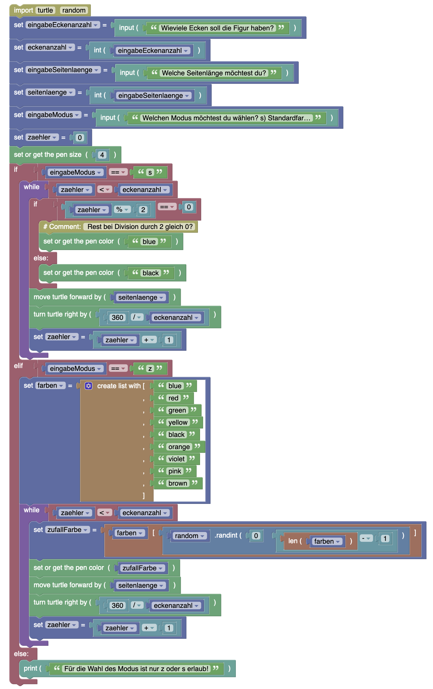

# POLYGONIX

## Problemstellung

### Ziel
Für die Volksschule Urgen soll eine Geometrie-App Namens POLYGONIX entwickelt werden, mit der Kinder geometrische Figuren kennenlernen können.

**Hinweis**: Als Beispiel für ein ähnliches reales Projekt, das Online-Lernspiele für Volksschüler:innen implementiert, kann z. B. auf das [Wiki-Projekt](https://wiki-imst.tsn.at/spiele/web/lernspiele/index) der HAK Imst verwiesen werden.

### Deine Rolle
Du bist Schüler:in im Fach Digitale Grundbildung. Du setzte die Kompetenzen aus dem Unterricht ein, um eine hilfreiche App für Volksschulkinder zu entwickeln.

### Zielgruppe
Die Zielgruppe für die App sind Kinder der 3. und 4. Klasse Volksschule.

### Situation
Im Fach Digitale Grundbildung lernst du, wie man kleine Computerprogramme schreibt, mit denen man geometrische Figuren mittels Turtle-Grafik zeichnen kann. Nutze die erlangten Kompetenzen und hilf bei der Entwicklung der App.

### Produkt POLYGONIX

#### Funktionale Anforderungen ENDAUSBAU
Die App soll im Endausbau folgende Modi bzw. Module aufweisen:

1. LERNMODUS: Im Lernmodus der App sollen die Schüler:innen über eine Auswahl die Möglichkeit haben, verschiedene regelmäßige Polygone auf dem Bildschirm anzuzeigen (Quadrate, Dreiecke, Fünfecke etc.). Damit die Schüler:innen sich beim Zählen leichter tun, soll jede Seite eine andere Farbe aufweisen.
2. ÜBUNGSMODUS: Im Übungsmodus der App bekommen die Schüler:innen ein zufälliges Polygon angezeigt, und sie müssen korrekt beantworten, um welche Art von Polygon es sich handelt.
3. STARTBILDSCHIRM: Nach dem Start der App, sollen die Kinder mit einem schönen Startbildschirm aus lauter geometrischen Figuren begrüßt werden.

#### Funktionale Anforderungen LERNMODUS
Wie in der Softwareentwicklung üblich, wird das Produkt in mehreren Versionen ausgeliefert. **POLYGONIX 1.0** implementiert nur den LERNMODUS (nicht jedoch den STARTBILDSCHIRM oder den ÜBUNGSMODUS). 

Folgende Benutzer:innen-Erfahrung soll für den LERNMODUS realisiert werden:

1. Die Schüler:innen starten die App.
2. Es folgt eine Aufforderung zur Eingabe der gewünschten Ecken-Anzahl. Die Eingabe muss eine positive Zahl größer gleich 3 sein. Falls das nicht der Fall ist, muss ein Hinweis erscheinen und die Schüler:innen müssen die Möglichkeit haben, erneut einzugeben (solange, bis eine korrekte Zahl eingegeben wurde). Das Programm darf nicht abstürzen.
3. Es folgt eine Aufforderung zur Eingabe der gewünschten Seitenlänge. Die Eingabe muss wieder eine positive Zahl sein.
4. Es folgt die Frage, ober Benutzer zufällige Farben für die Kanten möchte, oder selbst eine Farbe bestimmen möchte. Wenn selbst eine Farbe bestimmt werden möchte, dann wird eine Liste mit den möglichen Farben angezeigt. Die gewünschte Farbe muss eingegeben werden.
5. Wenn alle Eingaben erledigt sind, wird ein entsprechendes Polygon am Bildschirm gezeichnet.

#### Didaktische Hinweise zur Vorgangsweise
Wir entwickeln das den POLYGONIX LERNMODUS in mehreren Iterationen. Am Ende einer Iteration entsteht jeweils eine ausprobiere Version unserer Software, die Teile der gewünschten Gesamtfunktionalität realisiert. 

Für jede Iteration wählen wir dazu Teilfunktionalitäten der oben dargestellten gesamtheitlichen Benutzererfahrung aus, planen deren Implementierung und realisieren die Implementierung.

Für jede Iteration durchlaufen wir (iterativ) dazu die folgenden Phasen:

1. **Problemanaylse** und **Lösungsansätze** entwickeln:
  * Abstraktion: Reduktion auf das für den Lösungsansatz Wesentliche
  * Generalisierung: Verallgemeinerung des Lösungsansatzes um Klassen von Problemen lösen zu können
  * Dekomposition: 
    * Gesamtproblem in Teilprobleme aufteilen, Teilprobleme lösen, Teilprobleme zu Gesamtlösung zusammenbauen
    * Teillösungen für Teilprobleme in Form von Programmbibliotheken nutzen
  * Mustererkennung: Muster im Lösungsansatz erkennen, die Automatisierungspotential enthalten
  * Lösungsansätze beschreiben
2. **Algorithmisierung**
  * Identifikation der nötigen Konzepte aus dem gewählten Werkzeugkasten / Paradigma
  * Algorithmus in [Pseudocode](https://de.wikipedia.org/wiki/Pseudocode) beschreiben
  * Algorithmus grafisch darstellen, d.h. z.B. als:
    * [Struktogramm](https://www.inf-schule.de/imperative-programmierung/python/konzepte/ablaufmodellierung/konzept_kontrollstrukturen)
    * [Ablaufdiagramm](https://en.wikipedia.org/wiki/Flowchart)
    * [Zustandsdiagramm](https://de.wikipedia.org/wiki/Zustandsübergangsdiagramm)
    * etc.
3. **Implementierung** und **Test**
  * blockbasiert
  * Python-Code

**Hinweis**: In der Softwareentwicklung sind agile Vorgehensmodelle wie etwa [SCRUM](https://de.wikipedia.org/wiki/Scrum) üblich. Unsere Vorgangsweise einer schrittweisen Implementierung von Software im Rahmen von Iterationen, in denen jeweils Teilfunktionalitäten zur Implementierung ausgewählt werden, die dann in einem ausprobierbaren Prototypen resultieren, stellt eine vereinfachte Form eines solchen Vorgehensmodells dar und kann auch als Methodik für den Unterricht verwendet werden.

## POLYGONIX Version 0.1

### Problemanalyse / Lösungsansätze 

#### Dekomposition
Funktionen: 
  - Ausgabe eines Quadrates mit Linien einer bestimmten Farbe

Es werden folgende vorgefertigte Module (Teillösungen für Teilprobleme) verwendet: 
  - Wir verwenden die Funktionen des [Python-Turtle-Moduls](https://docs.python.org/3/library/turtle.html) für das Zeichnen von Linien, 
  - die Drehung des Stiftes,
  - das Setzen der Stiftfarbe.

#### Abstraktion
Wir reduzieren das Problem zunächst auf das Zeichnen von Linien in verschiedenen Winkeln zueinander.

Ein Polygon besteht aus Kanten mit einer bestimmten Seitenlänge, die in einem bestimmen Winkel zueinander stehen. 

### Algorithmisierung
#### Neue Konzepte
* [Programm / Quellcode / Anweisungen](https://www.inf-schule.de/imperative-programmierung/python/konzepte/programme/konzept_programme)
  * Kompilieren und interpretieren
  * [Syntaxfehler](https://www.inf-schule.de/imperative-programmierung/python/konzepte/fehler/exkurs_syntaxfehler)
* Werte (Literale)
* [Datentypen](https://www.inf-schule.de/imperative-programmierung/python/konzepte/datentypen/konzept_datentyp)
  * [Zahlen in Python](https://www.inf-schule.de/imperative-programmierung/python/konzepte/datentypen/exkurs_zahlen)
  * [Zeichenketten](https://www.inf-schule.de/imperative-programmierung/python/konzepte/zeichenketten/konzept_zeichenkette) in [Python](https://www.inf-schule.de/imperative-programmierung/python/konzepte/datentypen/exkurs_zeichenketten)
* [Funktionen](https://www.inf-schule.de/imperative-programmierung/python/konzepte/funktion/konzept_funktion)
* [Kontrollstrukturen](https://www.inf-schule.de/imperative-programmierung/python/konzepte/ablaufmodellierung/konzept_kontrollstrukturen):
  * Sequenzen von Anweisungen

#### Pseudocode
```python
Wir definieren die Linienfarbe "black"
Wir zeichnen eine Linie der Länge 100
Wir drehen uns um 120 Grad
Wir definieren die Linienfarbe "blue"
Wir zeichnen eine Linie der Länge 100
Wir drehen uns um 120 Grad
Wir definieren die Linienfarbe "black"
Wir zeichnen eine Linie der Länge 100
Wir drehen uns um 120 Grad
```
#### Struktogramm


### Implementierung

#### Blöcke


#### Python-Code
```python
import turtle
turtle.pensize(4)
turtle.fillcolor('yellow')
turtle.pencolor('black')
turtle.forward(100)
turtle.right(120)
turtle.pencolor('blue')
turtle.forward(100)
turtle.right(120)
turtle.pencolor('black')
turtle.forward(100)
turtle.right(120)
```

**Hinweis**: Je nach Pyhton-Ausführungsumgebung muss am Ende der Scripte die mit der Turtle-Bibliothek arbeiten, das Statement der Art `turtle.mainloop()` platziert werden, damit das Turtle-Fenster nicht sofort nach Ende des Python-Scriptes schließt.

**Hinweis**: Die Turtle-Funktionen können in Python auch objektorientiert verwendet werden. Dazu geht man wie folgt vor:

```pyhton
from turtle import Turtle
myTurtle = Turtle()
myTurtle.forward(100)
#... usw. ...
myTurtle.screen.mainloop()
```
Details zum Turtle-Modul sind auf der offiziellen Dokumentation des [Python-Turtle-Moduls](https://docs.python.org/3/library/turtle.html) zu finden.

## POLYGONIX Version 0.2

### Problemanalyse / Lösungsansätze

#### Dekomposition

Funktionen: 
  - Benutzer:in gibt 3 oder 4 ein
  - Es folgt eine entsprechende Ausgabe eines gleichseitigen Dreiecks oder eines Quadrats.
  - Es folgt eine Fehlermeldung, falls der Benutzer nicht die Zahlen 3 oder 4 eingegeben hat.

Es werden folgende vorgefertigte Module (Teillösungen für Teilprobleme) verwendet: 
  - Teillösung: Wir verwenden die Print-Funktion für Ausgaben an den Benutzer
  - Teillösung: Wir verwenden die Input-Funktion für Eingaben des Benutzers

#### Abstraktion

Wir benötigen als Eingabe lediglich eine Zahl, die wir uns für das Zeichnen des Polygons merken müssen. Auf Basis dieser Zahl entscheiden wir, ob wir ein Dreieck oder ein Viereck ausgeben. 

Für die Verarbeitung von Entscheidungen des Benutzers verwenden wir bedingte Verzweigungen (If). Diese ermöglichen uns in Abhängigkeit bestimmter Bedingungen Codeblöcke auszuführen oder nicht.

### Algorithmisierung

#### Neue Konzepte

* [Programm / Quellcode / Anweisungen](https://www.inf-schule.de/imperative-programmierung/python/konzepte/programme/konzept_programme)
  * [Laufzeitfehler](https://www.inf-schule.de/imperative-programmierung/python/konzepte/fehler/exkurs_laufzeitfehler)
  * [Logische Fehler](https://www.inf-schule.de/imperative-programmierung/python/konzepte/fehler/exkurs_logischefehler)
* [Eingabe - Verarbeitung - Ausgabe (EVA)](https://www.inf-schule.de/imperative-programmierung/python/konzepte/programme/konzept_eva) in [Python](https://www.inf-schule.de/imperative-programmierung/python/konzepte/programme/exkurs_eingabeausgabe)
* [Bedingungen](https://www.inf-schule.de/imperative-programmierung/python/konzepte/bedingungen/konzept_bedingungen)
* [Logische Verknüpfungen](https://www.inf-schule.de/imperative-programmierung/python/konzepte/bedingungen/konzept_logischeverknuepfungen)
* [Variablen](https://www.inf-schule.de/imperative-programmierung/python/konzepte/variablen/konzept_variable) / Sichtbarkeit / Gültigkeit
* [Zuweisung (Assignment)](https://www.inf-schule.de/imperative-programmierung/python/konzepte/variablen/konzept_zuweisung)
* [Datentypen](https://www.inf-schule.de/imperative-programmierung/python/konzepte/datentypen/konzept_datentyp)
  * [Wahrheitswerte in Python](https://www.inf-schule.de/imperative-programmierung/python/konzepte/datentypen/exkurs_wahrheitswerte)
  * [Typumwandlung in Python](https://www.inf-schule.de/imperative-programmierung/python/konzepte/datentypen/exkurs_typumwandlungen)
* [Kontrollstrukturen](https://www.inf-schule.de/imperative-programmierung/python/konzepte/ablaufmodellierung/konzept_kontrollstrukturen)
  * [Fallunterscheidung (bedingte Verzweigungen)](https://www.inf-schule.de/imperative-programmierung/python/konzepte/entscheidungen/konzept_fallunterscheidungen)

#### Pseudocode
```python
Wir fragen den Benutzer nach der Anzahl der Ecken, konvertieren die Texteingabe in eine Zahl und merken uns die Zahl.
Wenn der Benutzer 3 eingegeben hat:
    Wir definieren die Linienfarbe "black"
    Wir zeichnen eine Linie der Länge 100
    Wir drehen uns um 120 Grad
    Wir definieren die Linienfarbe "blue"
    Wir zeichnen eine Linie der Länge 100
    Wir drehen uns um 120 Grad
    Wir definieren die Linienfarbe "black"
    Wir zeichnen eine Linie der Länge 100
    Wir drehen uns um 120 Grad
Sonst:
    Wenn der Benutzer 4 eingegeben hat:
        Wir definieren die Linienfarbe "black"
        Wir zeichnen eine Linie der Länge 100
        Wir drehen uns um 90 Grad
        Wir definieren die Linienfarbe "blue"
        Wir zeichnen eine Linie der Länge 100
        Wir drehen uns um 90 Grad
        Wir definieren die Linienfarbe "black"
        Wir zeichnen eine Linie der Länge 100
        Wir drehen uns um 90 Grad
        Wir definieren die Linienfarbe "blue"
        Wir zeichnen eine Linie der Länge 100
        Wir drehen uns um 90 Grad
    Sonst:
        Wir geben eine Information aus, dass das noch nicht unterstützt wird.
```
#### Struktogramm


### Implementierung
#### Blöcke 


#### Python
```python
import turtle
eingabe = input("Wieviele Ecken soll die Figur haben?")
eingabe_zahl = int(eingabe) #Konvertierung von Text in Zahl
turtle.pensize(4)
if eingabe_zahl == 3:
    turtle.pencolor('black')
    turtle.forward(100)
    turtle.right(120)
    turtle.pencolor('blue')
    turtle.forward(100)
    turtle.right(120)
    turtle.pencolor('black')
    turtle.forward(100)
    turtle.right(120)
else:
    if eingabe_zahl == 4:
        turtle.pencolor('black')
        turtle.forward(100)
        turtle.right(90)
        turtle.pencolor('blue')
        turtle.forward(100)
        turtle.right(90)
        turtle.pencolor('black')
        turtle.forward(100)
        turtle.right(90)
        turtle.pencolor('blue')
        turtle.forward(100)
        turtle.right(90)
    else:
        print("Das Programm unterstützt aktuell nur Dreiecke oder Vierecke.")
```
## POLYGONIX Version 0.3

### Problemanalyse / Lösungsansätze

#### Dekomposition

Funktionen: 
  - Das Programm kann mit beliebig vielen Ecken zurechtkommen, d.h. beliebige regelmäßige Polygone (gleichseitige Dreicke, Vierecke, Fünfecke etc.).
  - Einschränkung: Wir zeichnen vorerst alle Seiten in derselben Farbe.

#### Generalisierung
Zur Verallgemeinerung der vorhergehenden Lösung beobachten wir folgenden Zusammenhang:

* Für ein Dreieck (3 Seiten) zeichnen wir 3 Kanten, jeweils in einem Winkel von 360 : 3 = 120 Grad zueinander.
* Für ein Quadrat (4 Seiten) zeichnen wir 4 Kanten, jeweils in einem Winkel von 360 : 4 = 90 Grad zueinander.
* Für ein Fünfeck (5 Seiten) zeichnen wir 5 Kanten, jeweils in einem Winkel von 360 : 5 = 72 Grad zueinander.
* Für ein Sechsecke (6 Seiten) zeichnen wir 6 Kanten, jeweils in einem Winkel von 360 : 6 = 60 Grad zueinander.

Die Grad in einem regelmäßigen Polygon sind also abhängig von der Anzahl der Ecken.

#### Mustererkennung

Die Anzahl der Ecken spielt außerdem auch eine wichtige Rolle beim Zeichnen der Polygone, weil sie auch die Anzahl der zu zeichnenden Seiten bestimmt.

Für ein Dreieck gehen wir wie folgt vor:
1. Wir zeichnen eine Linie in einer bestimmten Farbe
   Wir drehen uns um 120 Grad
2. Wir zeichnen eine Linie in einer bestimmten Farbe
   Wir drehen uns um 120 Grad
3. Wir zeichnen eine Linie in einer bestimmten Farbe
   Wir drehen uns um 120 Grad

Für ein Viereck gehen wir wie folgt vor:
1. Wir zeichnen eine Linie in einer bestimmten Farbe
   Wir drehen uns um 90 Grad
2. Wir zeichnen eine Linie in einer bestimmten Farbe
   Wir drehen uns um 90 Grad
3. Wir zeichnen eine Linie in einer bestimmten Farbe
   Wir drehen uns um 90 Grad
4. Wir zeichnen eine Linie in einer bestimmten Farbe
   Wir drehen uns um 90 Grad

Für ein Fünfeck gehen wir wie folgt vor:
1. Wir zeichnen eine Linie in einer bestimmten Farbe
   Wir drehen uns um 72 Grad
2. Wir zeichnen eine Linie in einer bestimmten Farbe
   Wir drehen uns um 72 Grad
3. Wir zeichnen eine Linie in einer bestimmten Farbe
   Wir drehen uns um 72 Grad
4. Wir zeichnen eine Linie in einer bestimmten Farbe
   Wir drehen uns um 72 Grad
5. Wir zeichnen eine Linie in einer bestimmten Farbe
   Wir drehen uns um 72 Grad

usw.

Die Anzahl der Ecken bestimmt also auch die Anzahl der auszugebenden Seiten incl. Drehung.

### Algorithmisierung

#### Neue Konzepte
* [Datentypen](https://www.inf-schule.de/imperative-programmierung/python/konzepte/datentypen/konzept_datentyp)
  * [Zahlen in Python](https://www.inf-schule.de/imperative-programmierung/python/konzepte/datentypen/exkurs_zahlen) - rechnen und vergleichen von Zahlen
* [Kontrollstrukturen](https://www.inf-schule.de/imperative-programmierung/python/konzepte/ablaufmodellierung/konzept_kontrollstrukturen):
  * [Wiederholung (Schleifen)](https://www.inf-schule.de/imperative-programmierung/python/konzepte/wiederholungen/konzept_wiederholungen)

#### Pseudocode

```python
Wir fragen den Benutzer nach der Anzahl der Ecken, konvertieren die Texteingabe in eine Zahl und merken uns die Zahl.
Wir definieren die Linienfarbe "black".
Wir definieren einen Zähler mit dem Startwert 0, der die Anzahl der Wiederholungen enthält.
Wir wiederholen solange der Zähler kleiner als die eingegebene Anzahl von Ecken ist:
    Wir zeichnen eine Linie der Länge 100
    Wir drehen uns um (360 : anzahl_ecken) Grad
    Wir zählen den Zähler um 1 hoch.
```
#### Struktogramm


### Implementierung

#### Blöcke


#### Python

```python
import turtle
eingabe = input("Wieviele Ecken soll die Figur haben?")
eingabe_zahl = int(eingabe)
zaehler = 0
turtle.pensize(4)
turtle.pencolor('black')
while zaehler < eingabe_zahl:
    turtle.forward(100)
    turtle.right(360/eingabe_zahl)
    zaehler = zaehler + 1
```

## POLYGONIX Version 0.4

### Problemanalyse / Lösungsansätze

#### Dekomposition
Funktionen: 
  - Wir zeichnen jede zweite Linie der Figuren abwechselnd mit einer anderen Farbe.

Es werden folgende vorgefertigte Module (Teillösungen für Teilprobleme) verwendet: 
  - Wir verwenden erneut die Funktion pencolor, um die Stiftfarbe zu ändern.

#### Abstraktion
Wir benötigen eine Möglichkeit, um in einem Computerprogramm Gerade/Ungerade darzustellen. Dazu können wir folgenden Trick anwenden. Eine Zahl ist genau dann gerade, wenn sie bei einer Division durch 2 den Rest 0 ergibt.

#### Mustererkennung
Laut Spezifikation müssen wir zumindest jede zweite Seite in einer anderen Farbe ausgeben, also z.B.: 

1. Seite: Farbe Schwarz
2. Seite: Farbe Blau
3. Seite: Farbe Schwarz
4. Seite: Farbe Blau
5. ...

Die Farbe wechselt also mit jeder Seite, die wir zeichnen.

#### Lösungsansatz
In unserer vorhergehenden Lösung haben wir die Seiten der Polygone in einer Schleife gezeichnet. Diese Schleife enthält auch einen Zähler. Wir können diesen Zähler nutzen, um gerade und ungerade Schleifendurchläufe zu unterscheiden und dementsprechend die Farbe zu wechseln.

Eine alternative Vorgangsweise (ohne Mathematik / Rest-Operation) wäre, eine bool'sche Variable in Kombination mit der bestehenden Schleife zu verwenden. Wenn die bool'sche Variable true ist, dann setzen wir Farbe A und wechseln den Wert der bool'schen Variable auf false. Wenn die bool'sche Variable auf false ist, dann setzen wir Farbe B und wechseln den Wert der bool'schen Variable auf true, usw.

### Algorithmisierung
#### Neue Konzepte
- keine
#### Pseudocode
```python
Wir fragen den Benutzer nach der Anzahl der Ecken, konvertieren die Texteingabe in eine Zahl und merken uns die Zahl.
Wir definieren einen Zähler mit dem Startwert 0, der die Anzahl der Wiederholungen enthält.
Wir wiederholen solange der Zähler kleiner als die eingegebene Anzahl von Ecken ist:
    Wenn der Zähler durch 2 teilbar ist (ergibt also Zähler dividiert durch 2 den Rest 0):
        Wir setzen die Linienfarbe "blue"
    Ansonsten:
        Wir setzen die Linienfarbe "black"
    Wir zeichnen eine Linie der Länge 100
    Wir drehen uns um (360 : anzahl_ecken) Grad
    Wir zählen den Zähler um 1 hoch.
```

Für die Lösung der Farben-Thematik wäre auch folgender Lösungsansatz (ohne Rest-Berechnung) unter Verwendung der einer bool'schen Variable möglich:

```python
Wir fragen den Benutzer nach der Anzahl der Ecken, konvertieren die Texteingabe in eine Zahl und merken uns die Zahl.
Wir definieren einen Zähler mit dem Startwert 0, der die Anzahl der Wiederholungen enthält.
Wir definieren eine Variable farbenwechsel als Wahrheitswert (True/False) und setzen diese auf False
Wir wiederholen solange der Zähler kleiner als die eingegebene Anzahl von Ecken ist:
    Wenn farbenwechsel True ist:
        Wir setzen die Linienfarbe "blue"
        Wir ändern farbenwechsel auf False
    Ansonsten:
        Wir setzen die Linienfarbe "black"
        Wir ändern farbenwechsel auf True
    Wir zeichnen eine Linie der Länge 100
    Wir drehen uns um (360 : anzahl_ecken) Grad
    Wir zählen den Zähler um 1 hoch.
```

#### Struktogramm (Variante mit Rest-Berechnung)


### Implementierung

#### Blöcke (Variante mit Rest-Berechnung)


#### Python

Implementierung mit Rest-Operation:

```python
import turtle
eingabe = input("Wieviele Ecken soll die Figur haben?")
eingabe_zahl = int(eingabe)
zaehler = 0
turtle.pensize(4)
while zaehler < eingabe_zahl:
    if zaehler % 2 == 0: # Rest bei Division durch 2 gleich 0?
        turtle.pencolor('blue')
    else:
        turtle.pencolor('black')
    turtle.forward(100)
    turtle.right(360/eingabe_zahl)
    zaehler = zaehler + 1
```

Alternative Implementierung mit einer bool'schen Variable:

```python
import turtle
eingabe = input("Wieviele Ecken soll die Figur haben?")
eingabe_zahl = int(eingabe)
zaehler = 0
turtle.pensize(4)
schalter = True;
while zaehler < eingabe_zahl:
    if schalter:
        turtle.pencolor('blue')
        schalter = not schalter
    else:
        turtle.pencolor('black')
        schalter = not schalter
    turtle.forward(100)
    turtle.right(360/eingabe_zahl)
    zaehler = zaehler + 1
```

## POLYGONIX Version 0.5

### Problemanalyse / Lösungsansätze

#### Dekomposition
Funktionen: 
  - Das Programm soll nun auch nach der Seitenlänge der Polygone fragen.
  - Das Programm soll einen Modus für zufällige Farben anbieten. Wenn der Benutzer diesen Modus wählt, werden für das Zeichnen der Polygone abwechselnd unterschiedlichen Farben aus einer vordefinierten Liste von mehreren Farben verwendet.

Neue Funktionen aus der Python-Bibliothek:
- Für die Berechnung einer Zufallszahl innerhalb eines bestimmten Zahlenbereichs verwenden wir ein fertiges Modul.
- Die Farben speichern wir in einer durchnummerierten Liste von Farben-Strings. Wir können auf die Farben dann per (zufälliger) Listenposition zugreifen.

#### Lösungsansatz für die Seitenlänge
Analog zur Abfrage und Verwendung der Anzahl der Ecken erfolgt nun die Abfrage und Verwendung der Seitenlänge.

#### Lösungsansatz und Abstraktion für den Zufallsfarbenmodus
Der Benutzer bekommt die Möglichkeit zur Wahl zwischen Zufallsmodus und Standardmodus. 

Im Standardmodus werden aufeinanderfolgende Seiten wie bisher in wechselweise zwei verschiedenen Farben dargestellt.

Für die Implementierung des Zufallsfarbenmodus gehen wir wie folgt kombinieren wir eine indexbasierte  (durchnummerierte) Liste, die alle möglichen Farben als Zeichenketten enthält. In Kombination mit einem Zufallszahlengenerator wählen wir jedes Mal eine Farbe an einer zufälligen Position aus. Die Stiftfarbe setzen wir dann mit dieser ermittelten Farbe und zeichnen eine Seite des Polygons damit.

Wir gehen also wie folgt vor:

  1) Wir definieren eine indexbasierte (durchnummerierte) Liste mit Farben-Strings. 
  2) Solange eine Seite gezeichnet werden soll:
     1) Wir ermitteln mittels Zufallszahlengenerator eine Zufallszahl zwischen 0 (erste Listenposition) und Listenlänge - 1 (letzte Listenposition). 
     2) Wir holen uns die Farbe aus der Liste, die an der Position der Zufallszahl steht und liefern diese ausgesuchte Farbe zurück, die dann für das Zeichnen einer Seite verwendet wird. 
  
### Algorithmisierung

#### Neue Konzepte

Für die Umsetzung oben genannter Lösungsideen wenden wir die folgenden neuen Konzepte an:

  * [Listen](https://www.inf-schule.de/imperative-programmierung/python/konzepte/listen)
  * [Zufallszahlen (Ganzzahlen)](https://www.w3schools.com/python/ref_random_randint.asp)
  * [Mehrfach-Fallunterscheidung](https://www.inf-schule.de/imperative-programmierung/python/konzepte/entscheidungen/exkurs_mehrfachfallunterscheidungen)
 
#### Pseudocode
```python
Wir fragen den Benutzer nach der Anzahl der Ecken, konvertieren die Texteingabe in eine Zahl und merken uns die Zahl.
Wir fragen den Benutzer nach der Seitenlänge, konvertieren die Texteingabe in eine Zahl und merken uns die Zahl.
Wir fragen den Benutzer ob er den Standardfarbenmodus s) oder den Zufallsfarbenmodus z) wählen möchte.
Wir definieren einen Zähler mit dem Startwert 0, der die Anzahl der Wiederholungen enthält.
Wenn der Benutzer den Standardmodus s gewählt hat:
  Wir wiederholen solange der Zähler kleiner als die eingegebene Anzahl von Ecken ist:
      Wenn der Zähler durch 2 teilbar ist (ergibt also Zähler dividiert durch 2 den Rest 0):
          Wir setzen die Linienfarbe "blue"
      Ansonsten:
          Wir setzen die Linienfarbe "black"
      Wir zeichnen eine Linie mit der Länge, die der **eingegebenen Seitenlänge** entspricht.
      Wir drehen uns um (360 : anzahl_ecken) Grad
      Wir zählen den Zähler um 1 hoch.
Wenn der Benutzer den Zufallsfarbenmodus z gewählt hat:
  Wir definieren eine indexbasierte Liste (ein Array) mit Farb-Strings, die von der Python-Turtle-Bibliothek verstanden werden.
  Wir wiederholen solange der Zähler kleiner als die eingegebene Anzahl von Ecken ist:
      Wir holen uns an einer zufälligen Position eine Farbe aus der Liste. Dazu ermitteln wir eine Zufallszahl zwischen 0 (erste Listenposition) und Listenlänge-1 (letzter Listenposition) und holen uns jene Farbe aus der Liste, die an dieser zufälligen Stelle gespeichert ist.
      Wir setzen die Linienfarbe auf die zufällig ermittelt Farbe.
      Wir zeichnen eine Linie mit der Länge, die der **eingegebenen Seitenlänge** entspricht.
      Wir drehen uns um (360 : anzahl_ecken) Grad
      Wir zählen den Zähler um 1 hoch.
Wenn der Benutzer weder z und s wählt:
  Wir informieren den Benutzer, dass nur z oder s als Auswahl möglich ist und beenden das Programm.
```

#### Struktogramm


### Implementierung

#### Blöcke



#### Python
```python
import turtle, random
eingabeEckenanzahl = input("Wieviele Ecken soll die Figur haben?")
eckenanzahl = int(eingabeEckenanzahl)
eingabeSeitenlaenge = input("Welche Seitenlänge möchtest du?")
seitenlaenge = int(eingabeSeitenlaenge)
eingabeModus = input("Welchen Modus möchtest du wählen? s) Standardfarben z) Zufallsfarben")
zaehler = 0
turtle.pensize(4)
if eingabeModus == "s":
    while zaehler < eckenanzahl:
        if zaehler % 2 == 0: # Rest bei Division durch 2 gleich 0?
            turtle.pencolor('blue')
        else:
            turtle.pencolor('black')
        turtle.forward(seitenlaenge)
        turtle.right(360/eckenanzahl)
        zaehler = zaehler + 1
elif eingabeModus == "z":
    farben = ['blue', 'red', 'green', 'yellow', 'black', 'orange','violet','pink','brown']
    while zaehler < eckenanzahl:
        zufallFarbe = farben[random.randint(0, len(farben)-1)]
        turtle.pencolor(zufallFarbe)
        turtle.forward(seitenlaenge)
        turtle.right(360/eckenanzahl)
        zaehler = zaehler + 1
else:
    print("Für die Wahl des Modus ist nur z oder s erlaub!")
```

**Hinweis**: Die zufällige Auswahl eines Element aus einer Liste funktioniert in Python auch etwas einfacher über die choice-Methode. Die Zeile 

```python 
zufallFarbe = farben[random.randint(0, len(farben)-1)]
```
kann dazu ersetzt werden durch:

```python
zufallFarbe = random.choice(farben)
```
**Didaktischer Hinweis**: Manchmal muss man sich im (Programmier-)Unterricht zwischen dem Einsatz von mächtigeren High-Level-Funktionen und deren geplante Vermeidung zum Zwecke des erwünschten Erkenntnisgewinnes entscheiden.

## POLYGONIX VERSION 0.6

### Problemanalyse / Lösungsansätze

#### Dekomposition
Funktionen:
  - Benutzereingabevalidierung: Wir stellen sicher, dass der Benutzer nur Zahlen größer oder gleich 3 eingeben kann.

Neues Feature:
  - Ausnahmebehandlung: In Programmiersprachen gibt es eine spezielle Art von "Kontrollstruktur", die Codeblöcke ausführen kann, wenn es während der Programmausführung, d.h. also zur Laufzeit, zu Ausnahmen (sog. Exceptions) kommt.

#### Lösungsansatz

Wir benötigen eine Teillösung für die Prüfung der Korrektheit der Benutzereingabe. Es können zwei Probleme auftreten:
  1) Konvertierungsproblem: Es könnte sein, dass der Benutzer keine Zahl eingibt, womit der Eingabetext nicht in eine Zahl umgewandelt werden kann.
  2) Fachliches Problem: Es könnte sein, dass der Benutzer zwar eine Zahl eingibt (Punkt 1) trifft also nicht zu), dass diese aber im Sinne der Fachlogik nicht sinnvoll ist. So macht es z.B. keinen Sinn, eine Eckenanzahl für Polygone von kleiner als 3 zuzulassen.

In beiden Fällen wäre es hilfreich, den Benutzer über das Problem zu informieren und ihn neu eingeben zu lassen. 

#### Generalisierung (Ausblick)
  - Offensichtlich ist diese Art der Prüfung für viele verschiedene Benutzereingaben immer wieder gleich anwendbar. 
  - Man sollte für die Zukunft eine Lösung finden, um Benutzereingaben einheitlich zu behandeln (Codeduplikation vermeiden, Fehleranfälligkeit des Codes reduzieren, Wiederverwendbarkeit von Codeteilen ermöglichen)
  
### Algorithmisierung

#### Neue Konzepte

* [Ausnahmebehandlung](https://www.w3schools.com/python/python_try_except.asp)
  
#### Pseudocode
Es folgt der Pseudocode nur für den Teil der Eingabevalidierung (der Rest bleibt wie in der vorhergehenden Version).

```python
Wir definieren eine Variable eingabe_ok und setzen diese auf False
Solange eingabe_ok nicht auf True gesetzt ist:
    Der Benutzer wird aufgefordert, eine Zahl größer gleich 3 einzugeben.
    Wir versuchen die Eingabe in eine Zahl zu konvertieren.
      Wenn die Konvertierung gelingt:
          Wenn die Zahl größer gleich 3 ist:
              Es liegt eine korrekte Benutzereingabe vor. Wir setzen die Variable eingabe_ok auf True und verlassen damit die Schleife
          Sonst:
              Wir informieren den Benutzer darüber, dass nur Zahlen größer gleich 3 erlaubt sind
      Sonst:
          Konvertierung ist fehlgeschlagen. Wir informieren den Benutzer darüber, dass nur Zahlen erlaubt sind.
... 
Rest wie vorher
...
```

#### Struktogramm
Es folgt das Struktogramm für die Eingabevalidierung (der Rest der App bleibt gleich):


#### Zustandsdiagramm
Als alternative grafische Modellierungstechnik zu einem Struktogramm eigenne sich manchmal auch Zustandsdiagramme.

Das folgende Zustandsdidagramm modelliert ebenfalls die oben beschriebene Eingabevalidierung:


### Implementierung (Variante entsprechend dem Struktogramm)

#### Blöcke


#### Python

```python
import turtle
eingabe_ok = False
eingabe_zahl = 0
while not eingabe_ok:
    try:
        eingabe = input("Wieviele Ecken soll die Figur haben?")
        eingabe_zahl = int(eingabe)
        if eingabe_zahl >= 3:
            eingabe_ok = True
        else:
            print("Es sind nur Zahlen größer oder gleich 3 erlaubt!")
    except:
        print("Bitte eine Zahl eingeben!")
print("Eingabe ok ... weiter geht's: " + str(eingabe_zahl))
```

### Implementierung (Variante als Automat entsprechend dem Zustandsdiagramm)
Die folgende Variante zeigt eine alternative Implementierung der Eingabevalidierung als prototypische Umsetzung des Zustandsdiagramms in Form eines endlichen Automaten

#### Blöcke


#### Python

```python
import turtle
zustand = "Benutzereingabe"
eingabe = ""
eingabe_zahl = 0
while zustand != "Ende":
    if zustand == "Benutzereingabe":
        eingabe = input("Wieviele Ecken soll die Figur haben?")
        zustand = "Konvertierung"
    elif zustand == "Konvertierung":
        try:
            eingabe_zahl = int(eingabe)
            zustand = "PruefungGroesserGleich3"
        except:
            print("Bitte eine Zahl eingeben!")
            zustand = "Benutzereingabe"
    elif zustand == "PruefungGroesserGleich3":
        if eingabe_zahl >= 3:
            zustand = "KorrekteEingabe"
        else:
            print("Es sind nur Zahlen größer oder gleich 3 erlaubt!")
            zustand = "Benutzereingabe"
    elif zustand == "KorrekteEingabe":
        zustand = "Ende"
print("Eingabe ok ... weiter geht's: " + str(eingabe_zahl))
```

## POLYGONIX VERSION X (Ideen für weitere Iterationen)
### Problemanalyse / Lösungsansätze
Weiter mögliche Funktionen:
  - Das Programm soll auch die Strichdicke durch den Benutzer bestimmen lassen.
  - Das Programm soll alle Benutzereingaben validieren.
  - Das Programm soll ergänzend zum Zufallsfarbenmodus auch die Möglichkeit bieten, eine Farbe aus einer Liste von Farben auszuwählen. In dieser Farbe wird dann das Polygon gezeichnet.
  
Refactoring (nicht funktionale Anforderungen):
  - Das Programm soll mit Funktionen besser wartbar und besser erweiterbar gehalten werden.

### Lösungsideen

#### Lösungsideen für das Refactoring mit Funktionen (Dekomposition)
Wir identifizieren Teillösungen (Komponenten) in unserem Code, die wir mehrfach verwenden. Um Codeduplikate zu vermeiden und die Wiederverwendbarkeit von Code zu ermöglichen, extrahieren wir für diese Teillösungen eigene Funktionen, die wir dann immer wieder wenn, sie benötigt werden, aufrufen. Ein Aufruf erfolgt unter Übergabe verschiedener benötigter Informationen (Parameter) wodurch die Funktionen entsprechend variabel gehalten werden können. Funktionen können Werte zurückgeben oder einfach nur ihre Arbeit verrichten und nichts zurückgeben.

Kandidaten von Teillösungen, die für die Extraktion in Form von Funktionen infrage kommen:

- Benutzereingabe von Zahlen incl. Validierung (Min, Max)
- Benutzereingabe von Ja/Nein incl. Validierung
- Benutzereingabe von Farben incl. Validierung
- Polygon in einer bestimmten Farbe mit einer bestimmten Seitenlänge, Eckenanzahl, Strichdicke zeichnen
- Polygon mit zufälligen, abwechselnden Farben, einer bestimmten Seitenlänge, Eckenanzahl und Strichdicke zeichnen.

#### Lösungsidee für Benutzereingaben incl. Validierung (Generalisierung, Mustererkennung, Dekomposition)

Das Muster für viele Arten der Eingabevalidierung ist immer wieder dasselbe und kann daher wie folgt skizziert werden:

  - Zunächst setzen wir die eingabeKorrekt-Schaltervariable auf False und führen eine Schleife aus, die so lange läuft, solange dieser Schalter nicht True ist. 
  - Wir holen uns dann die Benutzereingabe als Text und versuchen diesen Text, falls nötig, entsprechend in einen anderen Datentype zu konvertieren. Diese Konvertierung wird über Try-Catch (Ausnahmebehandlung) überwacht. 
    - Wenn die Konvertierung möglich ist, dann prüfen wir fachlich, ob die Werte den gewünschten Grenzen entsprechen (z.B. Minimum oder Maximum für Zahlen, bestimmte vordefinierte Texte, etc.).
        - Wenn auch die fachliche Validierung ok ist, dann wurde alles korrekt eingeben und wir können die Schalter-Variable auf True setzen, wodurch die Schleife endet.
        - Wenn die fachliche Validierung fehlschlägt, geben wir dem Benutzer einen Hinweis, und beginnen die Schleife und damit die Benutzereingabe von vorne.
    - Wenn die Konvertierung fehlschlägt, geben wir dem Benutzer einen Hinweis, und beginnen die Schleife und damit die Benutzereingabe von vorne.
  - Nach der Schleife geben wird den eingegebenen Wert zurück.

#### Lösungsidee die Farbauswahl
Wir geben einer Liste von Farben zur Auswahl aus. Die Eingabe der Benutzer muss einer dieser Farben entsprechen (Eingabevalidierung siehe oben). Wenn eine passende Farbe eingegeben wurde, wird diese zurückgeliefert. 

### Algorithmisierung

Im folgenden wird eine Gesamt-Lösung mittels Funktionen realisiert, die die meisten der oben genannten Ideen umsetzt.

Viel Erfolg bei der Analyse :thumbsup:

#### Neue Konzepte
Für die Umsetzung oben genannter Lösungsideen / Optimierungen wenden wir die folgenden neuen Konzepte an:
  * [Funktionen](https://www.inf-schule.de/imperative-programmierung/python/konzepte/funktion)

#### Blöcke


#### Python
```python
import turtle, random

def zahlenEingabe(ausgabetext: str, minimum: int, maximum: int) -> int:
    eingabeKorrekt = False
    while not eingabeKorrekt:
        print(ausgabetext + ' Bitte Zahlen zwischen ' + str(minimum) + ' und ' + str(maximum) + ' eingeben!')
        try:
            eingabe = int(input())
            if eingabe >= minimum and eingabe <= maximum:
                eingabeKorrekt = True
        except Exception as e:
            pass # Hier könnte man auf die Exception reagieren
            
    return eingabe

def booleanEingabe(ausgabetext: str) -> bool:
    eingabe = ''
    while eingabe != 'j' and eingabe != 'n':
        print(ausgabetext + ' [j] für Ja, [n] für Nein')
        eingabe = input()
    if eingabe == 'j':
        return True
    elif eingabe == 'n':
        return False
    else:
        return False

def farbenEingabe(farben:list[str]) -> str:
    for i in range(1,len(farben)):
        print(str(i) +') ' + farben[i])
    eingabe = ''
    while eingabe not in farben:
        eingabe = input('Bitte Farbe eingeben:')
    return eingabe

def zufallsfarbe(farben:list[str])->str:
    zufallFarbe = farben[random.randint(0, len(farben)-1)]
    return zufallFarbe
                    
def polygonZeichnenMitZufallsfarbe(anzahlEcken: int, seitenlaenge: int,dicke: int, farbenliste:list[str]):
    turtle.pensize(dicke)
    i = 0
    while i < anzahlEcken:
        turtle.pencolor(zufallsfarbe(farbenliste))
        turtle.forward(seitenlaenge)
        turtle.right(360 / ecken)
        i = i + 1

def polygonZeichnenMitFarbe(anzahlEcken: int, seitenlaenge: int, dicke: int, farbe: str):
    turtle.pensize(dicke)
    for i in range(0,anzahlEcken):##Alternative zu While, insb. wenn man i als Zähler braucht
        turtle.pencolor(farbe)
        turtle.forward(seitenlaenge)
        turtle.right(360 / ecken)
    
#Eingaben des Benutzers:
zufallsfarbenWahl = booleanEingabe('Zufallsfarben?')
ecken = zahlenEingabe('Wieviele Ecken?',3 , 50)
laenge = zahlenEingabe('Seitenlänge? ',10,100)
strichdicke = zahlenEingabe('Strich-Dicke?',1,10)

#Polygon auf Basis der Eingaben Zeichnen:
farbenArray = ['blue', 'red', 'green', 'yellow', 'black', 'orange','violet','pink','brown']

if zufallsfarbenWahl:
    polygonZeichnenMitZufallsfarbe(ecken,laenge,strichdicke,farbenArray)
else:
    farbwahl = farbenEingabe(farbenArray)
    polygonZeichnenMitFarbe(ecken,laenge,strichdicke,farbwahl)
```