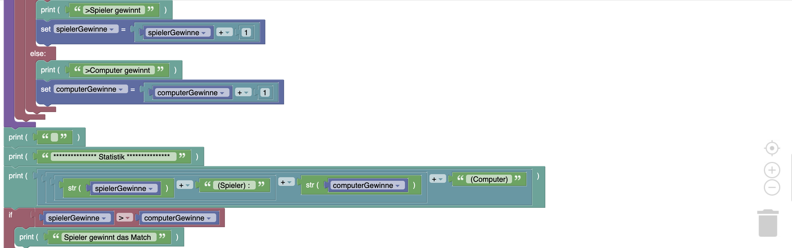

# Schere-Stein-Papier

## Aufgabe Python-Variante
Schere-Stein-Papier ist zwar retro aber lustig. Du möchtest dieses Spiel in Python programmieren und später als Discord-Bot bereitstellen.

Für die Software gelten folgende funktionale Anforderungen:

Der Benutzer / die Benutzerin möchte gegen das Programm ein Schere-Stein-Papier Match spielen können.

  - Version 1: Das Programm wählt einfach nur zufällig Schere, Stein oder Papier und zeigt das Ergebnis an. Der Benutzer denkt sich selbst Schere, Stein und Papier aus und legt selbst fest, ober er/sie gewonnen oder verloren hat. 
  - Version 2: Das Programm wählte zufällig Schere, Stein, Papier aus, lässt den Benutzer seine Wahl eingeben und entscheidet, wer gewonnen hat. 
  - Version 3: Das Programm soll am Ende eine Statistik mit den Spieler- bzw. Programmgewinnen anzeigen und es soll ausgeben, wer das Match insgesamt gewonnen hat.

## Implementierungen

### Blockbasierte Implementierung





### Python-Implementierung

```python
import random
print("*** Schere, Stein, Papier ***")
spielerGewinne = 0
computerGewinne = 0
while True:
    spielerwahl = input("Was wählst du? Tippe ein: [Schere]  [Stein]  [Papier]  [Exit] ")
    if spielerwahl != "Schere" and spielerwahl != "Stein" and spielerwahl != "Papier" and spielerwahl != "Exit":
        print("Es stehen nur folgende Optionen zur Verfügung: [Schere]  [Stein]  [Papier]  [Exit] ")
        continue
    elif spielerwahl == "Exit":
        break
    else:
        zufallszahl = random.randint(0,2)
        if zufallszahl == 0:
            computerwahl = "Schere"
        elif zufallszahl == 1:
            computerwahl = "Stein"
        elif zufallszahl == 2:
            computerwahl = "Papier"
        print("[Spielerwahl] : " + spielerwahl)
        print("[Computerwahl] : " + computerwahl)
        if spielerwahl == computerwahl:
            print(">Unentschieden")
        elif spielerwahl == "Schere" and computerwahl == "Papier":
            print(">Spieler gewinnt")
            spielerGewinne = spielerGewinne + 1
        elif spielerwahl == "Stein" and computerwahl == "Schere":
            print(">Spieler gewinnt")
            spielerGewinne = spielerGewinne + 1
        elif spielerwahl == "Papier" and computerwahl == "Stein":
            print(">Spieler gewinnt")
            spielerGewinne = spielerGewinne + 1
        else:
            print(">Computer gewinnt")
            computerGewinne = computerGewinne + 1
print("")
print("*************** Statistik ***************")
print(str(spielerGewinne) + " (Spieler) : " + str(computerGewinne) + " (Computer)")
if spielerGewinne > computerGewinne:
    print("Spieler gewinnt das Match")
elif computerGewinne > spielerGewinne:
    print("Computer gewinnt das Match")
else:
    print("Das Match geht untentschieden aus!")
print("*****************************************")

```

## Aufgaben-Variante für Micro:bit


(Quelle: Denken lernen -Probleme lösen mit BBC micro:bit V1 + V2, S. 29 - S. 30, https://microbit.eeducation.at/images/c/c7/Buch_microbit_sek_i-Auflage_2022_20220905_30MB.pdf)

### Tutorial dazu
Tutorial auf Englisch: https://github.com/microsoft/pxt-microbit/blob/master/docs/projects/rock-paper-scissors.md

### Implementierung dazu:


```python
zufallszahl = 0
def on_gesture_shake():
    global zufallszahl
    zufallszahl = randint(1, 3)
    basic.show_number(zufallszahl)
    if zufallszahl == 1:
        basic.show_leds("""
            . . . . #
                        # # . # .
                        # # # . .
                        # # . # .
                        . . . . #
        """)
    elif zufallszahl == 2:
        basic.show_leds("""
            # # # # #
                        # . . . #
                        # . . . #
                        # . . . #
                        # # # # #
        """)
    else:
        basic.show_leds("""
            . # # # #
                        . # # # #
                        # # # # .
                        # # # # #
                        . # # # .
        """)
input.on_gesture(Gesture.SHAKE, on_gesture_shake)
```


## Aufgaben-Variante 2 für Micro:bit
Wir möchten ein Schere-Stein-Papier Match gegen den micro:bit spielen können.

### Implementierung


```python
zufallszahl = 0
spielerGewinne = 0
microbitGewinne = 0

def on_gesture_shake():
    global zufallszahl, spielerGewinne, microbitGewinne
    zufallszahl = randint(1, 3)
    basic.pause(2000)
    if zufallszahl == 1:
        basic.show_leds("""
            . . . . #
                        # # . # .
                        # # # . .
                        # # . # .
                        . . . . #
        """)
        if input.button_is_pressed(Button.B):
            spielerGewinne = spielerGewinne + 1
            music.play_melody("E F G A B C5 - - ", 420)
        elif input.logo_is_pressed():
            microbitGewinne = microbitGewinne + 1
            music.play_melody("F E D C - - - - ", 419)
    elif zufallszahl == 2:
        basic.show_leds("""
            . # # # #
                        . # # # #
                        # # # # .
                        # # # # #
                        . # # # .
        """)
        if input.logo_is_pressed():
            spielerGewinne = spielerGewinne + 1
            music.play_melody("E F G A B C5 - - ", 420)
        elif input.button_is_pressed(Button.A):
            microbitGewinne = microbitGewinne + 1
            music.play_melody("F E D C - - - - ", 419)
    else:
        basic.show_leds("""
            # # # # #
                        # . . . #
                        # . . . #
                        # . . . #
                        # # # # #
        """)
        if input.button_is_pressed(Button.A):
            spielerGewinne = spielerGewinne + 1
            music.play_melody("E F G A B C5 - - ", 420)
        elif input.button_is_pressed(Button.B):
            microbitGewinne = microbitGewinne + 1
            music.play_melody("F E D C - - - - ", 419)
    basic.show_string("P:" + str(spielerGewinne))
    basic.show_string("M:" + str(microbitGewinne))
input.on_gesture(Gesture.SHAKE, on_gesture_shake)
```
