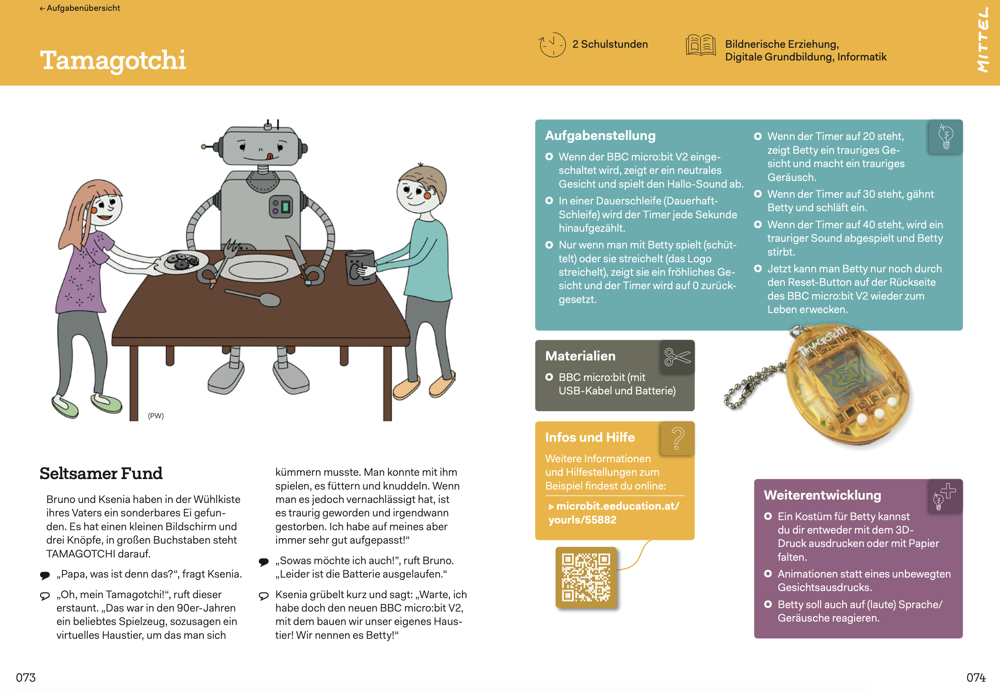
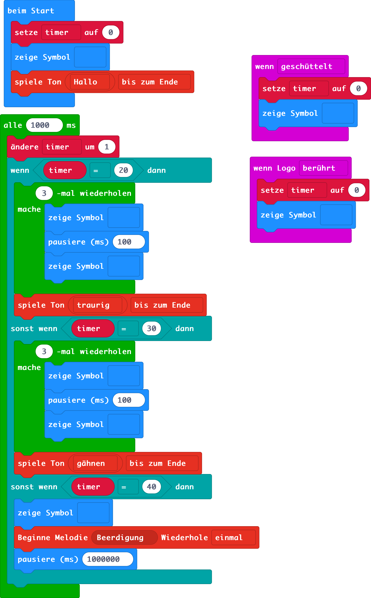

# Tamagotchi ePet BETTY

## Aufgabe für micro:bit


(Quelle: Denken lernen -Probleme lösen mit BBC micro:bit V1 + V2, S. 73 - S. 74, https://microbit.eeducation.at/images/c/c7/Buch_microbit_sek_i-Auflage_2022_20220905_30MB.pdf, https://microbit.eeducation.at/wiki/Hauptseite)

## Implementierung micro:bit
### Blöcke


### Python-Code
```python
def on_logo_touched():
    global timer
    timer = 0
    basic.show_icon(IconNames.HAPPY)
input.on_logo_event(TouchButtonEvent.TOUCHED, on_logo_touched)

def on_gesture_shake():
    global timer
    timer = 0
    basic.show_icon(IconNames.HAPPY)
input.on_gesture(Gesture.SHAKE, on_gesture_shake)

timer = 0
timer = 0
basic.show_icon(IconNames.MEH)
music.play_sound_effect(music.builtin_sound_effect(soundExpression.hello),
    SoundExpressionPlayMode.UNTIL_DONE)

def on_every_interval():
    global timer
    timer += 1
    if timer == 20:
        for index in range(3):
            basic.show_icon(IconNames.HAPPY)
            basic.pause(100)
            basic.show_icon(IconNames.SAD)
        music.play_sound_effect(music.builtin_sound_effect(soundExpression.sad),
            SoundExpressionPlayMode.UNTIL_DONE)
    elif timer == 30:
        for index2 in range(3):
            basic.show_icon(IconNames.SURPRISED)
            basic.pause(100)
            basic.show_icon(IconNames.ASLEEP)
        music.play_sound_effect(music.builtin_sound_effect(soundExpression.yawn),
            SoundExpressionPlayMode.UNTIL_DONE)
    elif timer == 40:
        basic.show_icon(IconNames.SKULL)
        music.start_melody(music.built_in_melody(Melodies.FUNERAL), MelodyOptions.ONCE)
        basic.pause(1000000)
loops.every_interval(1000, on_every_interval)
```
## Tamagotchi Tutorial

### MakeCode Tutorial Editor
Auf der Microsoft MakeCode Plattform können auch sehr einfach Selbstlern-Tutorials für den Unterricht erstellt und geteilt werden.

- Das Tool selbst ist erreichbar über: https://makecode.com/tutorial-tool
- Die Dokumentation zum Tool: https://makecode.com/writing-docs/tutorials

Über Markdown können die Tutorials geschrieben werden.

Wenn ein Tutorial über den Editor erstellt wurde, kann über den Teilen-Button ein Link erzeugt werden, der zum Teilen des Tutorials im Unterricht verwendet werden kann. 

Weder zum Erstellen noch zum Teilen der Tutorials ist keine Anmeldung nötig. Es ist allerdings ratsam, sich den Markdown-Code für das Tutorials abzuspeichern (falls später Änderungen platziert werden müssen oder der Tutorial-Link aus irgendeinem Grund später einmal nicht mehr funktionieren sollte).

### Tamagotchi-Tutorial
Für das Tamagotchi Beispiel wurde ein Tutorial zum Ausprobieren erstellt.

- Markdown-Code für das Tutorial: [Tutorial.md](Tutorial.md)
- Link auf das geteilte Tutorial zum Ausprobieren: https://makecode.microbit.org/#tutorial:33078-39730-51032-39734

### Weitere Tutorials
Beispiele für Tutorials (verfasst in MarkDown) finden sich z.B. auf den folgenden Seiten. 

- Flasing-Hearts: https://github.com/Microsoft/pxt-microbit/blob/master/docs/projects/flashing-heart.md
- Schere-Stein-Papier: https://github.com/Microsoft/pxt-microbit/blob/master/docs/projects/rock-paper-scissors.md
- Viele weitere: https://github.com/Microsoft/pxt-microbit/tree/master/docs/projects

## Vorgangsweise für das eigene Portfolio-Projekt
### Problemstellung
Suche dir eine passende Problemstellung:
 - Passende Problemstellung suchen:
   - [MakeCode micro:bit Tutorials und Anleitungen](https://makecode.microbit.org)
   - Beispiel-Problemstellung aus [diesem Schulbuch](https://microbit.eeducation.at/wiki/Hauptseite)
   - Das Projekt soll es erlauben, die für den Lehrplan nötigen Konzepte im Unterricht zu thematisieren.
### Tutorial
Entwickle ein Tutorial mit dem [Tutorial-Tool](https://makecode.com/tutorial-tool), das die Lösung der Problemstellung mithilfe von Microsoft MakeCode micro:bit Schritt für Schritt vorzeigt:

   - Das Tutorial soll die auf MakeCode nötigen Bausteine Schritt für Schritt einführen und zur Lösung verwenden
   - Das Tutorial soll auf die wesentlichen Konzepte der Programmierung referenzieren (Links), die für einen verwendeten MakeCode-Baustein passen.
### Unterricht
Bette die Problemstellung und das Tutorial in den Informatikunterricht ein. Plane dazu den Unterricht und entwickle die restlichen nötigen Materialien:

1. Lernziele definieren:
   - ausgehend vom Lehrplan
   - zentrale Konzepte / Ideen ableiten
   - Transferziel, Erkenntnisziel, Fakten, Fertigkeiten ableiten
2. Lernzielkontrolle definieren:
    - in Form einer ähnlichen Problemstellung (Fokus Transfer)
    - Fokussiert auf die umfassende Kontrolle der Zieldimension
3. Stundenverlauf festlegen:
   - Methodik orientiert sich am Zyklus Problem -> Problemanalyse -> Algorithmisierung -> Implementierung siehe [hier](../../../Didaktik/Zentrale-Ideen.md), und greift damit folgende Aspekte des Computational Thinkings auf:
      - Problemanalyse: 
        - Dekomposition
        - Abstraktion
        - Mustererkennung
        - Generalisierung
      - Algorithmisierung:
        - Sprachkonzepte identifizieren und einführen
        - Struktogramm / Flussdiagramm zeichnen
        - Pseudocode formulieren
      - Implementierung / Test mit Microsoft MakeCode micro:bit:
        - Das erstelle Tutorial hilft bei der Umsetzung in Code
   - Methodik realisiert ein etabliertes didaktisches Design, z.B [Gagné](https://www.niu.edu/citl/resources/guides/instructional-guide/gagnes-nine-events-of-instruction.shtml).
    1. Aufmerksamkeit erregen
    2. Ziele bekannt geben
    3. Vorwissen aktivieren
    4. Input (Konzepte + Werkzeuge)
    5. Lerngerüste
    6. Übungsphasen
    7. Feedback
    8. Kompetenzcheck
    9.  Transfer einüben
## Komplexere Version für Python (ohne micro:bit)

Die folgende Version eines Tamagotchi ePets ist etwas komplexer und kann als Anregung für die Erweiterung des oben dargestellten Beispiels dienen. 

Diese Variante des ePets kann müde, gelangweilt oder hungrig sein. Es gibt verschiedene Tendenzen für die einzelnen Zustände (Tendenz meint eine Wahrscheinlichkeit für die Verschlechterung des jeweiligen Zustands).

Zwischen jeder Aktion, die mit dem Tier durchgeführt werden kann, vergeht ein wenig Zeit (zufällig immer eine etwas andere Zeitspanne).

Das Tier möchte außerdem nicht immer spielen, essen oder schlafen. Das hängt vom aktuellen jeweiligen Zustand ab.

Jede mit dem Tier durchgeführt Aktion (füttern, schlafen legen, spielen) hat Auswirkungen auf alle Zustände.

Die Implementierung dazu sieht wie folgt aus:

```python
import time, random

tendenzZurMuedigkeit = 60
tendenzZurLangeweile = 50
tendenzZumHunger = 30
zeitTick = 10
name = input("Wie soll dein virtuelles Haustier heißen? ")
hunger = 5
langeweile = 5
muedigkeit = 5
while True: 
    print("")
    print("**************************")
    print("Ein wenig Zeit vergeht ...")
    print("**************************")
    time.sleep(random.randint(zeitTick-zeitTick/2, zeitTick+zeitTick/2))
    if random.randint(1,100)<tendenzZumHunger:
        hunger = hunger + 1
    if random.randint(1,100)<tendenzZurLangeweile:
        langeweile = langeweile + 1
    if random.randint(1,100)<tendenzZurMuedigkeit:
        muedigkeit = muedigkeit + 1
    if hunger > 5:
        print("\a____ Ich bin hungrig ... ("+str(hunger)+") ____")
    time.sleep(0.5)
    if langeweile > 5:
        print("\a____ Ich bin gelangweilt ... ("+str(langeweile)+") ____")
    time.sleep(0.5)
    if muedigkeit > 5:
        print("\a____ Ich bin müde ... ("+str(muedigkeit)+") ____")
    aktion = input("Was möchtest du mit " +str(name) + " tun? (1) Spielen (2) Füttern (3) Schlafen lassen (4) nichts? ")
    if aktion == "1":
        if langeweile > 3:
            print("____ Super, ich mag spielen ____ ")
            langeweile = langeweile - 3
            hunger = hunger + 1
            muedigkeit = muedigkeit + 1
        else:
            print("____ Ich mag jetzt nicht spielen ____")
    elif aktion == "2":
        if hunger > 3:
            print("____ Mmmmmh, fressen ____")
            hunger = hunger - 3
            muedigkeit = muedigkeit + 1
            langeweile = langeweile - 1
        else:
            print("____ Ich hab keinen Hunger ____")
    elif aktion == "3":
        if muedigkeit > 3:
            print("____ Ich bin müde, ich gehe schlafen ____")
            muedigkeit = muedigkeit - 3
            hunger = hunger + 1
            langeweile = langeweile + 1
        else:
            print("____ Ich mag jetzt nicht schlafen ____")
    elif aktion =="4":
        print("____")
    else:
        print("____ Ich weiß nicht was du von mir willst ____")
    if hunger > 10 or langeweile > 10 or muedigkeit > 10:
        break
print("++++++++++++++++++++++++++++++++++++++++++++++++++++++++++++++")
print("Ich mag nicht mehr dein Haustier sein, ich renne jetzt weg ...")
print("++++++++++++++++++++++++++++++++++++++++++++++++++++++++++++++")
```
