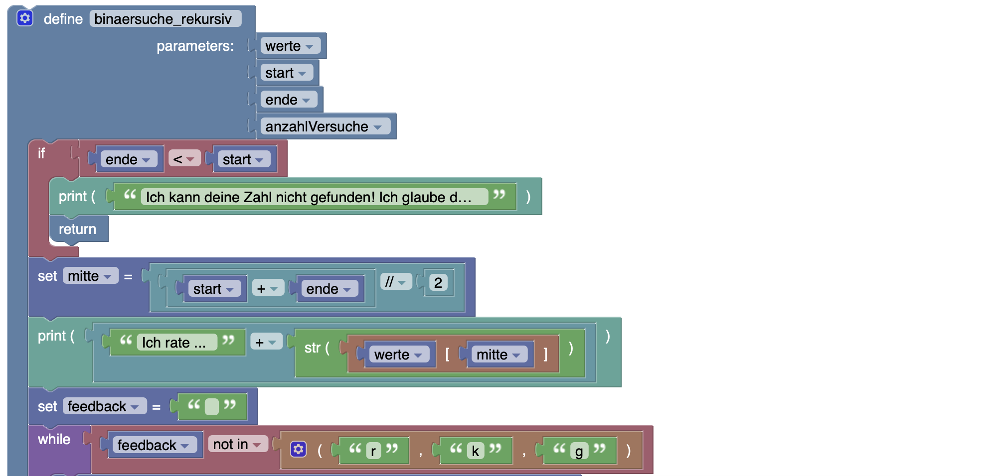
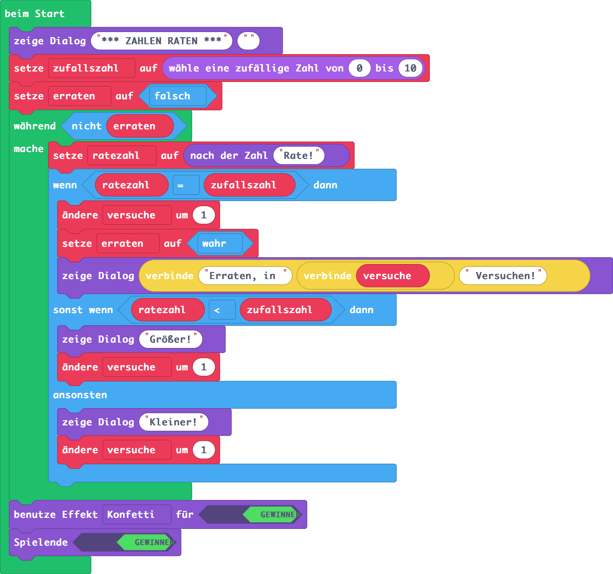

# Zahlenraten
(siehe dazu auch: https://www.inf-schule.de/imperative-programmierung/python/konzepte/ablaufmodellierung/beispiel_zahlenraten)
## Worum gehts? (Goal)
Auf dem Discord-Server deiner Klasse hat der User *IAmLegend* behauptet, dass er es schafft, jede ausgedachte Zahl innerhalb des Zahlenraumes 1 bis 100 in maximal 7 Versuchen zu erraten. 

## Deine Rolle? (Role)
Du bist an diesem Trick interessiert und möchtest herausfinden, wie *IAmLegend* das macht.

## Für wen? (Audience)
Du möchtest im Discord-Channel mit der Auflösung des Tricks glänzen.
## Die Situation? (Situation)
Du überlegst dir, dass es hilfreich wäre, einen Discord-Bot in Python zu schreiben, der sich zufällig eine Zahl ausdenkt und dann die Benutzer im Channel nach der Zahl fragt. Du gibst die Zahl ein und bekommst vom Bot dann den Hinweis, ob die gesuchte Zahl kleiner, größer oder korrekt ist. Damit können du und deine Kolleg:innen trainieren und prüfen, mit welcher Strategie ihr ebenfalls in maximal 7 Versuchen zur Lösung kommen könnt.

Außerdem könnt ihr damit prüfen, ob *IAmLegend* den Trick wirklich beherrscht.

Bevor du den Bot aktivierst, möchtest du das Programm jedoch lokal bei dir in Python implementieren.

## Funktionale Anforderungen? (Product)
Für die Software gelten folgende funktionale Anforderungen:

- Das Programm denkt sich eine zufällige Zahl zwischen 1 und 100 aus.
- Das Programm fragt dich nach der korrekten Zahl.
- Das Programm gibt den Hinweis "Kleiner" oder "Größer" aus, wenn du die Zahl nicht erraten hast.
- Das Programm gibt die Anzahl der Versuche aus, wenn du die Zahl erraten hast.
## Funktionale Anforderungen Discord-Bot-KI
In einer erweiterten Version der Software könnte man einen Discord-Bot implementieren, der in einem zweiten Modus eine von den Usern des Discord-Channels ausgedachte Zahl zwischen 1 und 100 mit maximal 7 Versuchen finden kann ... eine kleine KI sozusagen.
## Die Bewertungsstandards? (Standards)
- Funktionalität der Software lt. Anforderungen
- Qualität des Codes
- Zeitmanagement
- ...

# Implementierungen
## Basisvariante

### Pseudocode
```python
Wir ermitteln eine Zufallszahl im definierten Zahlenbereich
Solange die Benutzerin die Zufallszahl noch nicht erraten hat:
    Die Benutzerin ratet eine Zahl
    Wenn die geratene Zahl der Zufallszahl entspricht:
        Wir erhöhen die Anzahl der Versuche um 1
        Wir informieren den Benutzer, dass er die Zahl in [x] Versuchen erraten hat
        Wir merken uns, dass der Benutzer die Zahl erraten hat und beenden das Programm.
    Sonst: Wenn die vom Benutzer geratene Zahl kleiner als die Zufallszahl ist:
        Wir erhöhten die Anzahl der Versuche um 1
        Wir informieren den Benutzer darüber, dass er zu klein geraten hat.
    Sonst: Wenn
        Wir erhöhen die Anzahl der Versuche um 1
        Wir informieren den Benutzer darüber, dass er zu groß geraten hat.
```
### Ablaufplan / Flussdiagramm

### Blockbasierte Implementierung


### Python-Implementierung
```python
import random
min = 1
max = 100
anzahlVersuche = 0
zufallszahl = random.randint(min, max)
gefunden = False
while not gefunden:
    eingabe = input("Zahl zwischen " + str(min) + " und " + str(max) + " eingeben!")
    if eingabe.isnumeric():
        eingabeZahl = int(eingabe)
        if eingabeZahl == zufallszahl:
            anzahlVersuche = anzahlVersuche + 1
            print("Du hast die Zahl erraten! Anzahl der Versuche:" + str(anzahlVersuche))
            gefunden = True
        elif eingabeZahl < zufallszahl:
            print('Leider nicht, die gesucht Zahl ist größer!')
            anzahlVersuche += 1
        else:
            print('Leider nicht, die gesucht Zahl ist kleiner!')
            anzahlVersuche += 1
print('Auf Wiedersehen!')
```
## KI-Variante (Binäre Suche)
### Blockbasierte Implementierung



### Python-Implementierung KI-Variante (Binäre Suche)

```python
def binaersuche_rekursiv(werte, start, ende, anzahlVersuche):
    if ende < start:
        print('Ich kann deine Zahl nicht gefunden! Ich glaube du schwindelst!')
        return
    mitte = (start + ende) // 2
    print("Ich rate ... " + str(werte[mitte])) 
    feedback = ""
    while feedback not in ("r","k","g"):
        feedback = input("(r)ichtig (k)leiner oder (g)rößer? ")
    if feedback == "r":
        print("Zahl gefunden. Anzahl versuche: " + str(anzahlVersuche))
        return
    elif feedback == "g":
        return binaersuche_rekursiv(werte, mitte + 1, ende, anzahlVersuche+1)
    elif feedback == "k":
        return binaersuche_rekursiv(werte, start, mitte - 1, anzahlVersuche+1)
def binaersucheKi(werte):
    return binaersuche_rekursiv(werte, 0, len(werte) - 1, 1)
min = int(input("Minimum: "))
max = int(input("Maximum: "))
moeglicheWerte = list(range(min,max+1))
binaersucheKi(moeglicheWerte)

```

## Microsoft MakeCode Arcade Variante

### Blöcke


### Python Code (für)
```python
ratezahl = 0
game.splash("*** ZAHLEN RATEN ***", "")
zufallszahl = randint(0, 10)
erraten = False
versuche = 0
game.splash(zufallszahl)
while not (erraten):
    ratezahl = game.ask_for_number("Rate!")
    if ratezahl == zufallszahl:
        versuche += 1
        erraten = True
        game.splash("Erraten, in " + str(versuche) + " Versuchen!")
    elif ratezahl < zufallszahl:
        game.splash("Größer!")
        versuche += 1
    else:
        game.splash("Kleiner!")
        versuche += 1
game.set_game_over_effect(True, effects.confetti)
game.game_over(True)

```
## Microsoft MakeCode micro:bit Variante

### Blöcke

### Python Code für micro:bit
```python
def on_button_pressed_a():
    global ratezahl
    ratezahl += -1
    if ratezahl < 0:
        ratezahl = 0
    basic.show_number(ratezahl)
input.on_button_pressed(Button.A, on_button_pressed_a)

def on_gesture_shake():
    global versuche
    if ratezahl == zufallszahl:
        basic.show_icon(IconNames.HAPPY)
        basic.pause(1000)
        versuche += 1
        basic.show_string("" + convert_to_text(versuche) + " x")
        control.reset()
    elif ratezahl < zufallszahl:
        basic.show_leds("""
            . . . . .
                        . . # . .
                        . # # # .
                        # # # # #
                        . . . . .
        """)
        versuche += 1
    else:
        basic.show_leds("""
            . . . . .
                        # # # # #
                        . # # # .
                        . . # . .
                        . . . . .
        """)
        versuche += 1
input.on_gesture(Gesture.SHAKE, on_gesture_shake)

def on_button_pressed_b():
    global ratezahl
    ratezahl += 1
    basic.show_number(ratezahl)
input.on_button_pressed(Button.B, on_button_pressed_b)

versuche = 0
zufallszahl = 0
ratezahl = 0
ratezahl = 0
zufallszahl = randint(0, 10)

```


