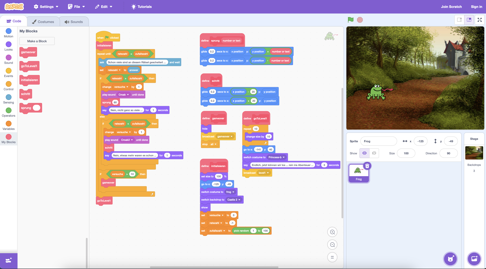

# Zahlenraten

## Worum gehts? (Goal)
Wir entwickeln ein kleines Adventure-Game. In die Rätsel des Spiels sind Ideen aus der Informatik verpackt.

## Deine Rolle? (Role)
Du bist ein Spieleentwickler.

## Für wen? (Audience)
Du entwickelst das Spiel für Volksschüler der 4. Klasse.

## Die Situation? (Situation)
Du programmierst ein kleines Adventure-Game in Scratch. Es ist voll mit Rätseln. Die Bewältigung der Rätsel soll den Spieler:innen Konzepte und Ideen der Informatik näher bringen.


## Funktionale Anforderungen? (Product)

### Level 0: Zahlenraten (binäre Suche)
Im Startlevel des Spiels geht es um Zahlenraten.

- Das Programm denkt sich eine zufällige Zahl zwischen 1 und 100 aus.
- Das Programm fragt nach der korrekten Zahl.
- Das Programm gibt einen Hinweis für "Kleiner" oder "Größer" aus, wenn die Zahl nicht erraten wird.
- Spieler haben maximal 10 Versuche.
- Werden mehr Versuche verbraucht, ist das Spiel zu ende.
- Wenn die Spieler die Zahl innerhalb der 10 Versuche erraten, dann wechselt das Spiel zu Level 1.

Und um welche Idee aus der Informatik dreht sich dieses Spiel? Es geht um "Divide and Conquer" bzw. um einen Algorithmus, der "Binäre Suche" genannt wird.

Verpacke einige Hinweise dazu, wenn die Spieler den Level nicht schaffen ...

### Level 1: ....

## Die Bewertungsstandards? (Standards)
- Funktionalität der Software lt. Anforderungen
- Qualität des Codes
- Zeitmanagement
- ...


## Lösung in Scratch
Lösung zum Download: [ZahlenratenScratch.sb3](ZahlenratenScratch.sb3)



# Alternative Lösungen 

## Vanilla Python

### Pseudocode
```python
Wir ermitteln eine Zufallszahl im definierten Zahlenbereich
Solange die Benutzerin die Zufallszahl noch nicht erraten hat:
    Die Benutzerin ratet eine Zahl
    Wenn die geratene Zahl der Zufallszahl entspricht:
        Wir erhöhen die Anzahl der Versuche um 1
        Wir informieren den Benutzer, dass er die Zahl in [x] Versuchen erraten hat
        Wir merken uns, dass der Benutzer die Zahl erraten hat und beenden das Programm.
    Sonst: Wenn die vom Benutzer geratene Zahl kleiner als die Zufallszahl ist:
        Wir erhöhten die Anzahl der Versuche um 1
        Wir informieren den Benutzer darüber, dass er zu klein geraten hat.
    Sonst: Wenn
        Wir erhöhen die Anzahl der Versuche um 1
        Wir informieren den Benutzer darüber, dass er zu groß geraten hat.
```
### Ablaufplan / Flussdiagramm

### Blöcke


### Python

```python
import random
min = 1
max = 100
anzahlVersuche = 0
zufallszahl = random.randint(min, max)
gefunden = False
while not gefunden:
    eingabe = input("Zahl zwischen " + str(min) + " und " + str(max) + " eingeben!")
    if eingabe.isnumeric():
        eingabeZahl = int(eingabe)
        if eingabeZahl == zufallszahl:
            anzahlVersuche = anzahlVersuche + 1
            print("Du hast die Zahl erraten! Anzahl der Versuche:" + str(anzahlVersuche))
            gefunden = True
        elif eingabeZahl < zufallszahl:
            print('Leider nicht, die gesucht Zahl ist größer!')
            anzahlVersuche += 1
        else:
            print('Leider nicht, die gesucht Zahl ist kleiner!')
            anzahlVersuche += 1
print('Auf Wiedersehen!')
```
## Lösung als Spiel mit Microsoft MakeCode Arcade
### Blöcke


### Python Code (MakeCode Arcade)
```python
versuche = 0
ratezahl = 0
game.splash("*** ZAHLEN RATEN ***", "")
zufallszahl = randint(0, 10)
erraten = False
while not (erraten):
    ratezahl = game.ask_for_number("Rate!")
    if ratezahl == zufallszahl:
        versuche += 1
        erraten = True
        game.splash("Erraten, in " + ("" + str(versuche)) + " Versuchen!")
    elif ratezahl < zufallszahl:
        game.splash("Größer!")
        versuche += 1
    else:
        game.splash("Kleiner!")
        versuche += 1
game.set_game_over_effect(True, effects.confetti)
game.game_over(True)
```
## Lösung als Spiel mit Microsoft MakeCode micro:bit

### Blöcke

### Python Code (MakeCode micro:bit)
```python
def on_button_pressed_a():
    global ratezahl
    ratezahl += -1
    if ratezahl < 0:
        ratezahl = 0
    basic.show_number(ratezahl)
input.on_button_pressed(Button.A, on_button_pressed_a)

def on_gesture_shake():
    global versuche
    if ratezahl == zufallszahl:
        basic.show_icon(IconNames.HAPPY)
        basic.pause(1000)
        versuche += 1
        basic.show_string("" + convert_to_text(versuche) + " x")
        control.reset()
    elif ratezahl < zufallszahl:
        basic.show_leds("""
            . . . . .
                        . . # . .
                        . # # # .
                        # # # # #
                        . . . . .
        """)
        versuche += 1
    else:
        basic.show_leds("""
            . . . . .
                        # # # # #
                        . # # # .
                        . . # . .
                        . . . . .
        """)
        versuche += 1
input.on_gesture(Gesture.SHAKE, on_gesture_shake)

def on_button_pressed_b():
    global ratezahl
    ratezahl += 1
    basic.show_number(ratezahl)
input.on_button_pressed(Button.B, on_button_pressed_b)

versuche = 0
zufallszahl = 0
ratezahl = 0
ratezahl = 0
zufallszahl = randint(0, 10)

```