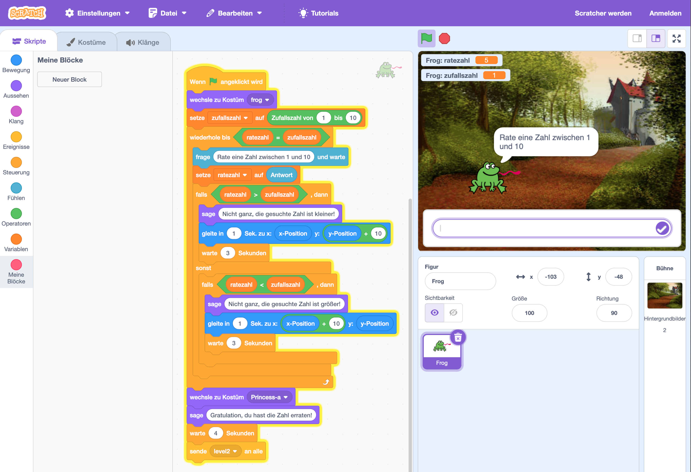

# Zahlenraten

## Worum gehts? (Goal)
Wir entwickeln ein kleines Adventure-Game. In die Rätsel des Spiels sind Ideen aus der Informatik verpackt.

## Deine Rolle? (Role)
Du bist Spieleentwickler:in.

## Für wen? (Audience)
Du entwickelst das Spiel für Volksschüler:innen der 4. Klasse.

## Die Situation? (Situation)
Du programmierst ein kleines Adventure-Game in Scratch. Es ist voll mit Rätseln. Die Bewältigung der Rätsel soll Spieler:innen Konzepte und Ideen der Informatik näher bringen.

## Funktionale Anforderungen? (Product)

### Level 0: Zahlenraten (binäre Suche)
Im Startlevel des Spiels geht es um Zahlenraten.

- Das Programm denkt sich eine zufällige Zahl zwischen 1 und 100 aus.
- Das Programm fragt nach der korrekten Zahl.
- Das Programm gibt einen Hinweis für "Kleiner" oder "Größer" aus, wenn die Zahl nicht erraten wird.
- Spieler*innen haben maximal 10 Versuche.
- Werden mehr Versuche verbraucht, ist das Spiel zu ende.
- Wenn die Spieler*innen die Zahl innerhalb der 10 Versuche erraten, dann wechselt das Spiel zu Level 1.

Und um welche Idee aus der Informatik dreht sich dieses Spiel? Es geht um "Divide and Conquer" bzw. um einen Algorithmus, der "Binäre Suche" genannt wird.

Verpacke einige Hinweise dazu, wenn die Spieler*innen den Level nicht schaffen ...

### Level 1: ....

## Die Bewertungsstandards? (Standards)
- Funktionalität der Software lt. Anforderungen
- Qualität des Codes
- Zeitmanagement
- ...

## Lösung in Scratch
Lösung zum Download: 

- [ZahlenratenScratch652023.sb3](ZahlenratenScratch652023.sb3)

## Lösungsvariante in Scratch (VO vom 13. Mai 2024)
- [Zahlenraten-Variante in Scratch aus der VO vom 13. Mai 2024](./Scratch-Zahlenraten-13-Mai-2024.sb3)

# Hinweis: Textadventure für Informatikkonzepte

In dem folgenden Python-Textadventure sind auch Informatik-Konzepte in Rätsel verpackt ...

[Textadventure](../../../VO-Teil-2/Textadventure/TextAdventure.py)