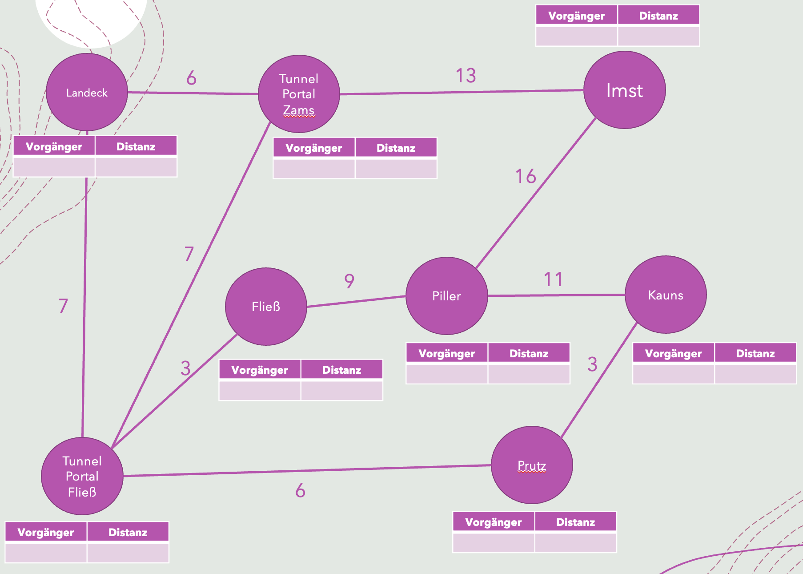

# Handlungsanleitungen nachvollziehen und entwickeln

## Idee
Schüler:innen verstehen und befolgen Handlungsanleitungen / Algorithmen und lösen damit bestimmte Probleme. Schüler finden Lösungen zu gegebenen Problemen und entwickeln Handlungsanleitungen bzw. Algorithmen.

Algorithmus:
Ein Algorithmus ... ist eine eindeutige Handlungsvorschrift zur Lösung eines Problems oder einer Klasse von Problemen. Algorithmen bestehen aus endlich vielen, wohldefinierten Einzelschritten. Damit können sie zur Ausführung in ein Computerprogramm implementiert, aber auch in menschlicher Sprache formuliert werden. Bei der Problemlösung wird eine bestimmte Eingabe in eine bestimmte Ausgabe überführt.
(https://de.wikipedia.org/wiki/Algorithmus)

Wichtig im Sinne der zentralen betroffenen Konzepte ist, dass die Handlungsanleitungen neben einfachen Anweisungen und Sequenzen von Anweisungen auch Bedingungen, bedingte Anweisungen sowie (bedingte) Wiederholungen enthalten. Auch sollte die Notwendigkeit der Verwendung von Variablen bzw. Datenstrukturen gegeben sein.
## Suchen mit der Binären Suche
"Ich wette, dass ich mit maximal 20 Rateversuchen eine beliebig ausgedachte Zahl zwischen 1 und einer Million erraten kann. Du musst mir nur immer ganz ehrlich sagen, ob die gesuchte Zahl größer, kleiner oder gleich meinem Rateversuch ist." 

Wie funktioniert der Trick? Entwickle einen Algorithmus!
### Algorithmus
* https://de.khanacademy.org/computing/computer-science/algorithms/binary-search/a/binary-search
* https://de.wikipedia.org/wiki/Binäre_Suche

## Sortieren mit Bubblesort
### Rollenspiel
Einstimmung: Die Lehrperson bringt eine Flasche Limonade oder Mineralwasser und ein paar Gläser in den Unterricht mit. Die Lernenden sollen einschenken und bevor sie trinken, die Bläschen (Bubbles) im Glas beobachten. 

Vorbereitung: Einige Schüler:innen stellen sich als Teilnehmer:innen des Rollenspiels in einer beliebigen Reihenfolge nebeneinander auf.

- Tauschüberwacher:in: Die Lehrperson bestimmt aus dem Rest der Klasse eine(n) Schüler:in als „Tauschüberwacher:in“. Er/Sie überwacht, ob ein Tauschvorgang stattgefunden hat. Falls ein Tauschvorgang bemerkt wird, hebt dieser/diese die Hand. Mit jedem neuen Durchgang wird die Hand zunächst wieder heruntergenommen.
- Vergleicher:in: Ein(e) zweite(r) Schüler:in hat die Aufgabe, je zwei Schüler:innen der Reihe miteinander zu vergleichen und dem/der Tauscher:in „Ja“ zu antworten, falls zwei nebeneinander Stehende in der Reihe so stehen, dass der Rechte kleiner ist als der Linke.
- Tauscher:in: Ein(e) dritte(r) Schüler:in wird nun beauftragt, von vorne beginnend immer zwei Schüler:innen der Reihe zu tauschen, falls der/die Vergleicher:in „Ja“ antwortet.
  - Wenn der/die Tauscher:in am Ende der Reihe angelangt ist, beginnt alles von vorne, falls der/die Tauschüberwacher:in die Hand oben hat.
  - Hat der/die Tauschüberwacher:in nach einem Durchlauf die Hand nicht oben, ist der Vorgang beendet und die Schüler:innenreihe sortiert. 

Nachbereitung: Am Ende kommt man nochmals auf die Limonade zurück. Warum trägt BubbleSort diesen Namen?
### Algorithmus
* https://de.wikipedia.org/wiki/Bubblesort
* Enaktive Erkundung von Bubblesort und anderen (Sortier-)Algorithmen: https://visualgo.net/en/sorting -> Bubble-Sort auswählen

## Kürzeste-Wege-Algorithmus von Dijkstra
### Handlungsanleitung

Vorbereitung: Mit Kreide wird ein Wegenetz in Form eines Graphen (Knoten + Kanten + Kantengewichte + Daten pro Knoten) auf den Asphalt im Schulhof oder auf die Tafel gezeichnet. Auf dieser Datenstruktur werden nun der folgende Algorithmus ausgeführt.

**Beispiel**:


Der folgende Algorithmus berechnet die kürzesten Wege in diesem Wegenetz ausgehend von einem definierten Startknoten.

1. Schritt: **Startaufstellung**:
Markiere im Graphen zunächst den Startknoten als besucht (grün). Trage die Distanz zum Starknoten mit 0 ein. Dieser Startknoten wird zum aktuellen Knoten.

1. Schritt: **Distanzen zu den Nachbarknoten (Relaxierung)**: Für alle Nachbarknoten des aktuellen Knotens, die noch nicht als besucht markiert sind (also noch nicht grün sind), erledigst du folgende Punkte:
      - Berechne die Entfernung zum Startknoten: Entfernung zum aktuellen Knoten + Entfernung zum Nachbarn.
      - Wenn der betroffene Nachbar noch keine Entfernung eingetragen hat, dann trage die gerade berechnete Entfernung einfach ein und merke dir den aktuellen Knoten als Vorgänger des Nachbarn.
      - Wenn der betroffene Nachbar bereits eine Entfernung eingetragen hat und diese größer ist, als die gerade berechnete Entfernung, dann trage die neue Entfernung ein und merke dir den aktuellen Knoten als Vorgänger des Nachbarn.
2. Schritt 3: **Weiterreise**
   - Wenn es nicht besuchte Knoten gibt, suchst du denjenigen mit der aktuell kleinsten Entfernung aus. Markiere diesen Knoten als besucht. Dieser Knoten wird der aktuelle Knoten. Fahre mit Schritt 2 fort.
   - Wenn es keine nicht besuchten Knoten mehr gibt (alle Knoten sind grün), dann ist der Algorithmus zu Ende. Du hast nun die kürzesten Wege vom Startknoten aus zu allen restlichen Knoten des Graphen berechnet.

Wenn du nun den kürzesten Weg von einem beliebigen Knoten des Graphen zum gewählten Starknoten wissen möchtest, dann kannst du von diesem Knoten aus über die jeweiligen Vorgänger den kürzesten Weg zum Startknoten finden.
### Beispiel-Ablauf


### Algorithmus
* https://de.wikipedia.org/wiki/Dijkstra-Algorithmus
* Dijkstra: https://de.wikipedia.org/wiki/Edsger_W._Dijkstra

## Algorithmenvisualisierungen mit Visualgo
Auf dieser Plattform können viele weitere Algorithmen und Datenstrukturen erkundet werden (enaktiv, ikonisch, symbolisch):

https://visualgo.net/en

## "Computer spielen" einmal anders
Schüler:innen übernehmen im Rahmen der folgenden Aufgabenreihe die Rolle eines einfachen Computers, der über einen kleinen Satz an Befehlen verfügt, die er ausführen kann und dazu als Hilfsmittel für die Speicherung von Daten und Programmen eine einfache Tabelle als Speicher verwendet.

Den Befehlssatz sowie die Vorgangsweise zur Programmausführung ist im Folgenden abgebildet. Schüler:innen werden einige Programme selbst laden, ausführen, analysieren, diskutieren und auch schreiben. Dadurch werden sie ein Verständnis dafür bekommen, wie Computer, Handys, Spielkonsolen etc. arbeiten, was sie wirklich können und tun. Sie müssen zur Lösung Handlungsanleitungen genau befolgen.

Ein Grundverständnis für die Arbeitsweise von Von- Neumann-Architekturen hilft bei der Problembewältigung in verschiedensten Alltagssituationen Jungendlicher, in denen entsprechende Informatiksysteme wie Computer, Handys oder auch Spielkonsolen zur Anwendung kommen. Über die Verwendung (Erstellung, Änderung, Interpretation) verschiedener Tabellen werden die Lernenden diese Arbeitsweise kennenlernen und selbst nachvollziehen. Genaues Lesen sowie entsprechend lückenloses Leseverständnis ist zur Lösung der Aufgaben dabei unabdingbar – eine wichtige allgemeinbildende Kompetenz, die der Informatikunterricht vermitteln und überprüfen kann. Verschiedene Aufgabenvarianten sollen es dem Schüler je nach Interessenslage (Individualisierung) zudem ermöglichen, sich nach der Basisaufgabenreihe in verschiedenen Bereichen der Informatik zu vertiefen und die dabei gewonnenen Erkenntnisse auszutauschen.

### Handlungsanleitung (FETCH-DECODE-EXECUTE Zyklus)

Die folgenden Anweisungen sagen dir im Detail wie die Ausführung jedes Programms ablaufen muss. Halte dich bei der Ausführung der Programme ganz genau an diese Anweisungen. Verwende die erstellte Tabellenvorlage für die Speicherung aller während der Programmsauführung relevanten Daten.

Es gelten folgende Abkürzungen:

* PZ – Programmzählerregister
* AR – Akkumulatorregister
* BR – Befehlsregister
* SR – Speicheradressenregister
* E – Eingabe
* A – Ausgabe

**Vor jedem Programmstart** machst du folgendes:
1. Schreib den Wert 0 in das PZ.
2. Lösche den Inhalt aller sonstigen Register (AR, BR, SR).
3. Lösche den Inhalt aus Eingabe und Ausgabe (E, A).
4. Übertrage das auszuführende Computerprogramm in die Arbeitsspeichertabelle und ersetze dabei alle Labels mit den Speicheradressen.

Führe das Programm nach folgenden Angaben aus:
1. **Befehl holen** (FETCH):
   1. Lies die Zahl im PZ.
   2. Gehe in deiner Arbeitsspeicher-Tabelle in die Zeile mit der Speicheradresse die der gelesenen Zahl entspricht.
   3. Schreibe den Befehl, der an dieser Speicherstelle angegeben ist, in das BR.
   4. Schreibe die hinter dem Befehl angegebene Speicheradresse in das SR. Wenn hinter dem Befehl nichts angegeben ist, lösche den Inhalt von SR.
2. **Befehl dekodieren** (DECODE):
   1. Lies den Befehl im BR und lies in der Befehlssatz-Tabelle nach, was zu tun ist. 
3. **Befehl ausführen** (EXECUTE):
   1. Erhöhe PZ um 1.
   2. Führe jetzt den Befehl entsprechend den Angaben in der Befehlssatz-Tabelle aus.
4. **Beginne wieder mit 1.** falls du nicht an einem HLT-Befehl angelangt bist.

### Befehlssatz
|Instruction|Mnemonic|Machine Code|Explanation|Handlungsanleitung|
|-----------|--------|------------|-----------|-----------------|
|Load Accumulator|LDA|5xx|Load the contents of the given memory address (xx) into the Accumulator|Gehe zur Speicherstelle mit der Adresse die im SR angegeben ist und kopiere den Wert von dort in das AR.
|Store Accumulator|STA|	3xx|	Store the contents of the Accumulator at the given memory address (xx)|Schreibe den Wert aus dem AR in die Speicherstelle mit der Adresse die im SR angegeben ist.|
|Add|	ADD|	1xx|	Add the contents of the given memory address (xx) to the value in the Accumulator|Gehe zur Speicherstelle mit der Adresse die im SR angegeben ist und lies dort die Zahl. Addiere dann diese Zahl zur Zahl im AR und schreibe das Ergebnis wieder zurück in das AR.
|Subtract|	SUB|	2xx|	Subtract the contents of the given memory address (xx) from the value in the Accumulator|Gehe zur Speicherstelle mit der Adresse die im SR angegeben ist und lies dort die Zahl. Subtrahiere dann diese Zahl von der Zahl im AR und schreibe das Ergebnis wieder zurück in das AR.
|Input|	INP|	901|	Copy the value from the Input 'mailbox' into the Accumulator|Überlege dir eine Zahl zwischen 0 und 99 und leg die Zahl in E ab. Kopiere dann den Wert aus E in das AR.
|Output|	OUT|	902|	Copy the value from the Accumulator into the Output 'mailbox'| Kopiere den Wert aus dem AR nach A.
|Branch|	BRA|	6xx|	Branch (jump) to the instruction at the given memory address (xx)|Schreibe die Zahl die im SR steht in das PZ.
|Branch if positive|	BRP|	8xx|	If the value in the Accumulator is positive (including zero), then branch to the instruction at the given memory address (xx)|Wenn im AR 0 oder eine positive Zahl steht, dann schreibe die Zahl die im SR steht in das PZ.
|Branch if zero|	BRZ|	7xx|	If the value in the Accumulator is zero, then branch to the instruction at the given memory address (xx)|Wenn im AR 0 steht dann schreibe die Zahl die im SR steht in das PZ.
|Halt|	HLT|	000|	Stop execution of the program|Beende die Programmausführung.
|Data|	DAT|	value of the data|	Indicates that the current memory address holds a data value | Du kannst die aktuelle Speicheradresse als Datenwert interpertieren.

### Aufgabe 1: Arbeitstabelle
Erstelle zunächst eine Tabelle wie in der folgenden Abbildung gezeigt. Mit Hilfe dieser Tabelle wirst du später „Computer spielen“, d.h. in die Computerrolle schlüpfen und diverse Befehle, Zahlen etc. festhalten und ändern.

Tabellenvorlage:

|Arbeitsspeicher||
|:-------:|:------:|
|Adresse|Befehl|
|00|[ _______ ]|
|01|[ _______ ]|
|02|[ _______ ]|
|03|[ _______ ]|
|04|[ _______ ]|
|05|[ _______ ]|
|06|[ _______ ]|
|07|[ _______ ]|
|08|[ _______ ]|
|09|[ _______ ]|
|10|[ _______ ]|
|11|[ _______ ]|
|12|[ _______ ]|
|13|[ _______ ]|
|14|[ _______ ]|
|15|[ _______ ]|
|16|[ _______ ]|
|...|....|

|CPU REGISTERSPEICHER||
|----------|----------|
|PZ Programmzähler| AR Akkumulatorregister|
|[ _____________ ]|[ _____________ ]|
|BR Befehlsregister| SR Speicheradressenregister|
|[ _____________ ]|[ _____________ ]|

|CPU EIN- und AUSGABE||
|----------|----------|
|E Eingabe| A Ausgaber|
|[ _____________ ]|[ _____________ ]|

### Aufgabe 2: Laden und Ausführung beobachten
Nun wird dein Lehrer „Computer spielen“, indem er ein Programm lädt und ausführt. Er wird seine Vorgangsweise genau erklären. Beobachte ihn ganz genau, mache dir wo nötig Notizen und stelle nach der Ausführung deine offenen
Fragen.
### Aufgabe 3: Programm übertragen 
Übertrage eines der folgenden Programme in deine Arbeitsspeicher-Tabelle.
### Aufgabe 4: Programm ausführen
1. Ausführung des Programms: Führe das in die Tabelle übertragene Programm entsprechend den Anweisungen (BEFEHLSSATZ, FETCH-DECODE-EXECUTE) bzw. entsprechend der Vorgangsweise deines Lehrers selbst aus.
2. Zweck des Programms herausfinden: Versuche den Zweck des Programms herauszufinden. Folgende Teilaufgaben helfen dir dabei:
   - Führe während der Programmausführung ein ta- bellarisches Protokoll in dem du festhältst, welche Eingabewerte welche Ausgabewerte erzeugen.
    - Führe das Programm solange immer wieder neu aus bis du mit Sicherheit nachvollziehen kannst (zusammen mit der entsprechenden Protokollie- rung der Ein- und Ausgabewerte), was das Com- puterprogramm kann oder tut.
    - Vergleiche deine Ergebnisse auch mit den Er- gebnissen deiner Klassenkollegen. Arbeite das Programm dazu ev. nochmals mit denselben Eingabewerten durch die auch deine Kollegen verwendet haben.
3. Zweck beschreiben: Beschreibe in einem Kurz- aufsatz den Zweck des Programms und gib deine Meinung zur Sinnhaftigkeit des Programmes ab!

### Beispielprogramme

Addition von zwei Zahlen:

|Zeile|Label|Befehl|Operand|
|-----|-----|------|-------|
|00||INP||
|01||STA|A|
|02||INP||
|03||ADD|A|
|04||OUT||
|05||HLT||
|06||||
|07|A|DAT|0|
...

Welche ist die größere Zahl?

|Zeile|Label|Befehl|Operand|
|-----|-----|------|-------|
|00||INP||
|01||STA|FIRST|
|02||INP||
|03||STA|SECOND|
|04||SUB|FIRST|
|05||BRP|HIGHER|
|06||LDA|FIRST|
|07||BRA|DONE|
|08|HIGHER|LDA|SECOND|
|09|DONE|OUT||
|10||HLT||
|11|FIRST|DAT||
|12|SECOND|DAT||

Countdown:

|Zeile|Label|Befehl|Operand|
|-----|-----|------|-------|
|00|    | INP||
|01|LOOP  |  OUT||
|02|   |   STA| COUNT
|03|   |     SUB| ONE
|04|   |     STA| COUNT
|05|    |    BRP| LOOP
|06|     |   HLT
|07|		
|08| ONE|     DAT | 1
|09| COUNT|   DAT 
### Additum-Aufgaben “Computerhirn“
Diskutiere mit deinen Klassenkollegen und mit deinem Lehrer folgende Fragestellungen und fasse die Ergebnisse der Diskussion zu den einzelnen Punkten in einem kurzen Protokoll zusammen.
1. Obwohl während der Programmausführung niemand wusste, was das Programm eigentlich macht, ist am Ende - bei korrekter Ausführung - eine korrekte Ausgabe erfolgt. Wie kommt das?
2. Was bedeutet das für die Denkleistung von Computern / Handys / Spielkonsolen usw., die als Von-Neumann-Architekturen ähnlich arbeiten?
3. Wer denkt eigentlich wirklich, wenn ein Computer Programme verarbeitet?
4. Überlege, in welchen Fällen die durchgearbeiteten Programme trotz korrekter Ausführung falsche Ergebnisse liefern könnten und erläutere warum!

### Additum-Aufgaben „Von-Neumann“
1. Informiere dich in den Unterlagen deines Lehrers bzw. im Internet über Aufbau und Abläufe einer Von-Neumann-Architektur.
2. Lege eine neue zweispaltige Tabelle an und ordne folgende Begrifflichkeiten den entsprechenden Elementen aus den bearbeiteten Basisaufgabenstellungen zu: CPU, Steuerwerk, Rechenwerk, Register, Arbeitsspeicher, Speicheradressen, Ein- und Ausgabeeinheit, Bussystem, Von-Neumann-Zyklus, Programm, Befehl, Daten;

### Additum-Aufgaben „EVA“
1. Informiere dich in den Unterlagen deines Lehrers bzw. im Internet über das EVA-Prinzip (Eingabe-Verarbeitung-Ausgabe).
2. Finde heraus, wie in den durchgespielten Programmen (A, B, C) das EVA-Prinzip zur Anwendung kommt und halte deine Entdeckungen in einem Protokoll fest
3. Finde heraus, wie in den folgenden Programmkategorien das EVA-Prinzip zur Anwendung kommt und halte deine Entdeckungen in einem Protokoll fest: Tabellenkalkulation, Computerspiel, Wörterbuch am Handy, Fenstersteuerung in Microsoft Windows, Google-Suche.

### Additum-Aufgabe "Little-Man-Computersimulatoren"
Programmiere einen Little-Man-Computersimulator mit den gegebenen Computerprogrammen. Führe die Programme aus und beobachte das Verhalten des Computers. Wie arbeitet der Computer? Liefert er die korrekten / erwarteten Ergebnisse?

Mögliche LMC-Implementierungen, die du verwenden kannst:

* https://wellingborough.github.io/LMC/LMC0.3.html
* https://peterhigginson.co.uk/LMC/
* https://www.101computing.net/LMC/

Weiter Details dazu siehe https://en.wikipedia.org/wiki/Little_man_computer

### Additum-Aufgaben "Programmieren"
Programmiere den Little-Man-Computer! Er soll folgende Aufgabe lösen:

... siehe https://www.101computing.net/little-man-computer-mini-challenges/

* 3 Zahlen addieren und Ergebnis ausgeben
* Eine Zahl von einer anderen subtrahieren
* Minimum / Maximum zweier Zahlen bestimmen
* Minimum / Maximum dreier Zahlen bestimmen
* 3 Zahlen aufsteigend sortiert ausgeben
* Berechnung von |a-b|
* Countdown von einer eingegebenen Zahl weg
* Multiplikation zweier Zahlen
* Division ganzzahlig
* Rest bei Division (Mod)
* etc.

## Steuerung von Akteuren in Miniwelten (Überblick)
Die Steuerung von Akteuren in Miniwelten ist eine beliebte Form des einführenden Programmmierunterrichts. Die Lernenden definieren Algorithmen zur Steuerung der Akteure und lösen damit die definierten Aufgaben.

Beispielwerkzeuge dafür sind:

- Turtle-Grafik (Logo, in verschiedenen Versionen)
- Roboter Karol: https://karol.arrrg.de (online) bzw. http://cgd.zum.de/wiki/Programmieren_lernen_mit_Robot_Karol
- Kara Marienkäfer: https://www.swisseduc.ch/informatik/karatojava/kara/ (incl. vielen Tutorial-Beispielen direkt in der Umgebung)
- Hamster-Modell (http://www.java-hamster-modell.de/index2.html)
- Open Roberta Sim (https://www.open-roberta.org)
- Pen and Paper Varianten wie hier beschrieben: https://microbit.eeducation.at/wiki/Hauptseite, Version 2, S. 11 bis S. 18

Hintergrund: https://de.wikipedia.org/wiki/Bildungsorientierte_Programmiersprache

### Beispiele mit Roboter Karol

- Siehe Tutorial in der entsprechenden Online-Umgebung: https://karol.arrrg.de

### Beispiele mit LOGO (in Python)
Logo ist die älteste Form der Realisierung des Miniwelt-Konzepts für die einführende Programmierung. Logo wurde von Seymour Papert in den 60er Jahren entwickelt und ist über die Jahre in immer wieder neuen Varianten herausgekommen. In Logo wird eine Schildkröte die zeichnen kann (Turtle) auf einer Zeichenfläche bewegt (Turtle-Grafik). Die Steuerung der Schildkröte erfolgt über eine Programmiersprache. Programmieraufgaben in Logo betreffen meist die Produktion von geometrischen Figuren (Turtle-Grafik).

Hinweis: Eine stark weiterentwickelte Form des Turtle-Grafik-Konzeptes stellt https://processing.org dar. Über Processing werden ebenfalls über die Verwendung einer Programmiersprache multimediale Kunstwerke erzeugt.

Die Logo-Turtle lässt sich in jeder Python-Standarddistribution (und auf entsprechenden Plattformen auch blockbasiert) programmieren. Es gibt aber auch unzählige andere Varianten. 

Hintergrund: https://de.wikipedia.org/wiki/Logo_%28Programmiersprache%29

Viele der später aufgekommenen Miniwelten (Kara, Karol, Scratch etc.) basieren auf dem Konzept der Miniwelt.

Die folgenden Beispiele können in https://blockpy.cis.udel.edu/ oder in https://app.edublocks.org/editor oder in jeder anderen Python-Umgebung ausprobiert werden. 

Quadrat mit verschiedenen Seitenfarben (einfach)

```python
import turtle
turtle.pensize(5)
turtle.forward(40)
turtle.right(90)
turtle.pencolor("red")
turtle.forward(40)
turtle.right(90)
turtle.pencolor("green")
turtle.forward(40)
turtle.right(90)
turtle.pencolor("blue")
turtle.forward(40)
turtle.right(90)
```

Quadrat

```python
import turtle
seitenlaenge = int(input('Seitenlänge?'))
i=0
while i < 4:
    turtle.forward(seitenlaenge)
    turtle.right(90)
    i = i + 1
```

Vieleck

```python
import turtle
ecken = int(input("Wieviele Ecken?"))
seitenlaenge = int(input("Seitenlänge?"))
i = 0
while i < ecken:
    turtle.forward(seitenlaenge)
    turtle.right(360/ecken)
    i = i +1
```

Vieleck mit zwei Farben

```python
import turtle
ecken = int(input("Wieviele Ecken?"))
seitenlaenge = int(input("Seitenlänge?"))
stiftdicke = int(input("Wie dick sollen die Linien sein?"))
turtle.pensize(stiftdicke)
i = 0
while i < ecken:
    if i % 2 == 0:
        farbe = "red"
    else:
        farbe = "black"
    turtle.pencolor(farbe)
    turtle.forward(seitenlaenge)
    turtle.right(360/ecken)
    i = i +1
```
Vieleck mit verschiedenen, zufälligen Farben (Array-Random-Variante)

```python
import turtle, random
ecken = int(input('Wieviele Ecken?'))
seitenlaenge = int(input('Seitenlänge?'))
farben = ['blue', 'red', 'green', 'yellow', 'black']
i = 0
while i < ecken:
    zufallFarbe = farben[random.randint(0, 4)]
    turtle.pencolor(zufallFarbe)
    turtle.forward(seitenlaenge)
    turtle.right(360 / ecken)
    i = i + 1
```
Spirale

```python
import turtle
seitenlaenge = 10
while seitenlaenge < 100:
    seiten = 2
    while seiten > 0:
        turtle.forward(seitenlaenge)
        turtle.right(90)
        seiten = seiten - 1
    seitenlaenge = seitenlaenge + 5
```

Fibonacci-Quadrate-Beispiel:

```python
import turtle
schritteAnzahl = 13
nMinus2 = 0
nMinus1 = 1
while schritteAnzahl > 0:
    schritteAnzahl = schritteAnzahl - 1
    n = nMinus2 + nMinus1
    i = 0
    while i < 4:
        turtle.forward(n)
        turtle.right(90)
        i = i + 1
    nMinus2 = nMinus1
    nMinus1 = n
```
## Weitere Ressourcen zum Thema "Handlungsanleitungen nachvollziehen"
- Denken lernen, Probleme lösen / digi.case: https://men.baa.at/?men=digi.case.dlpl
- Informatik erleben (Uni Klagenfurt): http://informatik-erleben.uni-klu.ac.at
- Buch: Abenteuer Informatik von Jens Gallenbacher: https://link.springer.com/book/10.1007/978-3-662-53965-1
- Biber der Informatik-Aufgabenhefte: https://www.ocg.at/node/269
- IKEA-Bauanleitungen
- Kochbücher / Kochrezepte
- Schulbuch "Denken lernen - Probleme lösen mit BBC micro:bit", S. 11 - S. 16, https://microbit.eeducation.at/images/c/c7/Buch_microbit_sek_i-Auflage_2022_20220905_30MB.pdf 