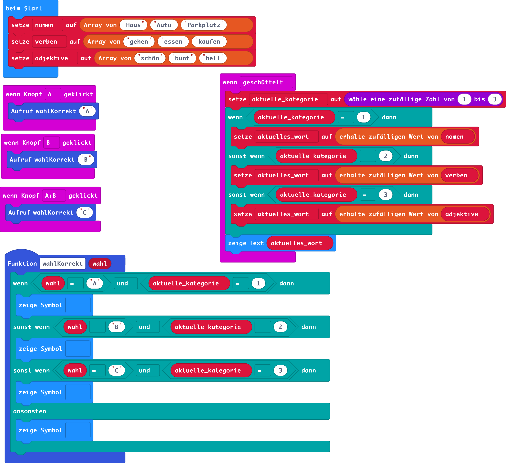

# Deutschwörter lernen
## Funktionen
Der Microbit soll ein Wort einer Kategorie (Hauptwort, Zeitwort, Adjektiv) anzeigen und der Spieler / die Spielerin soll entscheiden ob es sich um Hauptwort (A-Button), ein Zeitwort (B-Button) oder ein Adjektiv (A+B-Button) handelt.

## Microbit-Lösung

### Blöcke


### Python-Code
```python
def on_button_pressed_a():
    wahlKorrekt("A")
input.on_button_pressed(Button.A, on_button_pressed_a)

def on_gesture_shake():
    global aktuelle_kategorie, aktuelles_wort
    aktuelle_kategorie = randint(1, 3)
    if aktuelle_kategorie == 1:
        aktuelles_wort = nomen._pick_random()
    elif aktuelle_kategorie == 2:
        aktuelles_wort = verben._pick_random()
    elif aktuelle_kategorie == 3:
        aktuelles_wort = adjektive._pick_random()
    basic.show_string("" + (aktuelles_wort))
input.on_gesture(Gesture.SHAKE, on_gesture_shake)

def on_button_pressed_ab():
    wahlKorrekt("C")
input.on_button_pressed(Button.AB, on_button_pressed_ab)

def on_button_pressed_b():
    wahlKorrekt("B")
input.on_button_pressed(Button.B, on_button_pressed_b)

def wahlKorrekt(wahl: str):
    if wahl == "A" and aktuelle_kategorie == 1:
        basic.show_icon(IconNames.HAPPY)
    elif wahl == "B" and aktuelle_kategorie == 2:
        basic.show_icon(IconNames.HAPPY)
    elif wahl == "C" and aktuelle_kategorie == 3:
        basic.show_icon(IconNames.HAPPY)
    else:
        basic.show_icon(IconNames.SAD)
aktuelles_wort = ""
aktuelle_kategorie = 0
adjektive: List[str] = []
verben: List[str] = []
nomen: List[str] = []
nomen = ["Haus", "Auto", "Parkplatz"]
verben = ["gehen", "essen", "kaufen"]
adjektive = ["schön", "bunt", "hell"]
```