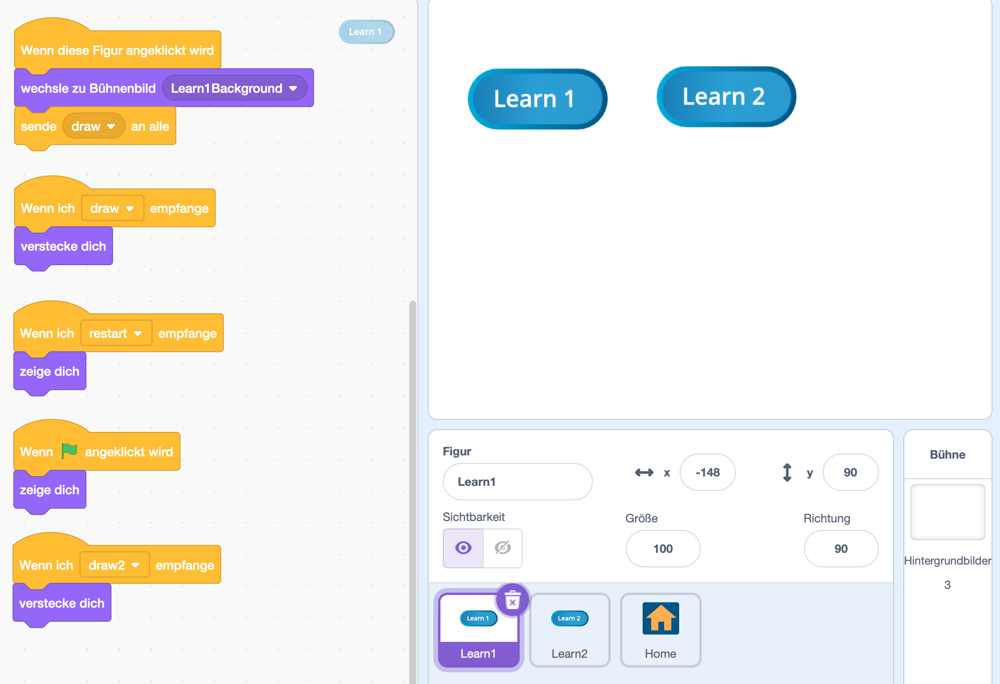
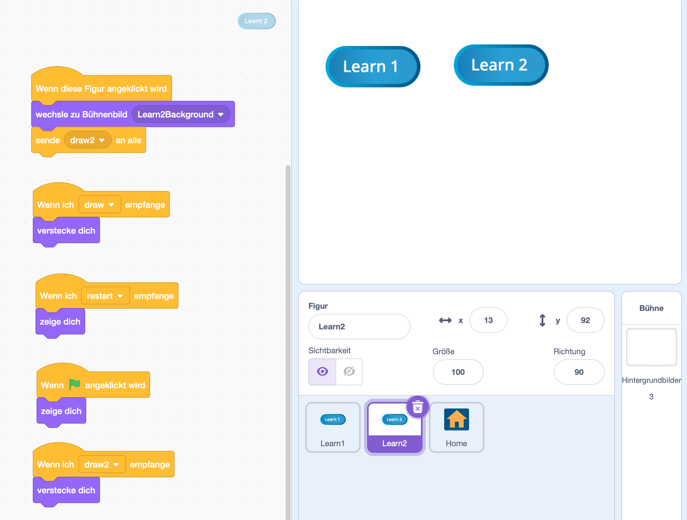
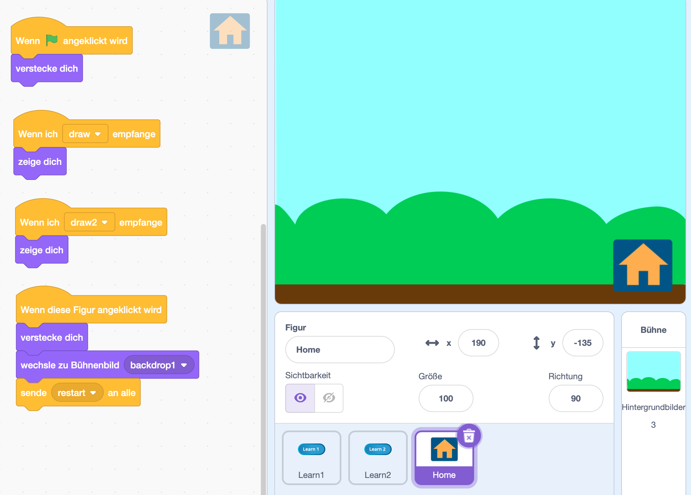

# Menüführung in Scratch.

In diesem Beispiel wird eine Menüführung mithilfe von Events in Scratch gezeigt.

<a href="code/scratch_menue_events_example.sb3">Scratch Code der Menüführung zum Download</a>

## Button "Learn 1"

## Button "Learn 2"

## Button "Home"

