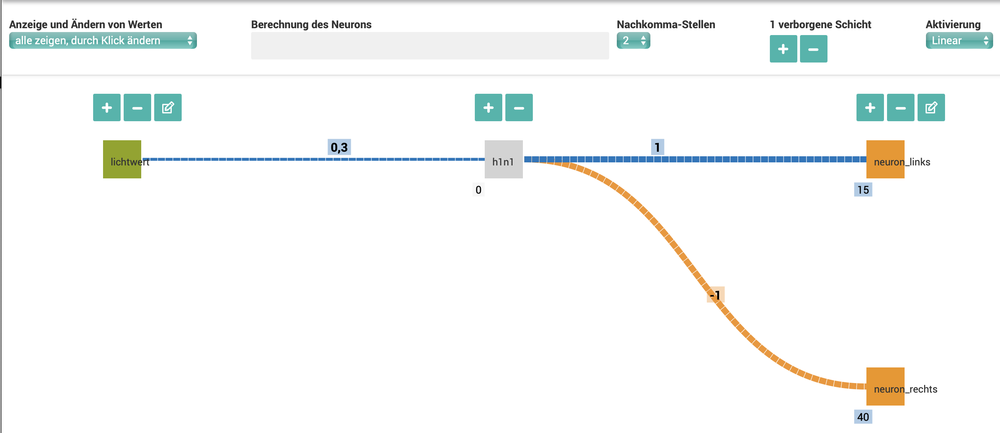
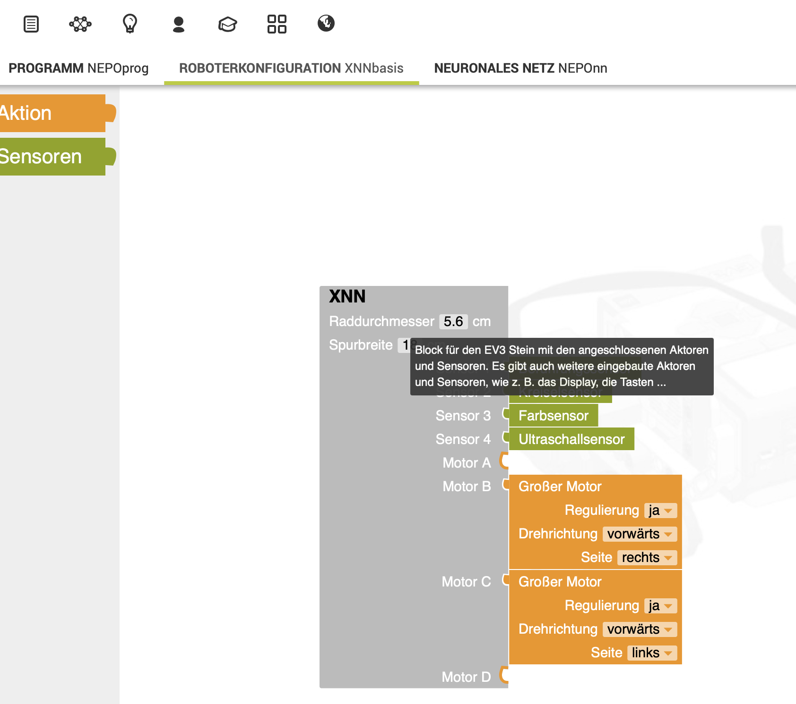
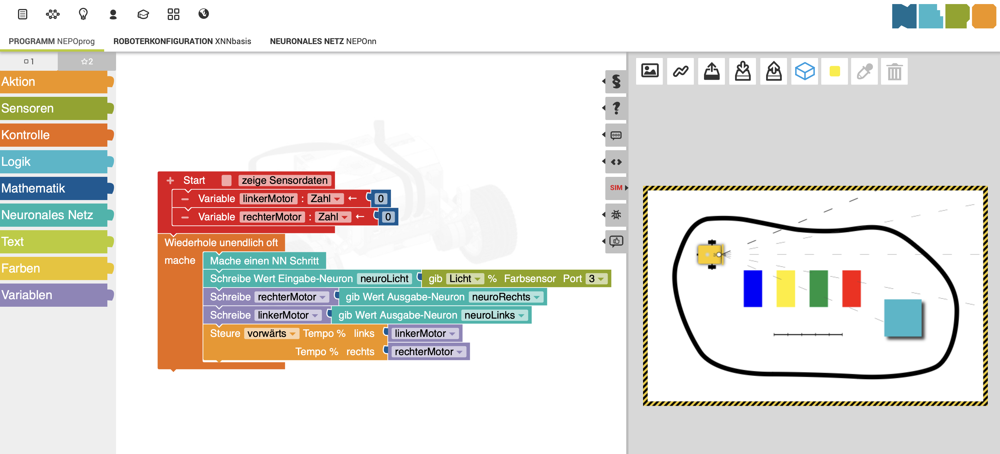

# OpenRoberta und Neuronale Netze

Einführung im Unterricht für die 6. Stufe (komplettes Material):

[Materialien für den Unterricht auf c't Ausgabe 24 vom 21.10.2023](https://ct.de/ycc9)

Programmierung des Roboters mit einem neuronalen Netz:

## Neuronales Netz

## Roboterkonfig

## Roboter-Programmierung mit Werten aus dem neuronalen Netz
