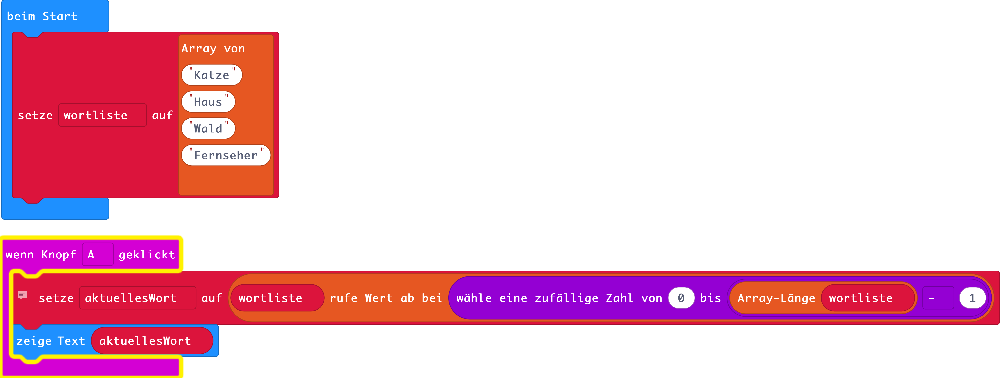
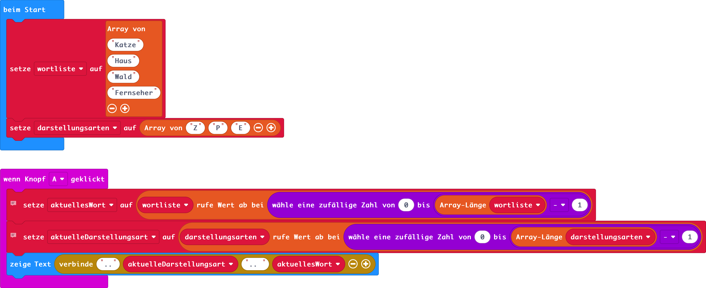
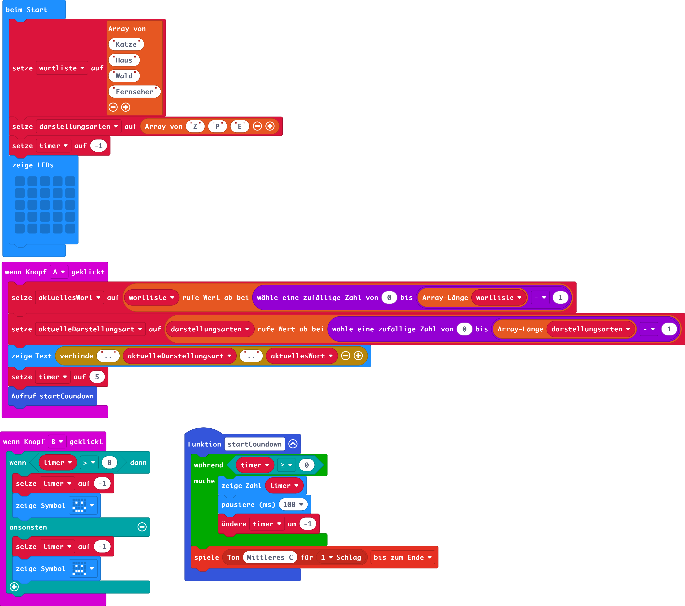
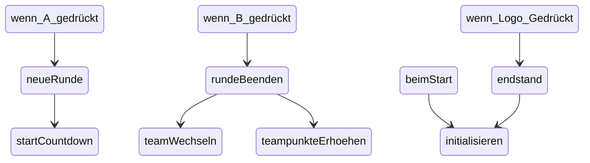
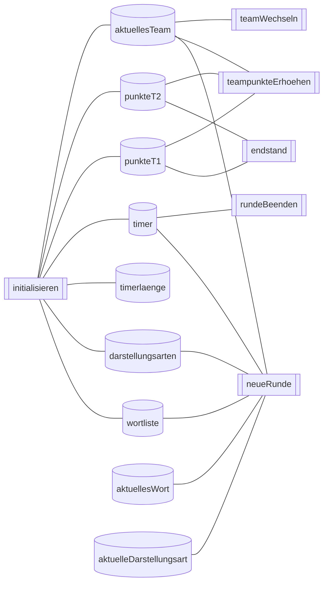
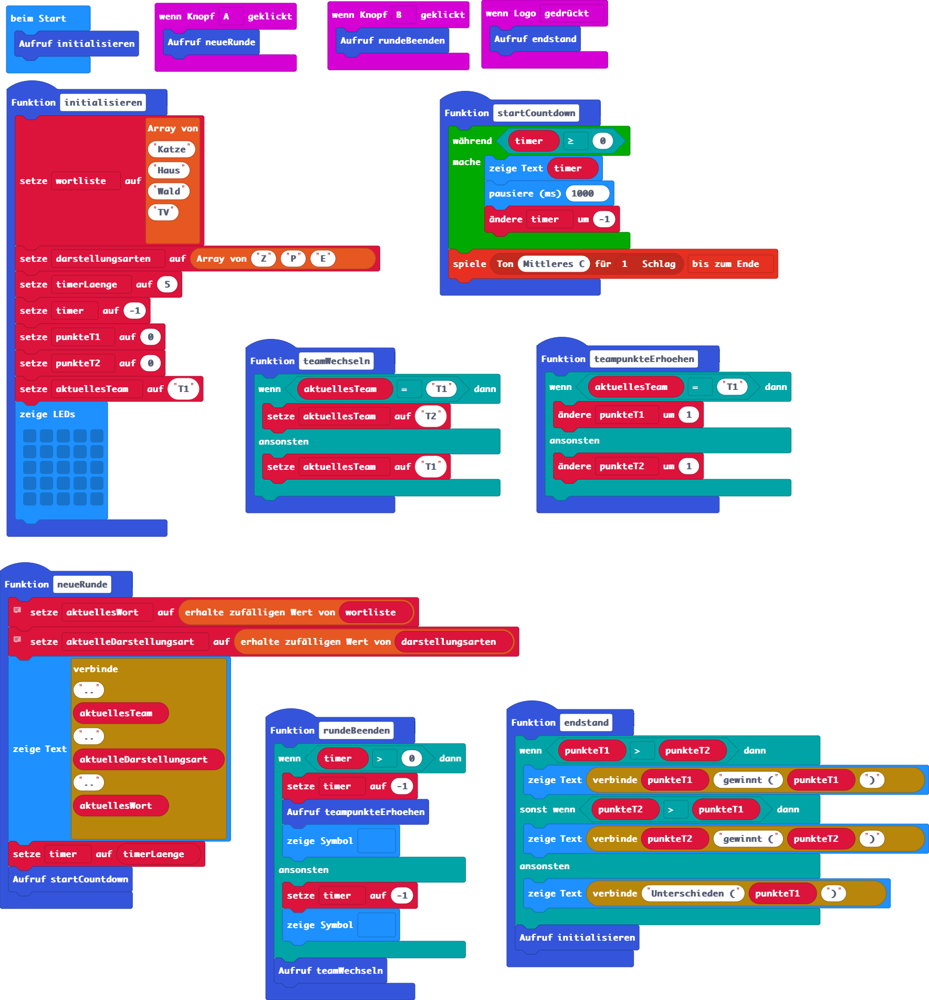

# SCHARADE

## Problemstellung (GRASPS-Schema)

### Ziel (Goal)
Implementiere [Scharade](https://de.wikipedia.org/wiki/Scharade_(Pantomimespiel)) mit dem Micro:bit.

### Deine Rolle (Role) / Situation (S)
Du bist Schüler:in im Fach Digitale Grundbildung. Dort lernst du, wie man kleine Computerprogramme für den Micro:bit schreibt. Du setzte die Kompetenzen aus dem Unterricht ein, um ein kurzweiliges Spiel für die Pause zu entwickeln.

### Deine Zielgruppe (Audience)
Du selbst und deine Klassenkameraden möchten das Spiel mit dem Micro:bit hin und wieder zum Zeitvertreib in der Pause spielen

### Das Produkt (Product, Purpose)

#### Funktionale Anforderungen der verschiedenen Iterationen

Folgende Benutzer:innen-Erfahrung soll in verschiedenen Versionen realisiert werden (Product Backlog):

* Benutzer:innen möchten den Micro:bit verwenden können, um mit einem Druck auf den A-Button eine Runde zu starten. In einer Runde wird zunächst nur ein zufälliges Wort aus einer größeren Liste von Wörtern angezeigt.
* Zusätzlich zum zufälligen Begriff soll für jede Runde auch die Darstellungsart (Z für Zeichnen, P für Pantomime, E für Erklären) zufällig gewählt und angezeigt werden.
* Benutzer:innen möchten, dass nach dem Start einer Runde und damit nach der Anzeige des Ratewortes ein Timer startet.
  * Wenn das Wort vor Ablauf des Timers erraten wurde (Erraten wird mit Druck auf Button B signalisiert), dann ist die Runde gewonnen (Smiley als Ausgabe)
  * Wenn das Wort vor Ablauf des Timers nicht erraten wurde (kein Druck auf Button B), dann ist die Runde verloren (trauriger Smiley als Ausgabe)
* Benutzer:innen möchten Teambattles abwickeln können. Zwei Teams, deren Punktestand mitgeführt wird, spielen gegeneinander. Das Team, das an der Reihe ist, soll mit "T1" oder "T2" angezeigt werden. Mit jeder neuen Runde (Druck auf A-Button) wechseln die Teams.
  * Wenn ein Team vor Ablauf der Ratezeit den Begriff errät, kann das durch einen Druck auf den B-Button signalisiert werden. Dann soll für das aktuelle Team der Punktestand um 1 erhöht werden.
  * Wenn das Logo gedrückt wird, wird angezeigt, welches Team gewinnt und dazu der Punktestand für beide Teams.
  * Alle Daten werden zurückgesetzt und die Benutzer könnten mit Druck auf A ein neues Teambattle beginnen.
* Es sollen Schwierigkeitsgrade für Begriffe verfügbar sein. Der Micro:bit soll mit jeder Runde entscheiden, ob ein Begriff aus dem Schwierigkeitsgrad "Normal" oder ein Begriff aus dem Schwierigkeitsgrad "Schwer" gewählt wird. 
  * Für eine erfolgreiche schwere Runde bekommt ein Team 2 Punkte. 
  * Für eine erfolgreiche leichte Runde bekommt ein Team 1 Punkt.
* ...


## V 0.1

### Problemanalyse und Lösungsansatz
#### Dekomposition

Teilfunktionen (Sprint Backlog V 0.1):
* Benutzer:innen möchten den Micro:bit verwenden können, um mit einem Druck auf den A-Button eine Runde zu starten. In einer Runde wird zunächst nur ein zufälliges Wort aus einer größeren Liste von Wörtern angezeigt.

#### Lösungsansatz / Abstraktion
* Begriffe speichern wir in einer indexbasierten Liste (Array) mit Zeichenketten.
* Wir benötigen Zufallszahlengenerator, der eine Zahl im Bereich der möglichen Indexwerte der Liste liefert.
* Wir zeigen den Listeneintrag an einer zufälligen Position an.

### Algorithmisierung
#### Konzepte
* Arrays / indexbasierte Listen
* Events / Eventhandling
* Zufallszahlengeneratoren

#### Pseudocode
```python
Beim Start definieren wir ein Array mit den Ratewörtern.

Wenn der A-Knopf gedrückt wird:
  Wir holen uns ein zufälliges Wort aus der Liste.
      Dazu verwenden wir den Zufallszahlengenerator der uns eine Zufallszahl zwischen 0 (erste Listenposition) und Listenlänge - 1 (letzte Listenposition) liefert.
      Die zufällige Zahl verwenden wir für den Zugriff auf das Array. Das Wort, das sich an der Stelle der zufälligen Zahl befindet ist unser neues Ratewort.
  Wir zeigen das neue Ratewort an.
```

### Implementierung
#### Blöcke in Makecode Micro:bit


#### Python
```python
def on_button_pressed_a():
    global aktuellesWort
    aktuellesWort = Wortliste[randint(0, len(Wortliste) - -1)]
    basic.show_string("" + (aktuellesWort))
input.on_button_pressed(Button.A, on_button_pressed_a)

aktuellesWort = ""
Wortliste: List[str] = []
Wortliste = ["Katze", "Haus", "Wald", "Fernseher"]
```

## V 0.2
### Problemanalyse und Lösungsansatz
#### Dekomposition

Teilfunktionen (Sprint Backlog V 0.2):
* Zusätzlich zum zufälligen Begriff soll für jede Runde auch die Darstellungsart (Z für Zeichnen, P für Pantomime, E für Erklären) zufällig gewählt und angezeigt werden.

#### Lösungsansatz / Abstraktion
Analog zur zufälligen Auswahl aus dem Array mit den Ratewörtern können wir auch für diese Anforderung ein Array verwenden. Die Strings Z, E und P im Array stehen dann als Code für die verschiedenen Darstellungsarten. Es ist darauf zu achten, das die obere Listengrenze für die zufällige Wahl vom neuen, zweiten Array bzw. dessen Länge abhängt.

### Algorithmisierung
#### Konzepte
- keine neuen Konzepte
#### Pseudocode
```python
Beim Start:
  Wir definieren wir ein Array mit den Ratewörtern.
  wir definieren ein zweites Array mit den Darstellungsarten.

Wenn der A-Knopf gedrückt wird:
  Wir holen uns ein zufälliges Wort aus der Liste.
      Dazu verwenden wir den Zufallszahlengenerator der uns eine Zufallszahl zwischen 0 (erste Listenposition) und Listenlänge - 1 (letzte Listenposition) liefert.
      Die zufällige Zahl verwenden wir für den Zugriff auf das Array. Das Wort, das sich an der Stelle der zufälligen Zahl befindet ist unser neues Ratewort.
  Wir holen uns eine zufällige Darstellungsart aus dem zweiten Array:
    Wir verfahren analog zur zur zufälligen Wahl des Ratewortes. 
    Hinweis: Die obere Grenze für den Zufallszahlenbereich muss an die Arraygröße des zweiten Arrays angepasst werden.
  Wir zeigen das neue Ratewort an.
```
### Implementierung
#### Blöcke in Makecode Micro:bit


#### Python
```python
def on_button_pressed_a():
    global aktuellesWort, aktuelleDarstellungsart
    aktuellesWort = wortliste[randint(0, len(wortliste) - 1)]
    aktuelleDarstellungsart = darstellungsarten[randint(0, len(darstellungsarten) - 1)]
    basic.show_string(".." + aktuelleDarstellungsart + ".." + aktuellesWort)
input.on_button_pressed(Button.A, on_button_pressed_a)

aktuelleDarstellungsart = ""
aktuellesWort = ""
darstellungsarten: List[str] = []
wortliste: List[str] = []
wortliste = ["Katze", "Haus", "Wald", "Fernseher"]
darstellungsarten = ["Z", "P", "E"]
```

## V 0.3
### Problemanalyse und Lösungsansatz
#### Dekomposition

Teilfunktionen (Sprint Backlog V 0.3):
  * Benutzer:innen möchten, dass nach dem Start einer Runde und damit nach der Anzeige des Ratewortes ein Timer startet.
  * Wenn das Wort vor Ablauf des Timers erraten wurde (Erraten wird mit Druck auf Button B signalisiert), dann ist die Runde gewonnen (Smiley als Ausgabe)
  * Wenn das Wort vor Ablauf des Timers nicht erraten wurde (kein Druck auf Button B), dann ist die Runde verloren (trauriger Smiley als Ausgabe)


#### Dekomposition - Modularisierung
* Wir führen eine startCountdown-Funktion ein, die die Timer-Variable abfragt und jede Sekunde herunterzählt (-1), solange bis der Timer auf 0 ist.

#### Lösungsansatz
* Für die Implementierung eines Countdowns auf Basis eines Timers verwenden wir eine globale Variable. Alle Variablen in Microsoft MakeCode Micro:bit sind globale Variablen. D.h. sie sind überall im gesamten Code sichtbar und können beliebig gelesen und verändert werden.
* Wir starten den Countdown (Aufruf der neu definierten Countdown-Funktion) mit jeder neuen Runde (A-Button).
* Wir können den Timer-Wert abfragen, um zu entscheiden, ob das Wort vor Ablauf des Timers erraten wurde (B-Button).


### Algorithmisierung

#### Konzepte
- Globale Variablen / Sichtbarkeit von Variablen
- Funktionen
- Seiteneffekte und Parallelität
  
#### Pseudocode
```python
Beim Start:
  #...
  Zusätzlich zum bisherigen Programmcode müssen setzen wir die Timer-Variable auf -1 (ein Minuswert soll zeigen, dass der Timer abgelaufen ist.)
  Wir leeren ausserdem den Bildschirm.
  #...

Wenn der A-Knopf gedrückt wird (Signal für Rundenstart):
  #... zusätzlich zur vorhergehenden Version ...
  Wir setzen den Timer auf den gewünschten Wert
  Wir starten den Countdown (Aufruf der Funktion dafür)

Funktion startCountdown
  Solange der Variablenwert von Timer > 0 ist
    1 Sekunde pausieren
    Timer am Bildschirm anzeigen
    Timer um 1 reduzieren

Wenn der B-Knopf gedrückt wird (Signal für Wort erraten):
  Wenn der Timer > 0 ist:
    Wir setzen den Timer auf -1 (abgelaufen). 
    # Hinweis: Damit erzeugen wir einen Seiteneffekt für die startCoundown-Funktion, die parallel zu unserer Abarbeitung auch die Timer-Variable verwendet. Beim nächsten Schleifendurchlauf wird dort die Schleife abgebrochen werden.
    Wir zeigen das Symbol für "Gewinnen" im Display an.
  Sonst:
    Wir setzen den Timer auf -1 (abgelaufen).
    Wir zeigen das Symbol für "Verlieren" im Display an.
```

### Implementierung
#### Blöcke in Makecode Micro:bit


#### Python
```python
def on_button_pressed_a():
    global aktuellesWort, aktuelleDarstellungsart, timer
    aktuellesWort = wortliste[randint(0, len(wortliste) - 1)]
    aktuelleDarstellungsart = darstellungsarten[randint(0, len(darstellungsarten) - 1)]
    basic.show_string(".." + aktuelleDarstellungsart + ".." + aktuellesWort)
    timer = 5
    startCoundown()
input.on_button_pressed(Button.A, on_button_pressed_a)

def on_button_pressed_b():
    global timer
    if timer > 0:
        timer = -1
        basic.show_icon(IconNames.HAPPY)
    else:
        timer = -1
        basic.show_icon(IconNames.SAD)
input.on_button_pressed(Button.B, on_button_pressed_b)

def startCoundown():
    global timer
    while timer >= 0:
        basic.show_number(timer)
        basic.pause(100)
        timer += -1
    music.play(music.tone_playable(262, music.beat(BeatFraction.WHOLE)),
        music.PlaybackMode.UNTIL_DONE)
aktuelleDarstellungsart = ""
aktuellesWort = ""
timer = 0
darstellungsarten: List[str] = []
wortliste: List[str] = []
wortliste = ["Katze", "Haus", "Wald", "Fernseher"]
darstellungsarten = ["Z", "P", "E"]
timer = -1
basic.show_leds("""
    . . . . .
    . . . . .
    . . . . .
    . . . . .
    . . . . .
    """)

```

## V 0.4
### Problemanalyse und Lösungsansatz
#### Dekomposition

Teilfunktionen (Sprint Backlog V 0.4):
  * Benutzer:innen möchten Teambattles abwickeln können. Zwei Teams, deren Punktestand mitgeführt wird, spielen gegeneinander. Das Team, das an der Reihe ist, soll mit "T1" oder "T2" angezeigt werden. Mit jeder neuen Runde (Druck auf A-Button) wechseln die Teams.
  * Wenn ein Team vor Ablauf der Ratezeit den Begriff errät, kann das durch einen Druck auf den B-Button signalisiert werden. Dann soll für das aktuelle Team der Punktestand um 1 erhöht werden.
  * Wenn das Logo gedrückt wird, wird angezeigt, welches Team gewinnt und dazu der Punktestand für beide Teams.
  * Alle Daten werden zurückgesetzt und die Benutzer könnten mit Druck auf A ein neues Teambattle beginnen.

#### Lösungsansatz 
* Um Teambattles abzubilden:
  * Wir führen eine globale Variable ein, in der wir das Team als String speichern (T1 oder T2), das gerade an der Reihe ist.
  * Wir führen zwei globale Variablen ein, in denen wir die Punktestände der Teams speichern.
  * Wir definieren verschiedene Funktionen (siehe unten), die ihre Aufgabe unter Verwendung dieser Variablen realisieren.

### Algorithmisierung

#### Funktionen
Wir führen für folgende Lösungsteile eigene Funktionen mit folgenden Zuständigkeiten ein:

* `initialisieren`:
  * alle Variablen (auch die neuen für das aktuelle Team und den Punktestand jedes Teams) wie bisher in einen passenden Startzustand zurücksetzen
  * wird beim Start und nach Anzeige des Endstandes aufgerufen
* `neueRunde`:
  * wird aufgerufen wenn A-Taste gedrückt wird
  * selber Code wie bisher nur in eigene Funktion ausgelagert
* `rundeBeenden`:
  * wird aufgerufen wenn B-Taste gedrückt wird
  * Code wie bisher, zusätzlich:
    * Teampunkte erhöhen, falls innerhalb der Zeit Wort erraten
    * Teamwechsel am Ende durchführen
* `teamWechseln`:
  * Globale Variable mit dem Team wird gelesen und in Abhängigkeit des aktuellen Teams mit dem jeweils anderen Team beschrieben
* `endstand`:
  * passiert wenn Logo berührt wird
  * Ausgabe welches Team gewonnen hat auf Basis der globalen Variablenwerte


#### Diagramme zu den Abhängigkeiten
Welche Funktion ruft welche andere Funktion auf?


Welche Funktion verwendet welche Variablen?



### Implementierung
#### Blöcke in Makecode Micro:bit


Hinweise: 
* Statements in startCoundown etwas umgereiht -> Aufgrund der Pausierung wird sonst manchmal der Timerwert -1 noch ausgegeben, wenn nähmlich während der Pausierung z.B. B gedrückt wird, und der Timer dann vermindert wird --> Frage des scheinbar parallelen Ablaufs von Event-Handler-Funktionen.
* Programmcode, der beim Eintreten von Events (A-Button gedrückt, Logo gedrückt etc.) ausgeführt weden soll, wurde aufgrund der Übersichtlichkeit und der besseren Lesbarkeit von Code (durch die sprechenden Funktionsnamen) in separate Funktionen ausgelagert.
* Die Timerlänge wurde in dier Initialisierung als Variable definiert. Damit kann die Länge zentral an einer Stelle des Codes schnell geändert werden.
* Die zufällige Auswahl des Rateworts und der Darstellungsart wurde durch die Verwendung des Blocks "erhalte zufälligen Wert von Liste" vereinfacht.

#### Python

```python
def on_logo_pressed():
    endstand()
input.on_logo_event(TouchButtonEvent.PRESSED, on_logo_pressed)

def neueRunde():
    global aktuellesWort, aktuelleDarstellungsart, timer
    # Es gibt einen Block [erhalte zufälligen Wert von Liste], der uns diese Vorgangsweise etwas erleichtert. Wenn wir jedoch die grundlegende standardisierte Vorgangsweise zur Arbeit mit Arrays zum Thema machen möchten, ist diese Version zielführender und allgemein gültiger.
    aktuellesWort = wortliste._pick_random()
    # Es gibt einen Block [erhalte zufälligen Wert von Liste], der uns diese Vorgangsweise etwas erleichtert. Wenn wir jedoch die grundlegende standardisierte Vorgangsweise zur Arbeit mit Arrays zum Thema machen möchten, ist diese Version zielführender und allgemein gültiger.
    aktuelleDarstellungsart = darstellungsarten._pick_random()
    basic.show_string(".." + aktuellesTeam + ".." + aktuelleDarstellungsart + ".." + aktuellesWort)
    timer = timerLaenge
    startCountdown()

def on_button_pressed_a():
    neueRunde()
input.on_button_pressed(Button.A, on_button_pressed_a)

def initialisieren():
    global wortliste, darstellungsarten, timerLaenge, timer, punkteT1, punkteT2, aktuellesTeam
    wortliste = ["Katze", "Haus", "Wald", "TV"]
    darstellungsarten = ["Z", "P", "E"]
    timerLaenge = 5
    timer = -1
    punkteT1 = 0
    punkteT2 = 0
    aktuellesTeam = "T1"
    basic.show_leds("""
        . . . . .
        . . . . .
        . . . . .
        . . . . .
        . . . . .
        """)
def teamWechseln():
    global aktuellesTeam
    if aktuellesTeam == "T1":
        aktuellesTeam = "T2"
    else:
        aktuellesTeam = "T1"
def endstand():
    if punkteT1 > punkteT2:
        basic.show_string("" + str(punkteT1) + "gewinnt (" + str(punkteT1) + ")")
    elif punkteT2 > punkteT1:
        basic.show_string("" + str(punkteT2) + "gewinnt (" + str(punkteT2) + ")")
    else:
        basic.show_string("Unterschieden (" + str(punkteT1) + ")")
    initialisieren()

def on_button_pressed_b():
    rundeBeenden()
input.on_button_pressed(Button.B, on_button_pressed_b)

def rundeBeenden():
    global timer
    if timer > 0:
        timer = -1
        teampunkteErhoehen()
        basic.show_icon(IconNames.HAPPY)
    else:
        timer = -1
        basic.show_icon(IconNames.SAD)
    teamWechseln()
def teampunkteErhoehen():
    global punkteT1, punkteT2
    if aktuellesTeam == "T1":
        punkteT1 += 1
    else:
        punkteT2 += 1
def startCountdown():
    global timer
    while timer >= 0:
        basic.show_string("" + str((timer)))
        basic.pause(1000)
        timer += -1
    music.play(music.tone_playable(262, music.beat(BeatFraction.WHOLE)),
        music.PlaybackMode.UNTIL_DONE)
punkteT2 = 0
punkteT1 = 0
timerLaenge = 0
timer = 0
aktuellesTeam = ""
darstellungsarten: List[str] = []
aktuelleDarstellungsart = ""
wortliste: List[str] = []
aktuellesWort = ""
initialisieren()
```

## V 0.5
### Problemanalyse und Lösungsansatz
#### Dekomposition:

Teilfunktionen (Sprint Backlog V 0.5):
  * Es soll ein neuer Schwierigkeitsgrad für Begriffe eingeführt werden. Der Micro:bit soll mit jeder Runde entscheiden, ob ein Begriff aus dem Schwierigkeitsgrad "Normal" oder ein Begriff aus dem Schwierigkeitsgrad "Schwer" gewählt wird. 
  * Für eine erfolgreiche schwere Runde bekommt ein Team 2 Punkte. 
  * Für eine erfolgreiche leichte Runde bekommt ein Team 1 Punkt.
  * ...

...
