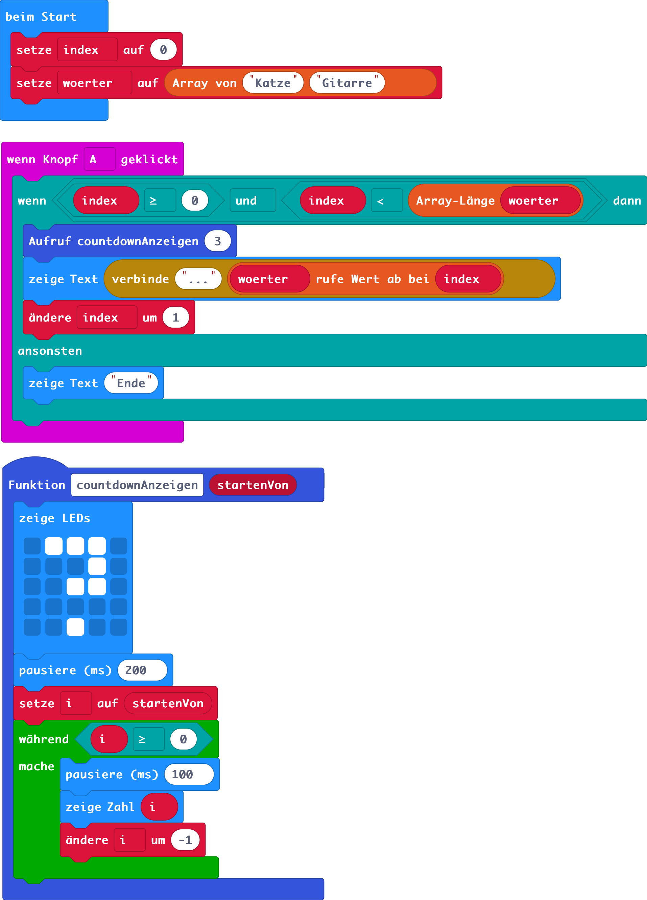

# SHARADE

## Problemstellung (GRASPS-Schema)

### Ziel (Goal)
Implementiere [Scharade](https://de.wikipedia.org/wiki/Scharade_(Pantomimespiel)) mit dem Micro:bit.

### Deine Rolle (Role) / Situation (S)
Du bist Schüler:in im Fach Digitale Grundbildung. Dort lernst du, wie man kleine Computerprogramme für den Micro:bit schreibt. Du setzte die Kompetenzen aus dem Unterricht ein, um ein kurzweiliges Spiel für die Pause zu entwickeln.

### Deine Zielgruppe (Audience)
Du selbst und deine Klassenkameraden möchten das Spiel mit dem Micro:bit hin und wieder zum Zeitvertreib in der Pause spielen

### Das Produkt (Product, Purpose)

#### Funktionale Anforderungen der verschiedenen Iterationen

Folgende Benutzer:innen-Erfahrung soll in verschiedenen Versionen realisiert werden (Product Backlog):

* Benutzer:innen möchten den Micro:bit verwenden können, um mit einem Druck auf den A-Button eine Runde zu starten. In einer Runde wird zunächst nur ein zufälliges Wort aus einer größeren Liste von Wörtern angezeigt.
* Zusätzlich zum zufälligen Begriff soll für jede Runde auch die Darstellungsart (Z für Zeichnen, P für Pantomime, E für Erklären) zufällig gewählt und angezeigt werden.
* Benutzer:innen möchten, dass nach dem Start einer Runde und damit nach der Anzeige des Ratewortes ein Timer startet.
  * Wenn das Wort vor Ablauf des Timers erraten wurde (Erraten wird mit Druck auf Button B signalisiert), dann ist die Runde gewonnen (Smiley als Ausgabe)
  * Wenn das Wort vor Ablauf des Timers nicht erraten wurde (kein Druck auf Button B), dann ist die Runde verloren (trauriger Smiley als Ausgabe)
* Benutzer:innen möchten Teambattles abwickeln können. Zwei Teams, deren Punktestand mitgeführt wird, spielen gegeneinander. Das Team, das an der Reihe ist, soll mit "T1" oder "T2" angezeigt werden. Mit jeder neuen Runde (Druck auf A-Button) wechseln die Teams.
  * Wenn ein Team vor Ablauf der Ratezeit den Begriff errät, kann das durch einen Druck auf den B-Button signalisiert werden. Dann soll für das aktuelle Team der Punktestand um 1 erhöht werden.
  * Wenn das Logo gedrückt wird, wird angezeigt, welches Team gewinnt und dazu der Punktestand für beide Teams.
  * Alle Daten werden zurückgesetzt und die Benutzer könnten mit Druck auf A ein neues Teambattle beginnen.
* Es sollen Schwierigkeitsgrade für Begriffe verfügbar sein. Der Micro:bit soll mit jeder Runde entscheiden, ob ein Begriff aus dem Schwierigkeitsgrad "Normal" oder ein Begriff aus dem Schwierigkeitsgrad "Schwer" gewählt wird. 
  * Für eine erfolgreiche schwere Runde bekommt ein Team 2 Punkte. 
  * Für eine erfolgreiche leichte Runde bekommt ein Team 1 Punkt.
* ...


## V 0.1

### Problemanalyse und Lösungsansatz
#### Dekomposition
Gewünschte Teilfunktionen (Sprint Backlog V 0.1):
* Benutzer:innen möchten den Micro:bit verwenden können, um mit einem Druck auf den A-Button eine Runde zu starten. In einer Runde wird zunächst nur ein zufälliges Wort aus einer größeren Liste von Wörtern angezeigt.

#### Lösungsansatz / Abstraktion
* Begriffe speichern wir in einer indexbasierten Liste (Array) mit Zeichenketten.
* Wir benötigen Zufallszahlengenerator, der eine Zahl im Bereich der möglichen Indexwerte der Liste liefert.
* Wir zeigen den Listeneintrag an einer zufälligen Position an.

### Algorithmisierung
#### Konzepte
* Arrays / indexbasierte Listen
* Events / Eventhandling
* Zufallszahlengeneratoren

#### Pseudocode
```python
Beim Start definieren wir ein Array mit den Ratewörtern.

Wenn der A-Knopf gedrückt wird:
  Wir holen uns ein zufälliges Wort aus der Liste.
      Dazu verwenden wir den Zufallszahlengenerator der uns eine Zufallszahl zwischen 0 (erste Listenposition) und Listenlänge - 1 (letzte Listenposition) liefert.
      Die zufällige Zahl verwenden wir für den Zugriff auf das Array. Das Wort, das sich an der Stelle der zufälligen Zahl befindet ist unser neues Ratewort.
  Wir zeigen das neue Ratewort an.
```

### Implementierung


## V 0.2


### Problemanalyse und Lösungsansatz
#### Dekomposition

Teilfunktionen (Sprint Backlog V 0.2):
* Zusätzlich zum zufälligen Begriff soll für jede Runde auch die Darstellungsart (Z für Zeichnen, P für Pantomime, E für Erklären) zufällig gewählt und angezeigt werden.

#### Abstraktion
Generalisierung, Abstraktion, Mustererkennung, Lösungsansatz

### Algorithmisierung
Pseudocode, grafische Darstellung

### Implementierung


## V 0.3
### Problemanalyse und Lösungsansatz
#### Dekomposition:

Teilfunktionen (Sprint Backlog V 0.3):
  * Benutzer:innen möchten, dass nach dem Start einer Runde und damit nach der Anzeige des Ratewortes ein Timer startet.
  * Wenn das Wort vor Ablauf des Timers erraten wurde (Erraten wird mit Druck auf Button B signalisiert), dann ist die Runde gewonnen (Smiley als Ausgabe)
  * Wenn das Wort vor Ablauf des Timers nicht erraten wurde (kein Druck auf Button B), dann ist die Runde verloren (trauriger Smiley als Ausgabe)


## V 0.4
### Problemanalyse und Lösungsansatz
#### Dekomposition:

Teilfunktionen (Sprint Backlog V 0.4):
  * Benutzer:innen möchten Teambattles abwickeln können. Zwei Teams, deren Punktestand mitgeführt wird, spielen gegeneinander. Das Team, das an der Reihe ist, soll mit "T1" oder "T2" angezeigt werden. Mit jeder neuen Runde (Druck auf A-Button) wechseln die Teams.
  * Wenn ein Team vor Ablauf der Ratezeit den Begriff errät, kann das durch einen Druck auf den B-Button signalisiert werden. Dann soll für das aktuelle Team der Punktestand um 1 erhöht werden.
  * Wenn das Logo gedrückt wird, wird angezeigt, welches Team gewinnt und dazu der Punktestand für beide Teams.
  * Alle Daten werden zurückgesetzt und die Benutzer könnten mit Druck auf A ein neues Teambattle beginnen.


Hinweise: 
* Statements in startCoundown etwas umgereiht -> Aufgrund der Pausierung wird sonst manchmal der Timerwert -1 noch ausgegeben, wenn man während der Pausierung z.B. B drückt (und der Timer dann vermindert wird).
* Alles Event-Handler-Funktionen in Funktionen ausgelagert.
* Timerlänge als Variable definiert.
* Eingebaute Funktion für die zufällige Wahl eines Arrayinhaltes verwendet (vereinfacht)

## V 0.5
### Problemanalyse und Lösungsansatz
#### Dekomposition:

Teilfunktionen (Sprint Backlog V 0.5):
  * Es soll ein neuer Schwierigkeitsgrad für Begriffe eingeführt werden. Der Micro:bit soll mit jeder Runde entscheiden, ob ein Begriff aus dem Schwierigkeitsgrad "Normal" oder ein Begriff aus dem Schwierigkeitsgrad "Schwer" gewählt wird. 
  * Für eine erfolgreiche schwere Runde bekommt ein Team 2 Punkte. 
  * Für eine erfolgreiche leichte Runde bekommt ein Team 1 Punkt.
  * ...

Teilfunktionen:

...

# Anhang mit Test-Prototypen (wird später gelöscht)

## Blöcke


## Python Code

```python
def on_button_pressed_a():
    global index
    if index >= 0 and index < len(woerter):
        countdownAnzeigen(3)
        basic.show_string("..." + woerter[index])
        index += 1
    else:
        basic.show_string("Ende")
input.on_button_pressed(Button.A, on_button_pressed_a)

def countdownAnzeigen(startenVon: number):
    global i
    basic.show_leds("""
        . # # # .
        . . . # .
        . . # # .
        . . . . .
        . . # . .
        """)
    basic.pause(200)
    i = startenVon
    while i >= 0:
        basic.pause(100)
        basic.show_number(i)
        i += -1
i = 0
woerter: List[str] = []
index = 0
index = 0
woerter = ["Katze", "Gitarre"]


````
``

