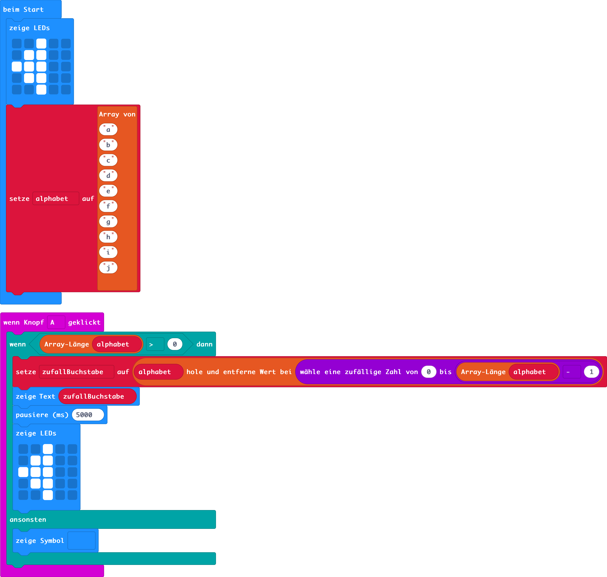

# STADT LAND FLUSS

## Blöcke (Microbit)

## Python (Microbit)
```python
def on_button_pressed_a():
    global zufallBuchstabe
    if len(alphabet) > 0:
        zufallBuchstabe = alphabet.remove_at(randint(0, len(alphabet) - 1))
        basic.show_string("" + (zufallBuchstabe))
        basic.pause(5000)
        basic.show_leds("""
            . . # . .
                        . # # . .
                        # # # . .
                        . # # . .
                        . . # . .
        """)
    else:
        basic.show_icon(IconNames.NO)
input.on_button_pressed(Button.A, on_button_pressed_a)

zufallBuchstabe = ""
alphabet: List[str] = []
basic.show_leds("""
        . . # . .
        . # # . .
        # # # . .
        . # # . .
        . . # . .
""")
alphabet = ["a", "b", "c", "d", "e", "f", "g", "h", "i", "j"]

```


## Python-Code
```python
import random, time

def wartenMitPfeil(sekunden):
    vergangeneSekunden = 1
    while vergangeneSekunden <= sekunden:
        time.sleep(1)
        print(vergangeneSekunden*'>')
        vergangeneSekunden = vergangeneSekunden + 1

def durchlaufStarten():
    zufallszahl = random.randint(0, laengeAlphabet-1)
    print("-----------------------")
    print("Runde " + str(durchlauf))
    print("Buchstabe: " + str(alphabet[zufallszahl]))
    wartenMitPfeil(dauerDurchlauf)

# Hauptprogramm

anzahlDurchlauefe = int(input("Wieviele Durchläufe möchtest du spielen!"))
dauerDurchlauf = int(input("Wieviele Sekunden soll ein Durchlauf dauern?"))
alphabet = ["A","B","C","D","E","F","G","H","I","J","K","L","M","N","O","P","Q","R","S","T","U","V","W","X","Y","Z"]
laengeAlphabet = len(alphabet)
durchlauf = 1 

while durchlauf <= anzahlDurchlauefe:
    durchlaufStarten()
    durchlauf = durchlauf + 1
    input("Durchlauf beendet. Nächster Durchlauf mit Enter")

print("Danke für's Spielen!")
```