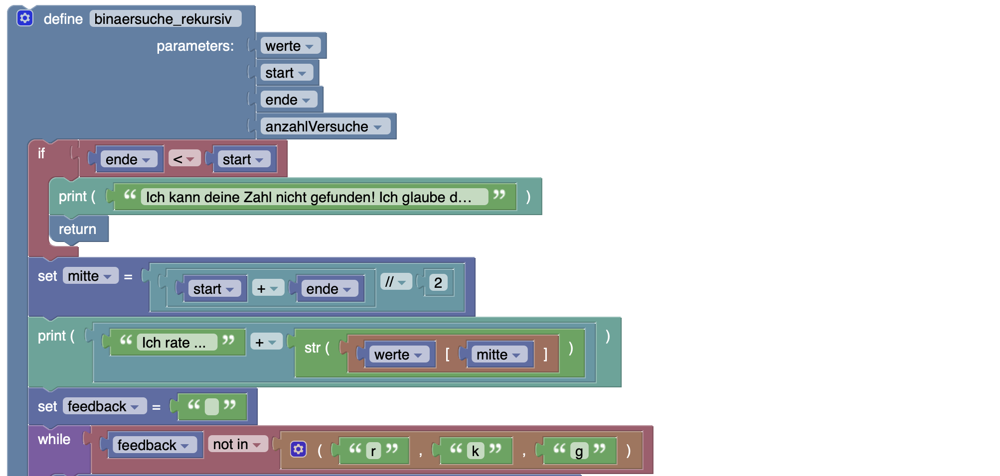

# Zahlenraten (Binary Search)
(siehe dazu auch: https://www.inf-schule.de/imperative-programmierung/python/konzepte/ablaufmodellierung/beispiel_zahlenraten)

## Worum gehts? (Goal)
Du möchtest auf dem Discord-Server deiner Klasse einen Discord-Bot bereitstellen, mit dem man Zahlen-Raten-Spielen kann. Er soll möglichst "intelligent" Zahlen raten können.

## Deine Rolle? (Role)
Du bist an diesem Trick interessiert und möchtest herausfinden, wie *IAmLegend* das macht.

## Für wen? (Audience)
Du möchtest im Discord-Channel mit einem intelligenten Bot glänzen.

## Die Situation? (Situation)
Du überlegst dir, dass es hilfreich wäre, einen Discord-Bot in Python zu schreiben, der in möglichst wenigen Schritten eine durch die Benutzer ausgdachte Zufallszahl erraten kann. Die Benutzer denken sich eine Zahl aus und sagen dem Discord-Bot innerhalb welcher Unter- und Obergrenzen die Zahl liegt. Der Bot wird dann mit seinen Rateversuchen starten und mit möglichst wenigen Schritten zur Lösung kommen.

Du hast gehört, dass die binäre Suche in diesem Zusammenhang einen guten Ansatz für eine Lösung bieten könnte.

Bevor du den Bot aktivierst, möchtest du das Programm jedoch lokal bei dir in Python implementieren.

## Funktionale Anforderungen? (Product)
Für die Software gelten folgende funktionale Anforderungen:

- Der Bot nimmt die Unter- und die Obergrenze als Eingabe entgegen.
- Der Bot ratet die Zahlen anhand des Algorithmus "Binary Search".
  
## Die Bewertungsstandards? (Standards)
- Funktionalität der Software lt. Anforderungen
- Qualität des Codes
- Zeitmanagement
- ...

# Implementierung

## Blockbasierte Implementierung



## Python-Implementierung KI-Variante (Binäre Suche)

```python
def binaersuche_rekursiv(werte, start, ende, anzahlVersuche):
    if ende < start:
        print('Ich kann deine Zahl nicht gefunden! Ich glaube du schwindelst!')
        return
    mitte = (start + ende) // 2
    print("Ich rate ... " + str(werte[mitte])) 
    feedback = ""
    while feedback not in ("r","k","g"):
        feedback = input("(r)ichtig (k)leiner oder (g)rößer? ")
    if feedback == "r":
        print("Zahl gefunden. Anzahl versuche: " + str(anzahlVersuche))
        return
    elif feedback == "g":
        return binaersuche_rekursiv(werte, mitte + 1, ende, anzahlVersuche+1)
    elif feedback == "k":
        return binaersuche_rekursiv(werte, start, mitte - 1, anzahlVersuche+1)
def binaersucheKi(werte):
    return binaersuche_rekursiv(werte, 0, len(werte) - 1, 1)
min = int(input("Minimum: "))
max = int(input("Maximum: "))
moeglicheWerte = list(range(min,max+1))
binaersucheKi(moeglicheWerte)