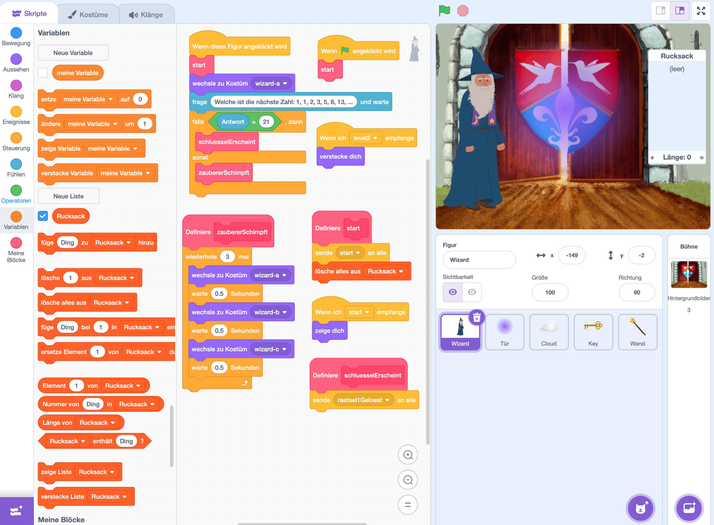

# Zauberer

In diesem Beispiel wird mit Events und Arrays gearbeitet.

1. Der Spieler / die Spielerin klickt den Zauberer an und erhält ein Rätsel.
2. Wenn das Rätsel gelöst wird, erscheint ein Schlüssel und ein Zauberstab.
3. Beide Items kann der Spieler anklicken und damit in den Rucksack (Liste) aufnehmen.
4. Wenn beide Items im Rucksack sind, dann lässt sich die Tür mit einem Klick öffnen.
5. Der Spieler / die Spielerin kommt in den nächsten Rätsel-Raum ...

## Code zum Download
<a href="code/scratch_bsp_lists_events.sb3">Scratch Code des Zauberer-Rätsels</a>

## Bilder

### Zauberer

### Tür

### Wolke

### Schlüssel

### Zauberstab

